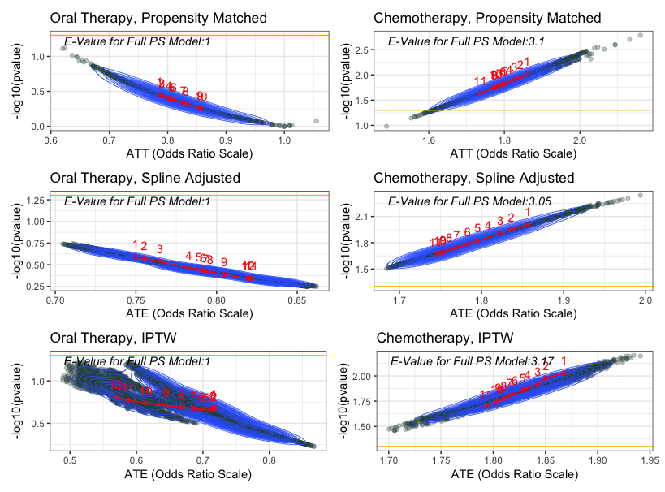

```{r setup, include=FALSE}
knitr::opts_chunk$set(
	echo = TRUE,
	message = FALSE,
	warning = FALSE
)
library(tidyverse)
library(tableone)
library(MatchIt)
library(ggplot2)
library(pander)
library(stats)
library(optmatch)
library(splines)
library(mgcv)
library(itsadug)
library(RColorBrewer)
library(CBPS)
library(ggpubr)

exp_out <-function(model_object){
  out<-matrix(nrow=1,ncol=3)
    out[1,1] <-round(exp(summary(model_object)$coefficients[2,1]),2)   
    out[1,2] <-round(exp(summary(model_object)$coefficients[2,1] - 1.96*summary(model_object)$coefficients[2,2]),2)
    out[1,3] <-round(exp(summary(model_object)$coefficients[2,1] + 1.96*summary(model_object)$coefficients[2,2]),2)
  colnames(out) <-c('OR','Lower','Upper')
  rownames(out)<-names(model_object$coefficients[2])
  print(out)
}

```


```{r computer_var_multi, message=FALSE, warning=FALSE, include=FALSE}
#define inverse logit 
expit <-function(x){
  exp(x)/(1+exp(x))
}

#out_type is linear, binary, or count
#ate_type is risk_difference, odds_ratio, or rate_ratio

U.DR = function(est,A,Y,X,OR.formula,out_type="linear",ate_type="difference"){
  data = data.frame(A,Y,X)
  
  Y_AX = model.matrix(data,object=OR.formula)
  
  par.Y_AX = est[1:ncol(Y_AX)]
  ATE = est[ncol(Y_AX)+1]
  
  data1 = data.frame(A=1,Y,X)
  data0 = data.frame(A=0,Y,X)
  
  #### setup predicted outcomes
  
  if (out_type=="binary") {
    
    m1 = expit(model.matrix(data1,object=OR.formula)%*%par.Y_AX)
    m0 = expit(model.matrix(data0,object=OR.formula)%*%par.Y_AX)
    
    L1 <-mean(m1)
    L0 <-mean(m0)
    
    U.DR.Y_AX = c(Y-expit(Y_AX%*%par.Y_AX)) *(Y_AX)
    
  } else if (out_type=="count") {
    
    m1 = exp(model.matrix(data1,object=OR.formula)%*%par.Y_AX)
    m0 = exp(model.matrix(data0,object=OR.formula)%*%par.Y_AX)
    
    L1 <-mean(m1)
    L0 <-mean(m0)
    
    U.DR.Y_AX = c(Y-exp(Y_AX%*%par.Y_AX)) *(Y_AX)
    
  } else if(out_type=="linear"){
    m1 = model.matrix(data1,object=OR.formula)%*%par.Y_AX
    m0 = model.matrix(data0,object=OR.formula)%*%par.Y_AX
    
    U.DR.Y_AX = c(Y-(Y_AX%*%par.Y_AX)) *(Y_AX)
  }
  
  ###construct estimating equations
  
  if(ate_type=="odds_ratio"){
    
    U.DR.ATE = ATE -log((L1/(1-L1))/(L0/(1-L0)))
  } else   if(ate_type=="rate_ratio"){
    
    U.DR.ATE = ATE -log(L1/L0)
  } else   if(ate_type=="difference"){
    
    U.DR.ATE = ATE -(m1-m0)
  }
  
  
  return(cbind(OR=U.DR.Y_AX,ATE=U.DR.ATE))
}

G = function(est,A,Y,X,OR.formula,out_type,ate_type){
  return(
    apply(U.DR(est,A,Y,X,OR.formula,out_type,ate_type),2,sum)
  )
}


return.CI <-function(est,A,Y,X,OR.formula,out_type="linear",ate_type="difference"){
  
  meat.half=U.DR(est,A,Y,X,OR.formula,out_type = out_type,ate_type = ate_type)
  
  bread<-numDeriv::jacobian(func=G,x=est, A=A,Y=Y,X=X, OR.formula=OR.formula,out_type = out_type,ate_type = ate_type)
  
  IF = meat.half%*%t(solve(-bread))
  ### ATE is the last element of est 
  ATE.var = sum(IF[,ncol(IF)]^2)
  
  out<-matrix(nrow=1,ncol=3)
  if(ate_type=="difference"){
    out[1,1] <-round(ATE,2)
    out[1,2] <-round(ATE-qnorm(0.975)*sqrt(ATE.var),2)
    out[1,3] <-round(ATE+qnorm(0.975)*sqrt(ATE.var),2)
  } else {
    out[1,1] <-round(exp(ATE),2)
    out[1,2] <-round(exp(ATE-qnorm(0.975)*sqrt(ATE.var)),2)
    out[1,3] <-round(exp(ATE+qnorm(0.975)*sqrt(ATE.var)),2)
  }
  colnames(out) <-c('ATE estimate','CI Lower','CI Upper')
  print(out)
  
}
```

```{r computer_var_ps, message=FALSE, warning=FALSE, include=FALSE}


#out_type is linear, binary, or count
#ate_type is risk_difference, odds_ratio, or rate_ratio

U.DR_ps = function(est,A,Y,X,PS,PS.formula,OR.formula,out_type="linear",ate_type="difference"){
  data = data.frame(A,Y,X,ps)
  A_X = model.matrix(data=data,object=PS.formula)
  
  Y_AX = model.matrix(data,object=OR.formula)
  
  par.A_X = est[1:ncol(A_X)]
  par.Y_AX = est[ncol(A_X)+ 1:ncol(Y_AX)]
  ATE = est[ncol(A_X)+ncol(Y_AX)+1]
  
  data1 = data.frame(A=1,Y,X,ps)
  data0 = data.frame(A=0,Y,X,ps)
  
  #### setup predicted outcomes
  
  if (out_type=="binary") {

    m1 = expit(model.matrix(data1,object=OR.formula)%*%par.Y_AX)
    m0 = expit(model.matrix(data0,object=OR.formula)%*%par.Y_AX)
    
    L1 <-mean(m1)
    L0 <-mean(m0)
    
    U.DR.A_X = c(A-expit(A_X%*%par.A_X)) *(A_X)
    U.DR.Y_AX = c(Y-expit(Y_AX%*%par.Y_AX)) *(Y_AX)

  } else if (out_type=="count") {
    
    m1 = exp(model.matrix(data1,object=OR.formula)%*%par.Y_AX)
    m0 = exp(model.matrix(data0,object=OR.formula)%*%par.Y_AX)
    
    L1 <-mean(m1)
    L0 <-mean(m0)
    
    U.DR.A_X = c(A-exp(A_X%*%par.A_X)) *(A_X)
    U.DR.Y_AX = c(Y-exp(Y_AX%*%par.Y_AX)) *(Y_AX)
    
  } else if(out_type=="linear"){
    m1 = model.matrix(data1,object=OR.formula)%*%par.Y_AX
    m0 = model.matrix(data0,object=OR.formula)%*%par.Y_AX
    
    U.DR.A_X = c(A-(A_X%*%par.A_X)) *(A_X)
    U.DR.Y_AX = c(Y-(Y_AX%*%par.Y_AX)) *(Y_AX)
  }
  
  ###construct estimating equations
  
  if(ate_type=="odds_ratio"){

    U.DR.ATE = ATE -log((L1/(1-L1))/(L0/(1-L0)))
  } else   if(ate_type=="rate_ratio"){

    U.DR.ATE = ATE -log(L1/L0)
  } else   if(ate_type=="difference"){
    
    U.DR.ATE = ATE -(m1-m0)
  }

  
  return(cbind(PS=U.DR.A_X,OR=U.DR.Y_AX,ATE=U.DR.ATE))
}

G_ps = function(est,A,Y,X,PS,PS.formula,OR.formula,out_type,ate_type){
  return(
    apply(U.DR_ps(est,A,Y,X,PS,PS.formula,OR.formula,out_type,ate_type),2,sum)
  )
}

  
return.CI_ps <-function(est,A,Y,X,PS,PS.formula,OR.formula,out_type="linear",ate_type="difference"){
    
  meat.half=U.DR_ps(est,A,Y,X,PS,PS.formula,OR.formula,out_type = out_type,ate_type = ate_type)
  
  bread<-numDeriv::jacobian(func=G_ps,x=est, A=A,Y=Y,X=X,PS=PS, PS.formula=PS.formula, OR.formula=OR.formula,out_type = out_type,ate_type = ate_type)
  
  IF = meat.half%*%t(solve(-bread))
  ### ATE is the last element of est 
  ATE.var = sum(IF[,ncol(IF)]^2)
  
  out<-matrix(nrow=1,ncol=3)
  if(ate_type=="difference"){
    out[1,1] <-round(ATE,2)
    out[1,2] <-round(ATE-qnorm(0.975)*sqrt(ATE.var),2)
    out[1,3] <-round(ATE+qnorm(0.975)*sqrt(ATE.var),2)
  } else {
    out[1,1] <-round(exp(ATE),2)
    out[1,2] <-round(exp(ATE-qnorm(0.975)*sqrt(ATE.var)),2)
    out[1,3] <-round(exp(ATE+qnorm(0.975)*sqrt(ATE.var)),2)
  }
  colnames(out) <-c('ATE estimate','CI Lower','CI Upper')
  print(out)
  
}
```


##Summary

This is a tutorial for using propensity score methods for comparative effectiveness and causal inference research. The example uses medical claims data with R code provided at each step.


<center>


</center>


##Abstract
Medical insurance claims are becoming increasingly common data sources to answer a variety of questions in biomedical research. Although comprehensive in terms of longitudinal characterization of disease development and progression for a potentially large number of patients, population-based studies using these datasets require thoughtful modification to sample selection and analytic strategies, relative to other types of studies.  Along with complex selection bias and missing data issues, claims-based studies are purely observational, which limits effective understanding and characterization of the treatment differences between groups being compared. All these issues contribute to a crisis in reproducibility and replication of comparative findings. This paper offers some practical guidance to the full analytical process, demonstrates methods for estimating causal treatment effects on several types of outcomes common to such studies, such as binary, count, time to event and longitudinally varying repeated measures outcomes, and aims to increase transparency and reproducibility. The analytic pipeline is illustrated using a sub-cohort of patients with advanced prostate cancer from the large Clinformatics TM Data Mart Database (OptumInsight, Eden Prairie, Minnesota), consisting of 73 million distinct private payer insurees from 2001-2016.                                           


##Introduction and Background

Health service billing data can be used to answer many clinical and epidemiological questions using a large number of patients and has the potential to capture patterns in health care practice that take place in the real world.[1,2,3,4,5] Such large datasets allow investigators to conduct scientific queries which may be difficult, if not practically impossible, to answer via a randomized clinical trial. For example, comparing multiple treatments that are produced by different drug companies and with varying guidelines for their use for a disease may only be feasible in a real healthcare database.[6,7] Although these large data sources offer a wealth of information, there are many challenges and drawbacks, such as confounding, selection bias, heterogeneity, missing values, duplicate records and misclassification of disease and exposures. These added complexities of these observational datasets contribute to the challenge of reproducing findings from studies using administrative health data. As regulatory agencies and pharmaceutical companies increasingly consider studying the real world evidence present in such databases, the importance of proper methodology, reporting, and reproducibility of the analysis for a broad audience of researchers is of necessity.[8,9,10,11,12,13,14] We emulate newly introduced principles from the predictability, computability, and stability (PCS) framework for veridical data science[15] to examine comparative effectiveness research questions that administrative claims data can be used to address. 

###Challenges to Characterizing Treatments using Claims Data

Healthcare claims data has been extensively criticized for its use in epidemiological research.[16,17] These types of data are prone to issues such as misclassification, missing data, and bias. For example, ICD codes are entered by the care provider, and thus certain diagnoses may be missed or may not be accurate or may differ across providers.[17] Further, coding schema can change over time, such as the change from ICD-9 to ICD-10, which can further complicate analyses. Outcomes can be particularly difficult to define and identify. For example, there is no agreed upon algorithm for identifying Emergency Room visits, and thus many definitions are used.[18] While not as clean as gold standard clinical trial data, these datasets are still the best source of data for a wide variety of questions regarding drug utilization, effectiveness, and monitoring of adverse events.[19,20] Claims data have the benefit of reflecting how medications are actually being prescribed, and thus may provide a more accurate depiction of treatment benefit in practice or real-life evidence. Further, these datasets provide a wide breadth of a patient’s interaction with the healthcare system that electronic medical record (EHR) data alone21, going beyond just visits by adding procedures, tests, and pharmacy fills. With proper study design and methodological considerations, many of the common issues and concerns can be addressed,[8,9,10,11,12,13,14] and these large databases of longitudinal data can provide insight to many research questions and be used to emulate a clinical trial.[22]

With claims data, and observational data in general, the assignment of treatment is not random, and thus susceptible to confounding and selection bias. In practice, the clinician and patient decide among treatment options based on the patient’s circumstances and overall health. Further, these same factors may also be associated with the health outcome of interest. If not properly incorporated, these factors will misrepresent and bias the true treatment effect comparison. While there are several approaches to handling confounding and selection bias available, propensity score-based methods are versatile in that they can be used for a variety of research questions and can be used for many different kinds of study designs and databases. Propensity score models can be particularly useful when there are many potential confounders and the outcome is rare. Propensity score approaches also prevent p-hacking of a desired result in the outcome model.[23] Thus, these methods have gained increasing popularity, especially for questions of comparative effectiveness in pharmacoepidemiologic and pharmacoeconomic research. 


###Lack of Reporting and Reproducibility

A downside to this rise in popularity is that the assumptions and critical steps for the propensity score-based methods are often ignored or unreported. This lack of reporting hinders other researchers’ ability to replicate the findings. Ali et al[24] found 296 published medical papers in a 6-month period that reported use of a propensity score method. However, in their systematic review, they found that 194 (65.5%) did not report how variables were selected for the propensity model, and that only 177 (59.8%) reported test for balance of confounders between the two groups of comparison. Others have also noted common misuse of propensity methods.[25,26,27,28] Yao et al.[29] concluded in a recent systematic review of cancer studies that there is considerable room for improvement in reporting propensity analysis and offered guidelines for such reporting. Yet, some researchers are still not clear with their use of propensity methods and presentation in a scientific paper. For example, when comparing the effectiveness of allopurinol or febuxostat on reducing the risk of atrial fibrillation using Medicare data, Singh et al.[30] matched subjects based on the propensity score. While they did report which variables were used for propensity construction and balance diagnostics after matching, many important details were not reported. Analysis questions arise, such as how the propensity score was calculated (logistic regression or otherwise), what distance measure was used to match subjects, if subjects were matched with or without replacement. These details are essential for researchers wishing to replicate the results reported.  Additionally, even for many those researchers that did describe such methods, sensitively analysis to the results were often not reported. Propensity score methods do not account for unmeasured confounding, and sensitivity analyses can provide the reader with crucial information on the robustness of the findings. In many situations it is not clear what is the target estimand, for example, whether we are estimating the average treatment effect or the conditional average treatment effect.

Austin[31] provides a conceptual overview of propensity score methods from a foundational and introductory standpoint. Stuart et al.[32] provide a general framework for using propensity methods with observational health care data, providing an example of effect estimation of drug monitoring programs for individuals with serious mental illness. Additionally, Brookhart et al.[33] provide practical example when comparing the risk of angioedema between two treatments for hypertension. While these papers offer an elegant and lucid exposition of the underlying principles, and are extremely important contribution to the literature, these overviews do not offer the reader complete practical guidance at every analysis step, as there remains a gap from methodological understanding to actual implementation. Further, these tutorials do not directly address the use of propensity methods for a range of outcomes commonly found in claims data, such as non-continuous, time to event or correlated outcomes. For example, a researcher may be interested in if a rare adverse event occurs or not (categorical) or monitoring a patient’s disease progression over the course of several visits (correlated repeated measures and time to event outcomes). There are unique assumptions and considerations when using propensity methods for these different types of outcomes beyond those used for a simple continuous and normally distributed outcome. Additionally, there is need for a demonstrated sensitivity analysis after the treatment effect estimation to understand the strength of evidence supporting the results.
Therefore, there is need for a usable, simple and comprehensive tutorial for all stages of analysis when characterizing a binary treatment effect on various outcome types using claims data, with accompanying software code for each step. This paper outlines the use of three primary propensity score-based methods: Propensity Matching, Spline Adjustment, and Inverse Probability of Treatment Weighting (IPTW). The paper also details how to use each method to estimate average treatment effect for four common outcome types: 1) Binary, 2) Count, 3) Time to event, and 4) Longitudinally varying repeated measures. Finally, we conduct sensitivity analysis for two of the outcome types. To improve transparency for reproducibility and usage of the methods discussed, detailed R code is provided.

To illustrate the entire process, we chose to study treatment patterns and treatment outcomes among patients with advanced stage prostate cancer from the Clinformatics TM Data Mart Database (OptumInsight, Eden Prairie, Minnesota). This database has a wealth of de-identified medical claims, pharmacy claims, inpatient confinement information, provider information, and socio-demographic information. Each outcome type is defined from emergency room visits (binary and count), time on treatment and in database (time to event), and prescription fills for opioids (repeated measures over time).

###Causal Inference and Average Treatment Effect

Causal inference relies on the potential-outcomes framework, where each individual has a potential outcome under each possible treatment, with in reality only one actually assigned to him/her.[34] This framework allows researchers to clearly define what it means for an effect to be causal through the use of counterfactuals that can be viewed as missing data. Consider the case of two possible available treatments, a treatment of interest compared to another established treatment for the same disease, with a single outcome measured after treatment. We would define the causal effect of the treatment of interest as the difference between the actual and counterfactual outcomes in both treatment scenarios.

As described by Rubin,[34,35] many causal inference problems involve comparison of potential outcomes on the same (say $i^{th}$) individual. Define $Y_{i}(0)$ as the potential outcome under the control treatment, and  $Y_{i}(1)$ as the potential outcome under the active treatment of interest. We wish to know the treatment effect for each individual, typically defined as $Y_{i}(1) - Y_{i}(0)$, which cannot be estimated directly from the observed data because for each individual we observe either    $Y_{i}(0)$ or $Y_{i}(1)$, but never both. If subject $i$ actually received the active treatment, denoted by $T_i=1$ then $Y_{i}(1)$ is observed and $Y_i =Y_{i}(1)$; otherwise, $T_i=0$, and we observe $Y_i=Y_{i}(0)$, under the stable unit treatment value assumption. Often, researchers are interested in how patients receiving a specific treatment compares to a comparison group within a larger population. We can define the average treatment effect (ATE) as $E[Y_{i}(1) - Y_{i}(0)]$,which is the average treatment effect across the entire population.[36] In a randomized trial, we can estimate ATE as $E[Y_{i}(1) - Y_{i}(0)] = E[Y_i|T_i=1] - E[Y_i|T_i=0]$ as randomization ensures that the treatment groups are balanced and hence $E[Y_i(a)] = E[Y_i(a)|T_i=a] = E[Y_i|T_i=a]$ for all $a = 0,1$ [31,37]  ATE can be defined on different scales, such as a ratio $\frac{E[Y_i|T_i=1]}{E[Y_i|T_i=0]}$ or odds ratio for binary outcomes $\frac{E[Y_i|T_i=1]/(1-E[Y_i|T_i=1])}{E[Y_i|T_i=0]/(1-E[Y_i|T_i=0])} $ We can also define the average treatment effect on the treated (ATT) as $E[Y_i(1)− Y_i(0)|T = 1]$ and the average treatment effect on the control (ATC) as $E[Y_i(1)− Y_i(0)|T = 0]$ when a particular sub-population is of interest.

The standard method of estimating treatment effect for data from a randomized trial, or from observational data that is sufficiently balanced, is a general linear model with the treatment variable as the sole predictor:

$$
g(\mu_{i}) = \beta_{0} +\beta_{1}T_{i}
$$
where $\mu_{i} = E[Y_{i}|T_i]$ and $\beta_1$ is the parameter of interest for treatment comparison. In the simple linear regression case where $g()$ is the identity function, $\beta_1 = E[Y_i|T_i=1] - E[Y_i|T_i=0]$. When using claims data, the mechanism behind treatment assignment is not random, and thus the treatment populations may differ greatly. Therefore  $E[Y(1)|T = 1] \neq E [Y(1)]$ and $E[Y(0)|T = 0] \neq E [Y(0)]$ in general.[31] As a result, the estimate for $\beta_1$ ATE will not  confounding. Traditionally, confounders were adjusted for directly in the outcome model to obtain an estimate of ATE. 

When confounders are present, a natural inclination would be to extend our outcome model to account for such confounders: 

$$
g(\mu_{i}) = \beta_{0} +\beta_{1}T_{i} +\beta_{2}X_{2i} +...++\beta_{k}X_{ki}
$$

However, $\beta_1$ in the multivariate adjustment model generally does not estimate ATE even if we have the correct confounders and the model is correctly specified, particularly when $g()$ is not a collapsible link function. One approach to estimate ATE is G-computation, which predicts the pair of potential outcomes for each individual.[38,39] The accompanying standard error can be computed using sandwich estimation.[40,41] While a valid analytical approach, it may be difficult for the researcher to specify the outcome model, as there may be limited understanding of the relationship between the outcome and each covariate. The notion of the propensity score, a unidimensional construct, offers an alternative analytical approach that may be more suitable. The researcher may have more subject matter knowledge to construct a proper propensity score model, may want to avoid unconscious bias of demonstrating a desired causal effect in the outcome models by choosing confounders to adjust for, or use the propensity score simply as a dimension reduction technique. Using the propensity score in analysis involves several steps that have to be exercised with care and caution, as outlined in Figure 1. Below, we briefly explain each analysis step, and demonstrate all steps in the prostate cancer treatment example.


### Variable Indentification and the Propensity Score 
Proposed by Rosenbaum and Rubin,[42] the propensity score is  $e_{i}= Pr(T_{i} = 1| \boldsymbol{X}_{i} =x)$ . The score can be interpreted as the probability a subject receives treatment  conditional on the covariates $\boldsymbol{X}_{i}$. Rosenbaum and Rubin[42] showed that conditional on the propensity score, an unbiased estimate of ATE can be obtained if the treatment is strongly ignorable. A treatment is strongly ignorable if two conditions are met: 
1) $0 <P(T_{i}=1|\boldsymbol{X}_{i})<1$ and $(Y_i(0),Y_i(1)) \perp \perp T_i|\boldsymbol{X}_i$ [42]

Thus, a critical assumption for use of the propensity score is that all variables that affect the outcome and treatment assignment are measured. If all confounding variables are identified and included, and the model is correctly specified, this score achieves covariate balance between treatment and control groups. More formally, the correct $e_i$  satisfies that $T_i \perp \boldsymbol{X}_i |e_i,$ removing the effect of the confounders from the treatment effect when we condition on $e_i$ alone. We explain covariate balance in further detail in the balance assessment section. With the treatment groups more comparable, we can better characterize the treatment’s effect on the outcome of interest. We can estimate this probability using logistic regression, predicting treatment received from our observed covariates.

While logistic regression is commonly used to estimate this propensity score, researchers have expanded their attention beyond parametric models. Many have used machine learning methods such as boosted logistic regression, random forests, and neural networks.[43,44,45] Another method we highlight in this tutorial is the covariate balancing propensity score (CBPS) proposed by Imai and Ratkovic.[46]
Covariate Balancing Propensity Score (CBPS) is a generalized method of moments estimate that captures two characteristics of the propensity score, namely, as a covariate balancing score and as the conditional probability of treatment assignment.[46] This method is a more automated form of propensity score construction, in that it calculates the propensity score with the exact balancing goal in mind. Thus, CBPS provides a balancing score for each subject that ensures all covariates included in the CBPS construction are balanced. Therefore, CBPS is an efficient alternative to propensity score estimation by a parametric model. We do note that if using another estimation technique, the ultimate goal of the propensity model is not to predict treatment assignment, but to reduce bias by balancing covariates.[47] 


Still, the treatment effect estimation methods are sensitive to misspecification of the propensity score model, and thus the variables and their functional forms used in this model can affect the estimation of average treatment effect. Many suggest including all variables at all associated with the outcome, while excluding those only associated with the treatment of interest, based on subject-matter knowledge.[33,48,49,50,51] Vanderweele[52] provides a comprehensive general guide to confounder selection in observational studies. The sensitivity analysis can show how estimates can change under many plausible propensity score models.


###Using the Propensity Score
Once the propensity score is constructed, there are four basic ways to use the score in treatment effect estimation: 1) Stratification based on the propensity score, 2) Direct covariate adjustment using propensity score as a covariate in the outcome model, 3) Matching treatments and controls based on the propensity score (PM), and 4) Inverse probability treatment weighting on the propensity score (IPTW). Stratification ranks subjects by the estimated propensity score and splits them into mutually exclusive stratum (say, deciles). The treatment effect in each stratum (decile) can then be estimated and pooled to obtain an overall treatment effect.[53] We will not discuss stratification at length in the main paper as it is used less commonly,[54,55] but we do provide a quickstart. The rest of this tutorial will focus on the three routinely used methods: Spline Adjustment, Propensity Matching, and IPTW.

####Spline Adjustment
The propensity score is the coarsest balancing score while the full list of confounders is the finest.[56] This approach is similar to the G-computation approach above, except the confounders in the outcome model are replaced with a single covariate of the predicted propensity score. The ATE is calculated from the predicted potential outcomes for each individual, and estimate the standard error using sandwich estimation.[38,39,40,41]  Typically, the propensity score is fit with a smoothing function, such as a polynomial spline function,[56] allowing for a more flexible model that is also computationally fast and reliable. 


####Propensity Matching

The first method discussed is matching observations based on the propensity score to estimate ATT. Often, exactly identical scores do not exist across individuals, and thus matching requires a clear definition of “closeness” of propensity based on a measure of distance.[49,50,57,58] Stuart et al.[57] provides a comprehensive overview of the various matching methods available. In practice, it is common to do $1:1$ matching, where each individual in the treatment group is matched to a single individual in the comparison group, based on the predefined measure of closeness. This matching ratio can result in major loss of data, especially if the treatment groups are of very different sizes. An alternative is using $1:k$ matching, where $k$ is a max number of controls. With a defined distance, called a caliper, all potential matches within the distance up to $k$ will be matched. This allows for maximal efficiency of data while still reducing bias since all close matches are kept. There is little guidance on what caliper a researcher should specify; however, Austin[59] suggests a caliper of $0.2$ standard deviations of the logit of the propensity score as a default choice that works well across scenarios. Matching typically estimates the ATT, though some packages and techniques can estimate ATE.[58] 


####Inverse Probability of Treatment Weighting (IPTW)
The next method we consider is the inverse probability of treatment (IPTW) proposed by Rosenbaum.[40] We can calculate the IPTW  $v_i$ as
$$
v_{i} = \dfrac{T_{i}}{\hat{e}_{i}} + \dfrac{(1-T_{i})}{(1-\hat{e}_{i})}
$$
where $\hat{e_i}$ is the estimated propensity score. These weights can be very unstable for extreme values of  $\hat{e_i}$,  so trimming (sometimes called truncating) these values away from the extreme is often practiced.[61,62] In this paper we assume values greater than .99 or less than .01 to be extreme, so these values are rounded to the less extreme boundaries. The construction of weights used here estimates ATE, and different constructions can be used for ATT and other effect estimates of interest.[63]


###Balance Assessment

It is good practice to check if the chosen propensity method achieved its goal of balancing the covariates. While there are several balance diagnostics a common balance diagnostic originally proposed by Rosenbaum and Rubin[64] is the standardized difference (or standardized bias) for $1:1$ matching, defined as
$$
  \frac{\bar{x}_{t} - \bar{x}_{c}}{s_{p}}
$$
This is the difference in mean value of the covariate in the treatment group vs. the control group, adjusting for variability, where $s_{p}$ is the pooled standard deviation defined as $s_{p}=\sqrt{\frac{s_{t}^2 +s_{c}^2}{2}}$.[65,66] This value is calculated for each covariate, with values closer to zero indicating better mean balance and potentially less bias. The measure can be calculated for both continuous and categorical indicator variables.[29,66] A lack of balance indicates that the propensity model may be incorrect, or that a different method should be used. There is no generally accepted threshold, although some suggest that the standardized difference should not be greater than $0.1$.[64,65,66] We can modify this difference calculation for a different ration of matching, say  $1:k$, using weights.[67,68] The weighted mean is defined as   $\bar{x}_{w} = \frac{\sum w_{i}x_{i}}{\sum w_i}$ and the weighted standard deviaion is $$
s_{w} = \sqrt{\dfrac{\sum w_{i}(x_i - \bar{x}_{w})^2}{\frac{\sum w_{i}}{(\sum w_i)^2 - \sum {w_i}^2}}}
$$ where $w_i$ is the weight for subject $i$. For $1:1$ matching, all observations have equal weight. If $1:k$ matching is used, observations in the control treatment group have $1/k$ weights and treated observations have weights $1$. For IPTW, the calculated weights can be used, so $v_i = w_i$ for each observation.[68] If sufficient balance is not achieved, the process of propensity score construction and balance assessment is repeated, by changing the functional form of the propensity model. An important note here is that a researcher can repeat this process until balance is achieved to a desired level. Experimenting with the model specification at this stage is preferable to post-hoc modification of the outcome model with ATE as a desired target, especially in terms of reproducibility of results. 


###Treatment Effect Estimation

Once sufficient balance has been achieved, one can estimate the average treatment effect using a general outcome model
$$
g(\mu_{i}) = \beta_{0} +\beta_{1}T_{i}
$$

This model can be used directly on the matched dataset if 1:1 matching is used. If 1:k matching or IPTW is used, the constructing weights need to be used as well. Weights can be incorporated in the same fashion as weights from a survey design, using robust standard error estimation to account for error in weight estimation.[61,68] For the spline adjustment model, ATE is estimated by G-computation (also called standardization) with direct variance calculation.[56] Once an estimate is obtained, it is often useful to run a sensitivity analysis to see how the estimate may change under different model specifications and understand how sensitive the result is to some unmeasured confounder. 

###Sensitivity Analysis
For the sensitivity analysis, we adapt the visualization tool of capturing vibration of effects from Patel et al. [70] to a universe of potential propensity score models. This visualization tool allows the researcher to see the results of many possible models, providing an overall understanding of the ATE estimate’s robustness to model specifications with the observed set of confounders. To summarize sensitivity to an unobserved confounder, we calculate the estimate’s E-value.[71] The E-value tells us the minimum value of the association parameter that an unobserved confounder must have with both the treatment and the outcome of interest. Put more simply, the E-value tells us how strong an unmeasured confounder must be to explain away a significant effect. A large E-value indicates that the significance of our estimate for ATE is robust to confounders not accounted for, whereas a small E-value is weak evidence of a significant causal relationship. 

##Data for Illustrated Example

Many patients with advanced prostate cancer will receive a number of different therapies sequentially to try to control the disease and symptoms. The three different types of outcomes that we consider are based on what clinicians are typically interested in. Patients may have varying degrees of responsiveness and tolerance to different therapies during the period of treatment. For example, some patients who experience pain from their cancer will have pain relief after starting a treatment and thus require less opiates to manage their cancer. On the other hand, some patients will have poor tolerance of specific therapies and may experience exacerbation or development of comorbid conditions and seek emergency critical care. It is also important to note that a treatment is typically only continued for as long as it is effectively controlling the disease or symptom. Thus, the longer a patient is on a treatment, presumably the longer the duration of effective disease control on that treatment.  

###Cohort Definition and Data Preparation

We defined a cohort of men who received treatment for advanced prostate cancer, based on receiving one of six focus medications known to have a survival benefit in men with advanced prostate cancer (abiraterone, enzalutamide, sipuleucel-T, docetaxel, cabazitaxel, radium-223) from January 2010 through June 2016 from the Clinformatics TM Data Mart Insurance Claims Database. The initial cohort included any patient over the age of 18 with a diagnosis of malignant neoplasm of the prostate, coded as “185” in ICD-9 and “C61” in ICD-10. We restricted our final cohort to include patients that were continuously enrolled in the plan for the 180 days before the first medication claim. Finally, we wished to compare first-line therapies between patients where first-line treatment was defined as the first medication given of the six focus medications. We only kept those whose first focus claim was abiraterone, enzalutamide, docetaxel, and sipuleucel-T, as the other two medications were rarely first-line, and then categorized patients given abiraterone or enzalutamide as a common oral therapy group. Thus, there are three final first-line treatment groups: 1) Immunotherapy, 2) Oral Therapy, and 3) Chemotherapy. 

###Define Average Treatment Effect (ATE)

####Binary Outcome
We defined a binary outcome to be whether the patient had any emergency room (ER) visit within 60 days of the first pharmacy claim of the focus medications. ER visits were identified using both the provider and facility definition. The provider definition uses Current Procedural Technology (CPT) codes 99281-99285, and the facility definition uses revenue center codes 0450-0459, 0981.[18,72] To account for duplicate records for the same ER visit, claims for the same patient with the same date where removed. ATE is defined on the odds ratio scale.
####Count Outcome
Using the previously defined ER visits, we counted the number of ER visits each patient had within 180 days from the first pharmacy claim as a count outcome. ATE is defined on the rate ratio scale
####Time to Event Outcomes
We were also interested in the overall survival of patients; however, exact death dates were unavailable with this version of the data. We thus considered two other time to event outcomes as possible surrogates: time on treatment and time in database.  Time on treatment was defined as the time from start of first medication to the last claim of any of the six focus medications, thus the event is stopping all focus treatment permanently.  Time in database was defined as the time from start of the first medication to the last claim for that subject within the Clinformatics TM Data Mart Database for any medical-related issue. The last claim was identified by extracting the latest claim from each dataset, removing those after the enrollment end-date, and taking the maximum of those remaining. This definition of time in database could be considered a censored surrogate for death because we expect most patients to have medical needs until shortly before death.  These two endpoints differ in that some individuals may have stopped treatment from a focus medication, yet still used medical services and managed pain beyond ending treatment, while others may have been treated continuously right up until death. Patients would be expected to have less total time on treatment if they had a highly resistant cancer that would not respond to any treatments (and thus treatments would not be continued if they were ineffective), or if they had severe toxicities to treatment that did not allow for continuation. Also, these endpoints differed across treatment groups, with those on oral therapy continuing treatment near the end of enrollment, whereas chemotherapy patients may stop a year or more before ending enrollment.  ATE was defined as the mean difference in time, restricting to five years of follow-up. 
####Time Varying Repeated Measures Outcome
For the final longitudinal varying repeated measures outcome, we used opioid usage over time, calculated using prescription drug pharmacy claims. Common opioid drug types were identified and were converted into morphine milligram equivalents (MME) according to the Center for Disease Control conversion factors.[73] The total (MME) supply prescribed was calculated in 30-day periods, starting with the 30 days before the first-line of treatment, which was used as a baseline, and continuing at 30-day intervals for the duration of claims data available. Many patients with metastatic prostate cancer have pain from their disease that require opiates for pain control. Therefore, the level of MMEs may be a surrogate measure for disease burden, and disease response to treatment. ATE is defined as the mean difference in opioids prescribed at three specified time points: treatment start, 3 months after treatment start, and 6 months after treatment start. 


###Potential Confounder Selection
Potential confounders were identified using previous research explored factors associated with treatment and our outcomes of interest.[74,75] Age of the patient at the time of receipt of first-line treatment and patient sociodemographic variables were identified through enrollment records included in the OptumInsight database. A demographic-based analytical model is used by OptumInsight to derive many of the sociodemographic variables. The major data syndicator used is Knowledge-Based Marketing Solutions (KBM, Richardson, TX). Race was classified as white, black, Hispanic, or Asian. Geographic region of the patient was originally determined by their ZIP; however, this view of the data was encrypted so only a broader geographic region could be identified.
Diabetes, hypertension, cardiac arrhythmias, congestive heart failure (CHF), and osteoporosis, were the pre-existing comorbid diseases we included in our analysis. To identify a pre-existing comorbid disease rather than a comorbid condition that may have resulted from treatment, the presence of a pre-existing comorbid disease was defined as at least two diagnosis codes within the two years before receipt of the first-line drug.  The list of ICD-9 (2008-2015) and ICD-10 (2015-2016) codes that describe the comorbid conditions are from Elixhauser Comorbidity Index and Clinical Classification Software.[76,77] Table 2 shows the descriptive characteristics of each of these variables across the three primary treatment groups.


##Propensity Analysis

Empirically identifying the optimal sequence of therapies through disease course is a complex problem due to sparse sample size. To determine which first-line treatment may lead to better outcomes regardless of which treatments a patient receives subsequently, we classified patients into one of the three categories of treatment that were prescribed first-line: oral therapy (abiraterone or enzalutamide), chemotherapy (docetaxel), or immunotherapy (sipuleucel-T). Since cabazitaxel and radium-223 were used infrequently as first-line treatments (n=110), we did not include patients who received cabazitaxel or radium-223 first-line in our analysis. We compared immunotherapy to oral therapy and compared immunotherapy to chemotherapy in two separate analyses. We chose immunotherapy as the reference group for both analyses, as it is the only treatment among the four included in the final analysis for which there is a clear treatment recommendation to be used in patients with minimally to asymptomatic metastatic castration-resistant prostate cancer. Our step-by-step example will primarily focus on the analysis process comparing immunotherapy to oral therapy and follow the same for comparing immunotherapy to chemotherapy. 


```{r data, message=FALSE, warning=FALSE, include=FALSE}
#patient firsline information and demographic information
load('./firstline.Rdata')
#patient opioid filling information
load('./firstline_opioid.Rdata')
#change factor labels for better interpretability 
firstline_opioid$Treatment <-factor(firstline_opioid$Brand,labels = c("Immunotherapy","Chemotherapy","Oral Therapy"))

firstline_single$Treatment <-factor(firstline_single$Brand,labels = c("Immunotherapy","Chemotherapy","Oral Therapy"))
#alternative dataset for opioids, where 0's are filled in for all patient time points where no opioids were recorded
load("./firstline_zero.Rdata")

#we can explore and check the datasets
#check the size
#dim(firstline_single)

#column names and the order
#colnames(firstline_single)

#load package that makes convenient discriptive summary
#library(tableone)
#descriptive summaries 
#print(CreateTableOne(vars=c("agecat"),strata=c("Treatment"),data=firstline_single,factorVars = c("agecat"),test=FALSE))

```

###Propensity Score Estimation

We can construct a model for treatment assignment, $T_{i}=0$ if immunotherapy was given and $T_{i}=1$ if oral therapy was given using logistic regression, and the CBPS method.  From the regression results, we can calculate the estimated propensity score for each subject. It is often helpful to plot the distribution of propensity scores between the two groups of comparison, as shown in Figure 2, especially if matching subjects based on the propensity score. If there is little or no overlap in the distributions, many subjects will not be included in analysis as matches will not be found. The propensity score constructed from the CBPS approach was implemented through the R package *CBPS*.[46] The weights from this propensity score were used in the outcome models similar to the inverse probability weights.


```{r propensity_construction, echo=TRUE, warning=FALSE}


#create subsets for treating oral therapy and immunotherapy separately
oral<-firstline_single[firstline_single$pae<99,]
oral$treatment<-oral$pae

#restrict to subjects that were enrolled for at least 60 days for our 60 day outcome
oral60<-oral %>%
  filter(enrolltime >=60)


#calculate propensity score using logistic regression model
prop_model <-glm(treatment~agecat+racecat+educat+housecat+Division+Product+met+Aso+diabetes+
  hypertension+CHF+osteoporosis+arrythmia+uro,data=oral60,family=binomial(link="logit"))

#save predicted scores to dataset
oral60$pr_score <-predict(prop_model,type="response")


```


It often helps to plot the distribution of the propensity scores by the treatment. We wish to see some overlap in the distributions and not a perfect separation.
```{r ps plot}
library(ggplot2)
library(ggpubr)
#this plots the distribution of our estimated propensity scores
g<- ggplot(oral60,aes(x = pr_score, color=Treatment,fill=Treatment)) +
  geom_density(alpha=.47) + 
  xlab("Estimated Probability of Recieving Oral Therapy") +
  ylab ("Density") +theme_minimal()+ theme(
                           axis.ticks.y=element_blank(),
                         panel.grid.minor=element_blank(),
                         legend.title=element_blank(),
                         text = element_text(size=16),
                         axis.title.x =element_text(hjust = 0.2,size=16))
```
```{r plot_1, eval=FALSE}
ggpar(g,palette="nejm")

```

<center>

</center>

```{r cbps, echo=TRUE}
library(CBPS)
#calculate weights using CBPS package and function
cbpsoral <-CBPS(treatment~agecat+racecat+educat+housecat+Division+Product+met+Aso+diabetes+
  hypertension+CHF+osteoporosis+arrythmia+uro,data=oral60,standardize=FALSE,method="exact",ATT=1)

oral60$cbps <-cbpsoral$weights
```

###Propensity Score Matching
To create a matched dataset, we used the R package *Matchit*.[78] We defined our distance with logistic regression using the “nearest neighbor” method select matches within a defined caliper distance of 0.2 standard deviations of the logit propensity score, with a variable matching ratio of 1:4 within the defined caliper, without replacement. These matching specifications were chosen to ensure maximal efficiency of this data. By using variable matching, we allow multiple matches for a subject in the control group if several in the treatment group have close propensity scores by our defined distance measure. This allows us to retain more subjects in our analysis dataset than a standard 1:1 ration. The caliper was decided using an iterative process, where several calipers were assessed and the one providing the highest quality matched sample was kept, based on the standardized differences across the covariates.

```{r matching, echo=TRUE, message=FALSE, warning=FALSE}
#create matched dataset based on same propensity model
#here we switched the outcome, as matchit requires the larger group to be the reference if variable ratio is being used
#We are capturing up to 4 oral therapy matches for every sipuleucel-T subject
matched <- matchit((1-treatment)~agecat+racecat+educat+housecat+Division+Product+met+Aso+diabetes+
  hypertension+CHF+osteoporosis+arrythmia+uro,data =oral60, method = "nearest",caliper=.2,ratio=4)

#looked at characteristics of matched object
matched_sum<-summary(matched)
matched_sum$nn

#save matched dataset
matched_oral <- match.data(matched)
```


###Inverse Probability Treatment Weighting
Weights were created from both the logistic regression and CBPS estimated propensity scores using the formula described above. Some weights were unstable, so propensity scores greater that $0.99$ were trimmed to $0.99$, and scores below $0.01$ were trimmed to $0.01$. Trimmed weights were used for analysis.

```{r ps_trim, echo=TRUE, message=FALSE, warning=FALSE}

#trim extreme values for stability
oral60$pr_score_trim <-if_else(oral60$pr_score<.01,.01,oral60$pr_score)
oral60$pr_score_trim <-if_else(oral60$pr_score>.99,.99,oral60$pr_score_trim)

#save the inverse weights from the propensity score
oral60$IPTW <-oral60$treatment/oral60$pr_score_trim + (1-oral60$treatment)/(1-oral60$pr_score_trim)
```

###Stratification
Here we provide a brief example of using propensity score stratification. Once the propensity score is calculated, the data can be stratified based on specified quantiles of the propensity score distribution. Researchers suggest 5 strata is often sufficient. Balance diagnostics can then be checked within each strata. If sufficient balance is achieved, estimates from each strata can be estimated and then combined as if a meta-analysis, weighting each group inversely by the variance. R package *PSAgraphics* is a quick way to check balance, and meta can be used to obtain final estimate 
```{r stratification, echo=TRUE}
library(gtools)

oral60$pr_cut <- as.numeric(factor(quantcut(oral60$pr_score_trim,q=5),labels=c(1,2,3,4,5)))
table(oral60$treatment,oral60$pr_cut)


library(PSAgraphics)
model_mat <-model.matrix(~ +agecat+racecat+educat+housecat+Division+Product+met+Aso+diabetes+
  hypertension+CHF+osteoporosis+arrythmia+uro -1,oral60)

cv.bal.psa(covariates = model_mat, treatment = oral60$treatment, propensity = oral60$pr_score,strata=5)


library(meta)

cells <-table(oral60$er60,oral60$treatment,oral60$pr_cut)

ai <- cells[1,1,]
bi <- cells[1,2,]
ci <- cells[2,1,]
di <- cells[2,2,]

meta <-metabin(event.e = di, n.e = ci + di,
                      event.c = bi, n.c = bi + ai,
                      sm = "OR", studlab = paste("propensity", c(1:5), sep = ""),
                      method="MH",
                      label.e="Oral Therapy", label.c="Immunotherapy", outclab = "ER Visit",
                      comb.fixed = TRUE, comb.random = FALSE)

forest.meta(meta)


```

###Assessment of Covariate Balance
Each method can be assessed for successful reduction in standardized difference for the analysis sample. Figure 3 shows a plot of the standardized difference of the covariates between the immunotherapy group, and oral therapy group for CBPS, IPTW and propensity matching methods. We can see that the inverse weighted data and the matched sample reduced the standardized difference for many covariates, even if perfect balance was not achieved. Unsurprisingly, the CBPS weights have very low/no bias, as the weights are constructed to achieve this goal of exact matching. With balance among the covariates achieved, we can now begin treatment effect estimation.
```{r balance plot, echo=TRUE, message=FALSE, warning=FALSE}
###################figure
#for forest plot to check the standardized differences
#create dummy variables for the many categorical variables
model_mat <-model.matrix(~treatment +agecat+racecat+educat+housecat+Division+Product+met+Aso+diabetes+
  hypertension+CHF+osteoporosis+arrythmia+uro -1,oral)

model_mat <-data.frame(model_mat)


#calculate means and standard deviations of each variable by group
fullsamp_means <-model_mat %>%
  group_by(treatment) %>%
  summarise_all(funs(mean))

fullsamp_var <-model_mat %>%
    group_by(treatment) %>%
  summarise_all(funs(sd))

fullsamp_std <-data.frame(t(fullsamp_var))
fullsamp_std$pooled <- sqrt(((fullsamp_std[,1])^2 + (fullsamp_std[,2])^2)/2)

fullsamp<-data.frame(t(fullsamp_means),fullsamp_std$pooled)

#calculate the standardized difference of the observed sample
colnames(fullsamp)<-c("sip_mean","oral_mean","sd")
fullsamp$bias <-(as.numeric(as.character(fullsamp$sip_mean))-as.numeric(as.character(fullsamp$oral_mean)))/as.numeric(as.character(fullsamp$sd))
fullsamp$group <-rep("Observed",nrow(fullsamp))
fullsamp$label <-rownames(fullsamp)


######matched group
#same calculations, now for the saved matched dataset
model_mat <-model.matrix(~treatment +agecat+racecat+educat+housecat+Division+Product+met+Aso+diabetes+
  hypertension+CHF+osteoporosis+arrythmia+uro+weights -1,matched_oral)

model_mat <-data.frame(model_mat)

matched_means <-model_mat %>%
  group_by(treatment) %>%
  summarise_all(funs(weighted.mean(., weights)))

matched_var <-model_mat %>%
  group_by(treatment) %>%
  summarise_all(funs(sqrt(sum(weights*(.-weighted.mean(., weights))^2/((n()-1)/n()*sum(weights))))))

matched_std <-data.frame(t(matched_var))
matched_std$pooled <- sqrt(((matched_std[,1])^2 + (matched_std[,2])^2)/2)

matched<-data.frame(t(matched_means),matched_std$pooled)

#remove the last row of our dataframe which contains the weights
matched<-matched[-nrow(matched),]

colnames(matched)<-c("sip_mean","oral_mean","sd")
matched$bias <-(as.numeric(as.character(matched$sip_mean))-as.numeric(as.character(matched$oral_mean)))/as.numeric(as.character(matched$sd))
matched$group <-rep("Matched",nrow(matched))
matched$label <-rownames(matched)


#####IPTW Group
#same calcuation using the inverse probability weights
model_mat <-model.matrix(~treatment +agecat+racecat+educat+housecat+Division+Product+met+Aso+diabetes+
  hypertension+CHF+osteoporosis+arrythmia+uro+IPTW -1,oral60)

model_mat <-data.frame(model_mat)
#model_mat$treatment <-as.factor(model_mat$treatment)


weighted_means <-model_mat %>%
  group_by(treatment) %>%
  summarise_all(funs(weighted.mean(., IPTW)))

weighted_var <-model_mat %>%
  group_by(treatment) %>%
  summarise_all(funs(sqrt(sum(IPTW*(.-weighted.mean(., IPTW))^2/((n()-1)/n()*sum(IPTW))))))

weighted_std <-data.frame(t(weighted_var))
weighted_std$pooled <- sqrt(((weighted_std[,1])^2 + (weighted_std[,2])^2)/2)

weighted<-data.frame(t(weighted_means),weighted_std$pooled)

#remove the last row of the dataframe 
weighted<-weighted[-nrow(weighted),]

colnames(weighted)<-c("sip_mean","oral_mean","sd")
weighted$bias <-(as.numeric(as.character(weighted$sip_mean))-as.numeric(as.character(weighted$oral_mean)))/as.numeric(as.character(weighted$sd))
weighted$group <-rep("Logistic IPTW",nrow(weighted))
weighted$label <-rownames(weighted)


#####CBPS Group
#same calculations using the covariate balance propensity score weights

model_mat <-model.matrix(~treatment +agecat+racecat+educat+housecat+Division+Product+met+Aso+diabetes+
  hypertension+CHF+osteoporosis+arrythmia+uro+cbps -1,oral60)

model_mat <-data.frame(model_mat)
#model_mat$treatment <-as.factor(model_mat$treatment)


cbps_means <-model_mat %>%
  group_by(treatment) %>%
  summarise_all(funs(weighted.mean(., cbps)))

cbps_var <-model_mat %>%
  group_by(treatment) %>%
  summarise_all(funs(sqrt(sum(cbps*(.-weighted.mean(., cbps))^2/((n()-1)/n()*sum(cbps))))))

cbps_std <-data.frame(t(cbps_var))
cbps_std$pooled <- sqrt(((cbps_std[,1])^2 + (cbps_std[,2])^2)/2)

balanced<-data.frame(t(cbps_means),cbps_std$pooled)

#remove last row containing weights
balanced<-balanced[-nrow(balanced),]

colnames(balanced)<-c("sip_mean","oral_mean","sd")
balanced$bias <-(as.numeric(as.character(balanced$sip_mean))-
                   as.numeric(as.character(balanced$oral_mean)))/as.numeric(as.character(balanced$sd))
balanced$group <-rep("CBPS IPTW",nrow(balanced))
balanced$label <-rownames(balanced)


#construct plot data frame from all calculations
plot_data <-rbind(fullsamp,matched,weighted,balanced)


#change label names for presentation purposes
plot_data$label <-c("Sip","Age: <55","Age: 55-64","Age: 65-74","Age: >74","Race: Asian","Race: Black","Race: Hispanic", "Race: Unknown","Educaton: Some College","Education: Unknown","Income: 50-99K", "Income: >99k", "Income: Unknown","Region: East South Central","Region: Middle Atlantic", "Region: Mountain","Region: New England","Region: Pacific","Region: South Atlantic","Region: Unknown","Region: West North Central","Region: West South Central","Product: Other","Product: PPO","Metastatic: Yes","ASO: Yes","Diabetes: Yes","Hypertension: Yes","CHF: Yes","Osteoporosis: Yes","Arrhythmia: Yes","Provider: Urologist")


#remove row where bias is infinite because there are no subjects in control group
'%!in%' <- function(x,y)!('%in%'(x,y))
plot_data <-plot_data %>%
  filter(label %!in% c("Sip","Region: Unknown","treatment"))


library(ggplot2)
library(ggpubr)
library(ggsci)
#visual inspect covariate balance using ggplot
fp <- ggplot(data =plot_data,aes(x=label, y=bias,color=group,shape=group)) +
  scale_shape_manual(values=c(20,18,17,15))+ 
    geom_hline(yintercept=-0.1, lty=3,size=0.7) + 
  geom_hline(yintercept=0.1,lty=3,size=0.7) + #these lines indicate the thresholds for high differences

  geom_point(size=5) + 
  geom_hline(yintercept=0, lty=2) +  # add a dotted line at x=1 after flip
  coord_flip() +  # flip coordinates (puts labels on y axis)
  xlab("Variable") + ylab("Standardized Difference") + 
  theme_minimal()+ theme(
                           axis.ticks.y=element_blank(),
                         panel.grid.minor=element_blank(),
                         legend.title=element_blank(),
                         text = element_text(size=16),
                         axis.title.x =element_text(hjust = 0.2,size=16)) #additional aesthetic options
```
```{r plot3, eval=FALSE}
ggpar(fp,palette="nejm")

```

<center>

</center>

##Treatment Effect Estimation

###Binary Outcome: Visit to the Emergency Room (ER) in 60 days

The first outcome of interest is whether a patient had an emergency room (ER) visit within the first 60 days of starting their treatment. Let $Y_{i}=1$ if the $i-th$ patient had an ER visit within the first 60 days of starting their first treatment, and $Y_{i}=0$ if not. Thus,  $\pi_{i}(1)$ is the probability an individual had an ER visit if they received oral therapy as first-line treatment, and $\pi_{i}(0)$ if they received the immunotherapy. We are interested in the odds ratio patient had an ER visit when treated with oral therapy to the odds a patient had an ER visit when treated with immunotherapy. We can model this odds ratio using a logistic regression model We cannot yet make any causal inferences from this model, as we haven’t addressed the imbalance across the confounding variables. After running this model, we get an estimate of 0.75 (0.46,1.23). This odds ratio indicates that patients treated with oral therapy first line had 0.75 times the odds of an ER visit in 60 days than immunotherapy patients, before making adjustments. 


```{r ae_er60_unad, echo=TRUE}
#model the unadjusted treatment effect
mod_unad <-glm(er60~treatment,data=oral60,family=binomial(link=logit))
#summarize model results
#summary(mod_unad)

#now see odds ratio and confidence interval after expoentiation
#exp_out is a manually defined function - see tab for function code
exp_out(mod_unad)
```
 After running this model, we get an estimate of 0.75 (0.46,1.23), also reported in Table 3. This odds ratio indicates that patients treated with oral therapy first line had 0.75 times the odds of an ER visit in 60 days than immunotherapy patients, before making adjustments.  
 Next, we use the covariate adjustment approach using G-computation:


```{r ae_er60_adj, echo=TRUE}

covariates <-c( "agecat"  ,     "racecat"   ,   "educat"    ,  
               "housecat"   ,  "Division"   ,  "Product"   ,   "met"    ,      
               "Aso"    ,      "diabetes"   ,  "hypertension",
                 "CHF"    ,      "osteoporosis", "arrythmia" ,   "uro")


OR.formula =as.formula(paste("Y ~ A +",paste(covariates, collapse='+')))

X <-oral60[,covariates]
Y <-oral60$er60
A <-oral60$treatment


data = data.frame(A,Y,X)


out_model<-glm(OR.formula,family = binomial(link="logit"),data=data)
OR.est = coef(out_model)


### (2) the pair of potential outcomes
Y_AX = model.matrix(data=data,object=OR.formula)
data1 = data.frame(A=1,Y,X); data0 = data.frame(A=0,Y,X)
m1 = predict(out_model,newdata=data1,type = "response")
m0 = predict(out_model,newdata=data0,type="response")

p1 = mean(m1)
p0 = mean(m0)
#risk difference
#ATE = p1-p0  
#log odds
ATE = log((p1/(1-p1))/(p0/(1-p0)))
#rate ratio
#ATE = log(p1/p0)

est = c(OR=OR.est, ATE=ATE)
return.CI(est,A,Y,X,OR.formula,out_type="binary",ate_type="odds_ratio")
```

Here a similar approach to above, but now we use a spline of the propensity score as a replacement for the covariates in the outcome model. This approach uses the packages *splines* [79]
```{r ae_er60_spline, echo=TRUE}
library(splines)
covariates <-model.matrix(~ +agecat+racecat+educat+housecat+Division+Product+met+Aso+diabetes+hypertension+CHF+osteoporosis+arrythmia -1,oral60)

colnames(covariates) <-make.names(colnames(covariates))

PS.formula <-as.formula(paste("A ~",paste(colnames(covariates), collapse='+')))
OR.formula =as.formula("Y~A+bs(ps)")

X <-covariates
Y <-oral60$er60
A <-oral60$treatment

data = data.frame(A,Y,X)
A_X = model.matrix(data=data,object=PS.formula)

#ps_model <-glm(PS.formula,data=data.frame(A_X),family="binomial")
ps_model <-CBPS(PS.formula,data=data.frame(A_X),standardize=FALSE,method="exact",ATT=0)
PS.est = coef(ps_model)

#ps = predict(ps_model,type="response")
ps<-ps_model$fitted.values
data =data.frame(A,Y,X,ps)
out_model<-glm(OR.formula,family = binomial(link="logit"),data=data)
OR.est = coef(out_model)


### (2) the pair of potential outcomes
Y_AX = model.matrix(data=data,object=OR.formula)
data1 = data.frame(A=1,Y,X,ps); data0 = data.frame(A=0,Y,X,ps)
m1 = predict(out_model,newdata=data1,type = "response")
m0 = predict(out_model,newdata=data0,type="response")

p1 = mean(m1)
p0 = mean(m0)
#risk difference
#ATE = p1-p0  
#log odds
ATE = log((p1/(1-p1))/(p0/(1-p0)))
#rate ratio
#ATE = log(p1/p0)

est = c(PS=PS.est,OR=OR.est, ATE=ATE)
return.CI_ps(est,A,Y,X,PS,PS.formula,OR.formula,out_type="binary",ate_type="odds_ratio")
```

Now we compare these results to our estimates of ATT and ATE. Since covariate balance is achieved, we can run the marginal logistic regression model on our propensity matched dataset, obtaining an estimate of 0.86 (0.51,1.45).  Notice the larger confidence interval, as the matching process reduced the sample size. 

```{r ae_er60_match, echo=TRUE}

#regular glm, but incorporating the weights from MATCHIT
mod_match <-glm(er60~treatment,data=matched_oral,family=binomial(link='logit'),weights = weights)

exp_out(mod_match)
```

Now, we can again fit the outcome model on the full dataset, now weighting each observation by the IPTW weights from the propensity scores estimated through logistic regression and the CBPS. Here, we use the same marginal model, using the weights for robust standard error estimation as described previously. We did so by using the R package *survey*.80 The estimates from these weighted models are 0.56 (0.26,1.23) and 0.55 (0.25 1.21). 

```{r ae_er60_iptw, echo=TRUE}

library(survey)

#create survey object using IPTW weights
design.ps <- svydesign(ids=~1, weights=~IPTW, data=oral60)

mod_iptw<-svyglm(er60~treatment,design=design.ps,family=binomial(link='logit'))

exp_out(mod_iptw)

design.cbps <- svydesign(ids=~1, weights=~cbps, data=oral60)

mod_iptw<-svyglm(er60~treatment,design=design.cbps,family=binomial(link='logit'))

exp_out(mod_iptw)
```


```{r doc_er60, eval=FALSE, include=FALSE}
doc<-firstline_single[firstline_single$pdoc<99,]
doc$treatment<-doc$pdoc

doc60<-doc %>%
  filter(enrolltime >=60)

#will produce warning, but warning is not of concern 
matched <- matchit((1-treatment)~agecat+racecat+educat+housecat+Division+Product+met+Aso+diabetes+
  hypertension+CHF+osteoporosis+arrythmia+uro,data =doc60, method = "nearest",caliper=.2,ratio=4)

matched_sum<-summary(matched)
matched_sum$nn


matched_doc <- match.data(matched)

modfullgroup <-glm(er60~treatment,data=doc60,family=binomial(link=logit))
summary(modfullgroup)
exp_out(modfullgroup)

modfullgroup2 <-glm(er60~treatment+agecat+racecat+educat+housecat+Division+Product+met+Aso+diabetes+
  hypertension+CHF+osteoporosis+arrythmia+uro,data=doc60,family=binomial(link=logit))

exp_out(modfullgroup2)

matchedmodreg <-glm(er60~treatment,data=matched_doc,family=binomial(link='logit'),weights =weights)
exp_out(matchedmodreg)

propdoc <-glm(treatment~agecat+racecat+educat+housecat+Division+Product+met+Aso+diabetes+
  hypertension+CHF+osteoporosis+arrythmia+uro,data=doc60,family=binomial(link='logit'))

doc60$pr_score <-predict(propdoc, type = "response")

summary(doc60$pr_score)

doc60$pr_score_trim <-ifelse(doc60$pr_score<.01,.01,doc60$pr_score)
doc60$pr_score_trim <-ifelse(doc60$pr_score>.99,.99,doc60$pr_score_trim)

doc60$IPTW <-doc60$treatment/doc60$pr_score_trim + (1-doc60$treatment)/(1-doc60$pr_score_trim)

#prep <-gam(er60~treatment+s(pr_score,k=4,m=3),data=doc60,family=binomial(link='logit'))
#summary(prep)
#exp(prep$coefficients[2] +qnorm(c(0.5,0.025,0.975)) *(sqrt(prep$Vc[2,2]) ))


cbps <-CBPS(treatment~agecat+racecat+educat+housecat+Division+Product+met+Aso+diabetes+
  hypertension+CHF+osteoporosis+arrythmia,data=doc60,standardize=FALSE,method="exact",ATT=1)
doc60$CBPS <-cbps$weights

design.ps <- svydesign(ids=~1, weights=~IPTW, data=doc60)

mod_iptw<-svyglm(er60~treatment,design=design.ps,family=binomial(link='logit'))

exp_out(mod_iptw)

design.cbps <- svydesign(ids=~1, weights=~CBPS, data=doc60)

mod_iptw<-svyglm(er60~treatment,design=design.cbps,family=binomial(link='logit'))

exp_out(mod_iptw)

```

### Count Outcome: Number of Emergency Room (ER) visits in 180 days
Next, we model our count outcome, the number of ER visits, where Y_i   can take any positive integer values. We are interested in the rate ratio of the expected number of ER visits had all patients taken chemotherapy or oral therapy compared to immunotherapy. We can model that difference using a Poisson model with a log link. All models we fit in the binary outcome can be fit in a similar fashion to this count outcome, now considering the different link function and scale of ATE. Table 3 shows the results of each method for the count outcome. The models show that we can expect the same number of ER visits for patients who receive an oral therapy first-line vs. those who receive immunotherapy. For example, the matched ratio estimate is 1.00 (0.59,1.71), indicating the expected number of ER visits is the same for both treatment groups. However, we see a different pattern when comparing immunotherapy to chemotherapy, the matched ratio is 1.86 (1.15, 3.00), indicating that patients on chemotherapy have more ER visits.

```{r ae_er180, echo=TRUE}
#filter data to those with at least 180 days of enrollment
oral180<-oral %>%
  filter(enrolltime >=180)

#use quasipoisson function to account for overdispersion
mod_unad <-glm(ercount180~treatment,data=oral180,family=poisson(link="log"))

exp_out(mod_unad)
```

```{r ae_er180_no, eval=FALSE, include=FALSE}
modfullgroup2 <-glm(ercount180~treatment+agecat+racecat+educat+housecat+Division+Product+met+Aso+diabetes+hypertension+CHF+osteoporosis+arrythmia+uro,data=oral180,family=poisson(link="log"))

exp_out(modfullgroup2)

#similar matching process for this group, but slighlty different matching numbers

matched <- matchit((1-treatment)~agecat+racecat+educat+housecat+Division+Product+met+Aso+diabetes+
  hypertension+CHF+osteoporosis+arrythmia+uro,data =oral180, method = "nearest",caliper=.2,ratio=4)

matched_sum<-summary(matched)
matched_sum$nn


matched_ae <- match.data(matched)

matchedmodreg <-glm(ercount180~treatment,data=matched_ae,family=quasipoisson(link="log"),weights = weights)

exp_out(matchedmodreg)

propae <-glm(treatment~agecat+racecat+educat+housecat+Division+Product+met+Aso+diabetes+
  hypertension+CHF+osteoporosis+arrythmia+uro,data=oral180,family=binomial(link='logit'))

oral180$pr_score <-predict(propae, type = "response")

summary(oral180$pr_score)

oral180$pr_score_trim <-ifelse(oral180$pr_score<.01,.01,oral180$pr_score)
oral180$pr_score_trim <-ifelse(oral180$pr_score>.99,.99,oral180$pr_score_trim)

oral180$IPTW <-oral180$treatment/oral180$pr_score_trim + (1-oral180$treatment)/(1-oral180$pr_score_trim)


cbps <-CBPS(treatment~agecat+racecat+educat+housecat+Division+Product+met+Aso+diabetes+
  hypertension+CHF+osteoporosis+arrythmia+uro,data=oral180,standardize=FALSE,method="exact")
oral180$CBPS <-cbps$weights

design.ps <- svydesign(ids=~1, weights=~IPTW, data=oral180)

mod_iptw<-svyglm(ercount180~treatment,design=design.ps,family=poisson)

exp_out(mod_iptw)

design.cbps <- svydesign(ids=~1, weights=~CBPS, data=oral180)

mod_iptw<-svyglm(ercount180~treatment,design=design.cbps,family=poisson)

exp_out(mod_iptw)


```

The models show that we can expect the same number of ER visits for patients who receive an oral therapy first-line vs. those who receive immunotherapy. For example, the matched ratio estimate is 1.00 (0.59,1.71), indicating the expected number of ER visits is the same for both treatment groups. However, we see a different pattern when comparing immunotherapy to chemotherapy, the matched ratio is 1.70 (1.00, 2.90), indicating that patients on chemotherapy have more ER visits.

```{r doc_er180, eval=FALSE, include=FALSE}

doc180<-doc %>%
  filter(enrolltime >=180)

modfullgroup <-glm(ercount180~treatment,data=doc180,family=quasipoisson(link="log"))
summary(modfullgroup)
for(i in 2:length(modfullgroup$coefficients)){
  out <-data.frame(t(exp(summary(modfullgroup)$coefficients[i,1] +     qnorm(c(0.5,0.025,0.975)) * summary(modfullgroup)$coefficients[i,2])))
  colnames(out) <-c('OR','Lower','Upper')
  rownames(out)<-names(modfullgroup$coefficients[i])
  print(out)
}

modfullgroup2 <-glm(ercount180~treatment+agecat+racecat+educat+housecat+Division+Product+met+Aso+diabetes+hypertension+CHF+osteoporosis+arrythmia+uro,data=doc180,family=quasipoisson(link="log"))

for(i in 2:length(modfullgroup$coefficients)){
  out <-data.frame(t(exp(summary(modfullgroup2)$coefficients[i,1] +     qnorm(c(0.5,0.025,0.975)) * summary(modfullgroup2)$coefficients[i,2])))
  colnames(out) <-c('OR','Lower','Upper')
  rownames(out)<-names(modfullgroup2$coefficients[i])
  print(out)
}

matched <- matchit((1-treatment)~agecat+racecat+educat+housecat+Division+Product+met+Aso+diabetes+
  hypertension+CHF+osteoporosis+arrythmia+uro,data =doc180, method = "nearest",caliper=.2,ratio=4)

matched_sum<-summary(matched)
matched_sum$nn


matched_doc <- match.data(matched)

matchedmodreg <-glm(ercount180~treatment,data=matched_doc,family=quasipoisson(link="log"))
summary(matchedmodreg)
for(i in 2:length(matchedmodreg$coefficients)){
  out <-data.frame(t(exp(summary(matchedmodreg)$coefficients[i,1] +     qnorm(c(0.5,0.025,0.975)) * summary(matchedmodreg)$coefficients[i,2])))
  colnames(out) <-c('OR','Lower','Upper')
  rownames(out)<-names(matchedmodreg$coefficients[i])
  print(out)
}

propdoc <-glm(treatment~agecat+racecat+educat+housecat+Division+Product+met+Aso+diabetes+
  hypertension+CHF+osteoporosis+arrythmia+uro,data=doc180,family=binomial(link='logit'))

doc180$pr_score <-predict(propdoc, type = "response")

summary(doc180$pr_score)

doc180$pr_score_trim <-ifelse(doc180$pr_score<.01,.01,doc180$pr_score)
doc180$pr_score_trim <-ifelse(doc180$pr_score>.99,.99,doc180$pr_score_trim)

doc180$IPTW <-doc180$treatment/doc180$pr_score_trim + (1-doc180$treatment)/(1-doc180$pr_score_trim)

prep <-gam(ercount180~treatment+s(pr_score,k=4,m=3),data=doc180,family=quasipoisson(link="log"))
summary(prep)
exp(prep$coefficients[2] +qnorm(c(0.5,0.025,0.975)) *(sqrt(prep$Vp[2,2]) ))


dociptw<-glm(ercount180~treatment,data=doc180,family=quasipoisson(link="log"),weights=as.vector(IPTW))
summary(dociptw)
for(i in 2:length(dociptw$coefficients)){
  out <-data.frame(t(exp(summary(dociptw)$coefficients[i,1] +     qnorm(c(0.5,0.025,0.975)) * summary(dociptw)$coefficients[i,2])))
  colnames(out) <-c('OR','Lower','Upper')
  rownames(out)<-names(dociptw$coefficients[i])
  print(out)
}

cbps <-CBPS(treatment~agecat+racecat+educat+housecat+Division+Product+met+Aso+diabetes+
  hypertension+CHF+osteoporosis+arrythmia,data=doc180,standardize=FALSE,method="exact")
doc180$CBPS <-cbps$weights

doccbps <-glm(er60~treatment,data=doc180,family=quasipoisson(link="log"),weights=as.vector(CBPS))
summary(doccbps)
for(i in 2:length(doccbps$coefficients)){
  out <-data.frame(t(exp(summary(doccbps)$coefficients[i,1] +     qnorm(c(0.5,0.025,0.975)) * summary(doccbps)$coefficients[i,2])))
  colnames(out) <-c('OR','Lower','Upper')
  rownames(out)<-names(doccbps$coefficients[i])
  print(out)
}
```

###Length of Stay Outcomes: Time on Treatment and Time Enrolled
We will now discuss the time to events outcomes previously described. For each treatment group, we are interested in the difference in days from stopping all treatment, and the difference in days from total time in database. We can define these differences in terms of Restricted Mean Survival Time (RMST) within a given follow up window.  We can calculate RMST, denoted $\mu_\tau$, as the area under the curve of the survival function: 
$$
\mu_\tau = \int_{0}^{\tau} S(t) dt
$$
where $S(t)$ is the survival function, and $\tau$ is the parameter for restricted the follow up time. We can then define our ATE estimate as $\mu_{\tau1} - \mu_{\tau0}$, or the difference in RMST between the treatment groups being compared. For example, when looking at our treatment time outcome comparing oral therapy to immunotherapy, we can interpret this ATE as "when restricting follow-up to $\tau$ days, patients given immunotherapy as first treatment will on average be treated $\mu_\tau$ days longer than patients give oral therapy as first treatment." For both of our outcomes, we estimated the surival function $S(t)$ using a Kaplan-Meier function, and choose $\tau = 1825$, restricting our follow-up time to 1,825 days - the equivalent of five years time. We can estimate the difference in RMST using the package *survrm2*.[61] We can also obtain estimates of RMST with covariate adjustment [82]  and with weights we calculate from the propensity score.[83]

```{r time_ae, echo=TRUE}
library(survival)
library(survminer)
library(survRM2)
#create a factor variable of the treatment
oral$treatment_fac<-factor(oral$treatment,labels =c("Immunotherapy","Oral Therapy"))

oral$status <-1

mod_unad <-rmst2(oral$enrolltime,oral$status,oral$treatment,tau=1825)
results <-mod_unad$unadjusted.result


plot(mod_unad,xlab="Days",ylab="Probability",col.RMTL="white")


results
```
<center>

</center>


```{r time_ae_other, eval=FALSE, include=FALSE}
matched <- matchit((1-treatment)~agecat+racecat+educat+housecat+Division+Product+met+Aso+diabetes+
  hypertension+CHF+osteoporosis+arrythmia+uro,data =oral, method = "nearest",caliper=.2,ratio=4)

matched_sum<-summary(matched)
matched_sum$nn


matched_ae <- match.data(matched)

matchedmodreg <-rmst2(matched_ae$enrolltime,matched_ae$status,matched_ae$treatment,tau=1825)
results <-matchedmodreg$unadjusted.result

#exp(matchedmodreg$coefficients[1] +qnorm(c(0.5,0.025,0.975)) *(sqrt(matchedmodreg$var[1,1]) ))

propae <-glm(treatment~agecat+racecat+educat+housecat+Division+Product+met+Aso+diabetes+
  hypertension+CHF+osteoporosis+arrythmia+uro,data=oral,family=binomial(link='logit'))

oral$pr_score <-predict(propae, type = "response")

summary(oral$pr_score)

oral$pr_score_trim <-ifelse(oral$pr_score<.01,.01,oral$pr_score)
oral$pr_score_trim <-ifelse(oral$pr_score>.99,.99,oral$pr_score_trim)

oral$IPTW <-oral$treatment/oral$pr_score_trim + (1-oral$treatment)/(1-oral$pr_score_trim)


oral_iptw <-akm_rmst(oral$enrolltime,oral$status,group =oral$treatment_fac,tau=1825,weight = oral$IPTW)


cbps <-CBPS(treatment~agecat+racecat+educat+housecat+Division+Product+met+Aso+diabetes+
  hypertension+CHF+osteoporosis+arrythmia+uro,data=oral,standardize=FALSE,method="exact",ATT=0)
oral$CBPS <-cbps$weights


oral_cbps <-akm_rmst(oral$enrolltime,oral$status,group =oral$treatment_fac,tau=1825,weight = oral$CBPS)

oral_cbps


#time on 6 drugs

mod_unad <-rmst2(oral$enroll_drug,oral$status,oral$treatment,tau=1825)
results <-mod_unad$unadjusted.result


matched <- matchit((1-treatment)~agecat+racecat+educat+housecat+Division+Product+met+Aso+diabetes+
  hypertension+CHF+osteoporosis+arrythmia+uro,data =oral, method = "nearest",caliper=.2,ratio=4)

matched_sum<-summary(matched)
matched_sum$nn


matched_ae <- match.data(matched)

matchedmodreg <-rmst2(matched_ae$enroll_drug,matched_ae$status,matched_ae$treatment,tau=1825)
results <-matchedmodreg$unadjusted.result

oral_iptw <-akm_rmst(oral$enroll_drug,oral$status,group =oral$treatment_fac,tau=1825,weight = oral$IPTW)

oral_cbps <-akm_rmst(oral$enroll_drug,oral$status,group =oral$treatment_fac,tau=1825,weight = oral$CBPS)


```

Here, the matched estimate of -49 (-88, -9) shows that patients who receive an oral therapy first-line stopped treatment on average 49 days sooner than patients given the immunotherapy first-line, restricting to five years of follow-up. In other words, we’d expect patients who received an oral therapy first-line stop all treatment much sooner than patients who received immunotherapy as their first-line therapy. Again, looking at the matched estimates now comparing immunotherapy to chemotherapy, patients who received chemotherapy as first-line stopped all treatment an average of 167 (120, 214) days sooner than those patients who started on immunotherapy. 

```{r time_doc, eval=FALSE, include=FALSE}
doc$treatment_fac<-factor(doc$treatment,labels =c("Immunotherapy","Chemotherapy"))


mod_unad <-survfit(Surv(enrolltime) ~ treatment_fac, data = doc)

doc$status <-1

mod_unad <-rmst2(doc$enrolltime,doc$status,doc$treatment,tau=1825)
results <-mod_unad$unadjusted.result


matched <- matchit((1-treatment)~agecat+racecat+educat+housecat+Division+Product+met+Aso+diabetes+
  hypertension+CHF+osteoporosis+arrythmia+uro,data =doc, method = "nearest",caliper=.2,ratio=4)

matched_sum<-summary(matched)
matched_sum$nn


matched_doc <- match.data(matched)

matchedmodreg <-rmst2(matched_doc$enrolltime,matched_doc$status,matched_doc$treatment,tau=1825)
results <-matchedmodreg$unadjusted.result


propdoc <-glm(treatment~agecat+racecat+educat+housecat+Division+Product+met+Aso+diabetes+
  hypertension+CHF+osteoporosis+arrythmia+uro,data=doc,family=binomial(link='logit'))

doc$pr_score <-predict(propdoc, type = "response")

summary(doc$pr_score)

doc$pr_score_trim <-ifelse(doc$pr_score<.01,.01,doc$pr_score)
doc$pr_score_trim <-ifelse(doc$pr_score>.99,.99,doc$pr_score_trim)

doc$IPTW <-doc$treatment/doc$pr_score_trim + (1-doc$treatment)/(1-doc$pr_score_trim)


cbps <-CBPS(treatment~agecat+racecat+educat+housecat+Division+Product+met+Aso+diabetes+
  hypertension+CHF+osteoporosis+arrythmia,data=doc,standardize=FALSE,method="exact",ATT=0)
doc$CBPS <-cbps$weights

doc_iptw <-akm_rmst(doc$enrolltime,doc$status,group =doc$treatment_fac,tau=1825,weight = doc$IPTW)

doc_cbps <-akm_rmst(doc$enrolltime,doc$status,group =doc$treatment_fac,tau=1825,weight = doc$CBPS)


#time on 6 drugs
mod_unad <-rmst2(doc$enroll_drug,doc$status,doc$treatment,tau=1825)
results <-mod_unad$unadjusted.result

matchedmodreg <-rmst2(matched_doc$enroll_drug,matched_doc$status,matched_doc$treatment,tau=1825)
results <-matchedmodreg$unadjusted.result

doc_iptw <-akm_rmst(doc$enroll_drug,doc$status,group =doc$treatment_fac,tau=1825,weight = doc$IPTW)

doc_cbps <-akm_rmst(doc$enroll_drug,doc$status,group =doc$treatment_fac,tau=1825,weight = doc$CBPS)


```


```{r opioid_doc, eval=FALSE, include=FALSE}

doc<-firstline_opioid[firstline_opioid$pdoc<=1,]

doc$provfac<-factor(doc$pdoc,labels =c("Sip","Doc"))
doc$Patid <-as.factor(doc$Patid)
doc$t <-as.integer(doc$t)

doc <-doc[doc$t<=6,]

modfullgroup <-bam(monthtotal~provfac + s(t,by=provfac,k=3) +
             s(Patid, bs="re",m=1),
            data=doc)
summary(modfullgroup)

p <- plot_diff(modfullgroup, view="t", 
                 comp=list(provfac=c("Doc", "Sip")),
                 cond=list(Condition=1),
                 ylim=c(-1000,2000),
                 main="Doc-Sip",
                 col=rainbow(6)[6], 
                 rm.ranef=TRUE)

        print(paste(p$est[c(1,51,99)],p$est[c(1,51,99)] - p$CI[c(1,51,99)],p$est[c(1,51,99)] + p$CI[c(1,51,99)])) 


modfullgroup2 <-bam(monthtotal~provfac +agecat+racecat+educat+
              housecat+Division+
              Product+met+Aso+diabetes+
              hypertension+
              CHF+osteoporosis+arrythmia+
              uro + s(t,by=provfac,k=3) +
             s(Patid, bs="re",m=1),
            data=doc)
summary(modfullgroup2)


p <- plot_diff(modfullgroup2, view="t", 
                 comp=list(provfac=c("Doc", "Sip")),
                 cond=list(Condition=1),
                 ylim=c(-1000,2000),
                 main="Doc-Sip",
                 col=rainbow(6)[6], 
                 rm.ranef=TRUE)

        print(paste(p$est[c(1,51,99)],p$est[c(1,51,99)] - p$CI[c(1,51,99)],p$est[c(1,51,99)] + p$CI[c(1,51,99)])) 
  
  doc_matching <-doc %>%
    group_by(Patid) %>%
    filter(row_number()==1)
  
  doc_matching <-data.frame(doc_matching)
  
matched <- matchit(treatment~agecat+racecat+educat+housecat+Division+Product+met+Aso+diabetes+hypertension+CHF+osteoporosis+arrythmia+uro,data =doc_matching, method ="nearest",caliper=.2,ratio=4)

matched_sum<-summary(matched)
matched_sum$nn


matched_doc <- match.data(matched)

matched_ids <-unique(matched_doc$Patid)

m_doc <- doc %>%
  filter(Patid %in% matched_ids)
  
matchedmodreg <-bam(monthtotal~provfac + s(t,by=provfac,k=4) 
            +s(t,k=4) + s(Patid, bs="re",m=1),
            data=m_doc)
summary(matchedmodreg)

p <- plot_diff(matchedmodreg, view="t", 
                 comp=list(provfac=c("Doc", "Sip")),
                 cond=list(Condition=1),
                 ylim=c(-1000,2000),
                 main="Doc-Sip",
                 col=rainbow(6)[6], 
                 rm.ranef=TRUE)

        print(paste(p$est[c(1,51,99)],p$est[c(1,51,99)] - p$CI[c(1,51,99)],p$est[c(1,51,99)] + p$CI[c(1,51,99)])) 

propdoc <-glm(provfac~agecat+racecat+educat+housecat+Division+Product+met+Aso+diabetes+
  hypertension+CHF+osteoporosis+arrythmia+uro,data=doc_matching,family=binomial(link='logit'))

doc_matching$pr_score <-predict(propdoc, type = "response")

cbps <-CBPS(treatment~agecat+racecat+educat+housecat+Division+Product+met+Aso+diabetes+
  hypertension+CHF+osteoporosis+arrythmia+uro,data=doc_matching,standardize=TRUE,method="exact")
doc_matching$CBPS <-cbps$weights

doc_matching$pr_score_trim <-ifelse(doc_matching$pr_score<.01,.01,doc_matching$pr_score)
doc_matching$pr_score_trim <-ifelse(doc_matching$pr_score>.99,.99,doc_matching$pr_score_trim)

doc_matching$IPTW <-doc_matching$treatment/doc_matching$pr_score_trim + (1-doc_matching$treatment)/(1-doc_matching$pr_score_trim)

doc_matching$st_weight <-doc_matching$IPTW / mean(doc_matching$IPTW)

doc_matching <- doc_matching[,c(3,29:33)]

doc <-left_join(doc,doc_matching,by="Patid")

prep <-bam(monthtotal~provfac + s(t,by=provfac,k=3) + s(pr_score,k=4) +
             s(Patid, bs="re",m=1),
            data=doc)
summary(prep)

p <- plot_diff(prep, view="t", 
                 comp=list(provfac=c("Doc", "Sip")),
                 cond=list(Condition=1),
                 ylim=c(-1000,2000),
                 main="Doc-Sip",
                 col=rainbow(6)[6], 
                 rm.ranef=TRUE)

        print(paste(p$est[c(1,51,99)],p$est[c(1,51,99)] - p$CI[c(1,51,99)],p$est[c(1,51,99)] + p$CI[c(1,51,99)])) 

dociptw <-bam(monthtotal~provfac + s(t,by=provfac,k=3) + 
             s(Patid, bs="re",m=1),
            data=doc, weights = st_weight)

summary(dociptw)


p <- plot_diff(dociptw, view="t", 
                 comp=list(provfac=c("Doc", "Sip")),
                 cond=list(Condition=1),
                 ylim=c(-1000,2000),
                 main="Doc-Sip",
                 col=rainbow(6)[6], 
                 rm.ranef=TRUE)

        print(paste(p$est[c(1,51,99)],p$est[c(1,51,99)] - p$CI[c(1,51,99)],p$est[c(1,51,99)] + p$CI[c(1,51,99)])) 
        
doccbps <-bam(monthtotal~provfac + s(t,by=provfac,k=3) + 
             s(Patid, bs="re",m=1),
            data=doc, weights = CBPS)

summary(dociptw)


p <- plot_diff(doccbps, view="t", 
                 comp=list(provfac=c("Doc", "Sip")),
                 cond=list(Condition=1),
                 ylim=c(-1000,2000),
                 main="Doc-Sip",
                 col=rainbow(6)[6], 
                 rm.ranef=TRUE)

        print(paste(p$est[c(1,51,99)],p$est[c(1,51,99)] - p$CI[c(1,51,99)],p$est[c(1,51,99)] + p$CI[c(1,51,99)])) 

```


### Time Varying Outcome: Opioid Usage Post Treatment 

Lastly, in those patients who had an opioid prescribed at any time, we evaluated the longitudinally varying repeated measures outcome of opioids prescribed in MME per month for patients who had baseline opioid use before starting one of the focus treatments for their prostate cancer. Each patient included in this subset had baseline opioid prescriptions (30 days prior to start of treatment) as well as 180 days of opioids prescribed after initiation of treatment. The opioid prescriptions were defined in 30-day periods. Figure 3 shows the mean of each 30-day period across the three treatment groups, with a smooth showing the overall trend. 
```{r opioid_plot, echo=TRUE, message=FALSE, warning=FALSE}
plot_data <-firstline_opioid %>%
  group_by(t,Brand) %>%
  summarise(mean = mean(monthtotal), std=sqrt(var(monthtotal)), n = n(),
            median = median(monthtotal), q1=quantile(monthtotal,.25),
            q3=quantile(monthtotal,.75)) %>%
  filter(t<=6)

plot_data$Treatment<-as.numeric(plot_data$Brand)
plot_data$Treatment<-factor(plot_data$Treatment,levels=c(1,2,3),labels = c("Immunotherapy","Chemotherapy","Oral Therapy"))
plot_data$provfac <-factor(as.numeric(plot_data$Brand),levels=c(1,2,3),labels=c("Sip","Doc","AE"))
plot_data$t <- plot_data$t*30

plot_all <-firstline_opioid %>%
  dplyr::select(t,Brand,monthtotal) %>%
  filter(t<=6)

plot_all$Treatment<-as.numeric(plot_all$Brand)
plot_all$Treatment<-factor(plot_all$Treatment,levels=c(1,2,3),labels = c("Immunotherapy","Chemotherapy","Oral Therapy"))
plot_all$provfac <-factor(as.numeric(plot_all$Brand),levels=c(1,2,3),labels=c("Sip","Doc","AE"))

plot_all$mean <-plot_all$monthtotal

#plot_data <-plot_data[plot_data$Brand!="DOC",]

p <-ggplot(plot_data,aes(x=t,y=mean,group=Treatment,color=Treatment,fill=Treatment,linetype=Treatment,weight=n,shape=Treatment,alpha=n))   + 
geom_smooth(method = lm, formula = y ~ splines::bs(x, 3), se = FALSE,size=0.8,alpha=0.4)+ geom_point(size=4.5) + labs(color='Treatment',x='Days Since Start of First Focus Drug',y='Mean Opioids Prescribed (MME)') + 
  scale_x_continuous(breaks = seq(0, 180, by = 30)) +theme_minimal()+
  scale_alpha_continuous(range = c(0.5, 1)) +
  theme(#plot.title = element_text(hjust = 0.9,size=16),
                           axis.ticks.y=element_blank(),
                         panel.grid.minor=element_blank(),
                         text = element_text(size=16))
```


```{r plot4save, echo=TRUE, message=FALSE, warning=FALSE}
png(filename="./PS_plot4.png",height = 520,width = 640)
ggpar(p,palette="nejm")
dev.off()
```

<center>

</center>

We wish to model the trend and to test if there is any difference in mean opioid prescribing at any time point between treatment groups. We can model the quantity of opioids prescribed in MME $Y_{ij}$ at the 30 day period $t_j$ for each individual $i$ as:

$$
Y_{ij} = \beta_{0} + b_{0i} + \beta_{1}T_{i} + S(t_{j}) +S(t_{j})T_{i} +\epsilon_{ij}
$$

where $j=1,..,n_{i}$, $n_{i} \in \{1,2,3,4,5,6,7\}$, $b_{0} \sim N(0,\tau^{2})$ and $\epsilon_{i} \sim MVN_{n_{i}}(0,\sigma^{2}I_{n_{i}})$. $S(t_{ij})$ is specified as a penalized regression spline with 3 degrees of freedom, allowing more flexible smooths for modeling the prescribing trend over time. We set the smooth in an interaction term to allow for different smooth trends for the immunotherapy and oral therapy treatment groups. Thus, the main parameter of interest tells us the difference in the mean opioid prescribing over time between the two groups. We can fit each of the methods in this outcome, adding covariates and smooths directly in the model, and fitting the model on a matched dataset. We use the R package *mgcv*.[84] Maindonald[$^{[59]}$]85 also provides more detail on smooths when using GAM models. An important note when using IPTW and CBPS is that we are only weighting on the initial treatment, so at other time points the weights may bias the results. Also, we truncated the time to six months because many patients will only respond to or tolerate treatment for around six months before switching therapies to another focus treatment. Opiate use may parallel disease response to treatment in those who are started on opiates for their cancer. In other words, a patient’s opiate use may decrease when their cancer is improving on treatment and subsequently increase when the cancer has become resistant to treatment. Pain management beyond six months from the initial treatment is unlikely related to that treatment as many patients have changed regimens or stopped treatment altogether. Any inferences using the full time period will be heavily biased by changing therapy or require advanced methods to handle switching treatments, such as marginal structure models.[86] 

```{r opioid_ae, echo=TRUE, eval=FALSE}

#these models take a long time to run, so output is saved 
#then reposted for illustrations

#opioid data is stored in firstline_opioid dataset
#create ae to only compare oral therapy and immunotherapy
ae<-firstline_opioid[firstline_opioid$pae<=1,]


ae$treatment <-ae$pae

#select variables needed from ae
ae <-ae %>%
  dplyr::select(Patid,monthtotal,t,treatment,pae,agecat,racecat,educat,
              housecat,Division,
              Product,met,Aso,diabetes,
              hypertension,
              CHF,osteoporosis,arrythmia,
              uro)

#replace missings 
ae$monthtotal <-ifelse(is.na(ae$monthtotal),0,ae$monthtotal)

ae$provfac<-factor(ae$pae,labels =c("Sip","AE"))
ae$Patid <-as.factor(ae$Patid)
ae$t <-as.integer(ae$t)

#keep only the first 6 periods
ae <-ae[ae$t<=6,]

modfullgroup <-bam(monthtotal~provfac  +s(t,by=provfac,k=3)+s(Patid, bs="re",m=1),data=ae)


summary(modfullgroup)


  p <- plot_diff(modfullgroup, view="t", 
                 comp=list(provfac=c("AE", "Sip")),
                 cond=list(Condition=1),
                 ylim=c(-1000,2000),
                 xlim=c(0,6),
                 main="AE-Sip",
                 col=rainbow(6)[6], 
                 rm.ranef=TRUE) #plot=FALSE
  
  #optional plot of smoothed model difference over time 
#plot_smooth(modfullgroup, view = "t",cond=list(provfac=c("Sip")),rm.ranef = TRUE, main="Model Dif",rug =FALSE)

  #check which rows of plot data contain estimates at times of interest 
p0 <-subset(p,t==0)
p0

#time we want may not be exeacly estimated, need something very close
#row 51 is what I took 
p3 <-subset(p,t>2.8 & t<3.2)
p3


p6 <-subset(p,t>5.8 & t<6.2)
p6

  #manual extraction of estimate and CI at desired time points
  print(paste(p$est[c(1,51,100)],p$est[c(1,51,100)] - p$CI[c(1,51,100)],p$est[c(1,51,100)] + p$CI[c(1,51,100)])) 
  

#now with covariate adjustments

modfullgroup2 <-bam(monthtotal~provfac +agecat+racecat+educat+
              housecat+Division+
              Product+met+Aso+diabetes+
              hypertension+
              CHF+osteoporosis+arrythmia+
              uro  + s(t,by=provfac,k=3) +
            + s(Patid, bs="re",m=1),
            data=ae)
summary(modfullgroup2)

  
    p <- plot_diff(modfullgroup2, view="t", 
                 comp=list(provfac=c("AE", "Sip")),
                 cond=list(Condition=1),
                 ylim=c(-1000,2000),
                 main="AE-Sip",
                 col=rainbow(6)[6], 
                 rm.ranef=TRUE)

  print(paste(p$est[c(1,51,99)],p$est[c(1,51,99)] - p$CI[c(1,51,99)],p$est[c(1,51,99)] + p$CI[c(1,51,99)]))  
  
  
  #match based on start of focus drug treatment 
  
  ae_matching <-ae %>%
    group_by(Patid) %>%
    filter(row_number()==1)
  
  ae_matching <-data.frame(ae_matching)
  
matched <- matchit(treatment~agecat+racecat+educat+housecat+Division+Product+met+Aso+diabetes+hypertension+CHF+osteoporosis+arrythmia+uro,data =ae_matching, method ="nearest",caliper=.2,ratio=4)

matched_sum<-summary(matched)
matched_sum$nn


matched_ae <- match.data(matched)

matched_ids <-unique(matched_ae$Patid)


#spline adjustment 
m_ae <- ae %>%
  filter(Patid %in% matched_ids)
  
matchedmodreg <-bam(monthtotal~provfac + s(t,by=provfac,k=3) +
             s(Patid, bs="re",m=1),
            data=m_ae)
summary(matchedmodreg)

    p <- plot_diff(matchedmodreg, view="t", 
                 comp=list(provfac=c("AE", "Sip")),
                 cond=list(Condition=1),
                 ylim=c(-1000,2000),
                 main="AE-Sip",
                 col=rainbow(6)[6], 
                 rm.ranef=TRUE)

        print(paste(p$est[c(1,51,99)],p$est[c(1,51,99)] - p$CI[c(1,51,99)],p$est[c(1,51,99)] + p$CI[c(1,51,99)])) 

#Now IPTW based on first drug
propae <-glm(provfac~agecat+racecat+educat+housecat+Division+Product+met+Aso+diabetes+
  hypertension+CHF+osteoporosis+arrythmia+uro,data=ae_matching,family=binomial(link='logit'))

ae_matching$pr_score <-predict(propae, type = "response")

summary(ae_matching$pr_score)

ae_matching$pr_score_trim <-ifelse(ae_matching$pr_score<.01,.01,ae_matching$pr_score)
ae_matching$pr_score_trim <-ifelse(ae_matching$pr_score>.99,.99,ae_matching$pr_score_trim)

ae_matching$IPTW <-ae_matching$treatment/ae_matching$pr_score_trim + (1-ae_matching$treatment)/(1-ae_matching$pr_score_trim)

cbps <-CBPS(treatment~agecat+racecat+educat+housecat+Division+Product+met+Aso+diabetes+
  hypertension+CHF+osteoporosis+arrythmia+uro,data=ae_matching,standardize=TRUE,method="exact")
ae_matching$CBPS <-cbps$weights

#normalize weights for bam
ae_matching$st_weight <-ae_matching$IPTW / mean(ae_matching$IPTW)

ae_matching<-data.frame(ae_matching)

ae_matching <- ae_matching %>%
            dplyr::select(Patid,pr_score,pr_score_trim,IPTW,CBPS,st_weight)

ae <-left_join(ae,ae_matching,by="Patid")

prep <-bam(monthtotal~provfac + s(t,by=provfac,k=3) + s(pr_score,k=4) +
            s(Patid, bs="re",m=1),
            data=ae)
summary(prep)

p <- plot_diff(prep, view="t", 
                 comp=list(provfac=c("AE", "Sip")),
                 cond=list(Condition=1),
                 ylim=c(-1000,2000),
                 main="AE-Sip",
                 col=rainbow(6)[6], 
                 rm.ranef=TRUE)

   print(paste(p$est[c(1,51,99)],p$est[c(1,51,99)] - p$CI[c(1,51,99)],p$est[c(1,51,99)] + p$CI[c(1,51,99)])) 

aeiptw <-bam(monthtotal~provfac + s(t,by=provfac,k=3) +  
             s(Patid, bs="re",m=1),
            data=ae, weights = st_weight)

summary(aeiptw)


p <- plot_diff(aeiptw, view="t", 
                 comp=list(provfac=c("AE", "Sip")),
                 cond=list(Condition=1),
                 ylim=c(-1000,2000),
                 main="AE-Sip",
                 col=rainbow(6)[6], 
                 rm.ranef=TRUE)

        print(paste(p$est[c(1,51,99)],p$est[c(1,51,99)] - p$CI[c(1,51,99)],p$est[c(1,51,99)] + p$CI[c(1,51,99)])) 
   
   
 aecbps <-bam(monthtotal~provfac + s(t,by=provfac,k=3) +  
             s(Patid, bs="re",m=1),
            data=ae, weights = CBPS)

summary(aecbps)


p <- plot_diff(aecbps, view="t", 
                 comp=list(provfac=c("AE", "Sip")),
                 cond=list(Condition=1),
                 ylim=c(-1000,2000),
                 main="AE-Sip",
                 col=rainbow(6)[6], 
                 rm.ranef=TRUE)

        print(paste(p$est[c(1,51,99)],p$est[c(1,51,99)] - p$CI[c(1,51,99)],p$est[c(1,51,99)] + p$CI[c(1,51,99)])) 
        


```

The difference in MME prescribed to an average individual in the immunotherapy group vs. the oral therapy group at treatment start is -83 MME (CI -391, 224) in the unadjusted model. In other words, among patients prescribed opioids, the average individual in the immunotherapy group treatment is predicted to have 83 more MME’s of prescribed opioids than the average individual in the oral therapy group at treatment start; however, this difference is not significantly significant. This estimate changes 90 days post treatment start to -130 MME (CI -380, 121) demonstrating how the estimate varies across time. We did not detect any significant differences in opioid usage at any time point, for both the oral and immunotherapy comparison and the chemotherapy and immunotherapy comparison.

###All Tabled Results

<center>

</center>

<center>

</center>

<center>

</center>

<center>

</center>

##Sensitivity Analysis
We assessed robustness of ATE estimates by looking at the vibration of effects to many propensity score models based on observed set of confounders, and also calculating an E-value for unobserved confounding. For the binary outcome, we assessed the estimates to all possible propensity score models for three selected methods. Age was included as a baseline predictor in all models.  E-values were calculated for the model that included the full covariate set. The below figure shows the results of these analyses. The figure shows that we cannot detect a meaningful difference between the immunotherapy and oral therapy with either of these outcomes across an ensemble of propensity score models. However, we see with the chemotherapy comparisons that all estimates are significant across most choices of the propensity model. Yet, the E-values of 3.1, 3.05, and 3.17 indicate that results can be explained away by a modest unobserved confounder, so we should be cautious generalizing these results.

```{r sensitivity analysis, echo=TRUE, eval=FALSE}

covariates <- ~ racecat+educat+housecat+Division+Product+met+Aso+diabetes+hypertension+CHF+osteoporosis+arrythmia+uro

base_ps_model <- treatment~agecat
base_out_model <- er60~treatment
base_out_spline <- er60~treatment+bs(pr_score)


vib_oral_spline <- conductVibration_ps(base_out_spline, base_out_model,oral60, covariates, family='binomial')
vib_oral_match <- conductVibration_ps(base_ps_model, base_out_model,oral60, covariates, family='binomial') 
vib_oral_iptw <- conductVibration_ps(base_ps_model, base_out_model,oral60, covariates, family='binomial') 


oral_spline <-plot_vibration_cox(vib_oral_spline,type='contour', alpha=.3)
oral_match <-plot_vibration_cox(vib_oral_match,type='contour', alpha=.3)
oral_iptw <-plot_vibration_cox(vib_oral_iptw,type='contour', alpha=.3)
```


<center>

</center>


##Conclusion

In summary, the methods shown are very standard and routinely used tools for estimating causal effects from observed data in claims databases. It is important to note that these tools cannot perfectly answer causal questions, even with the most extensive data.  There are assumptions that need to be met for causal interpretation of these estimates and they are often not verifiable from observed data. Thus, careful consideration is required by the researchers as to what variables are confounding treatment and outcome, and what method and assumptions best fit the study. See paper for more discussion


##References

1.	Sherman, R. E., Anderson, S. A., Dal Pan, G. J., Gray, G. W., Gross, T., Hunter, N. L., … Califf, R. M. (2016). Real-World Evidence — What Is It and What Can It Tell Us? New England Journal of Medicine, 375(23), 2293–2297. https://doi.org/10.1056/NEJMsb1609216
2.	Izurieta, H. S., Wu, X., Lu, Y., Chillarige, Y., Wernecke, M., Lindaas, A., … Forshee, R. (2019). Zostavax vaccine effectiveness among US elderly using real-world evidence: Addressing unmeasured confounders by using multiple imputation after linking beneficiary surveys with Medicare claims. Pharmacoepidemiology and Drug Safety, 28(7), 993–1001. https://doi.org/10.1002/pds.4801
3.	Noe, M. H., Shin, D. B., Doshi, J. A., Margolis, D. J., & Gelfand, J. M. (2019). Prescribing Patterns Associated With Biologic Therapies for Psoriasis from a United States Medical Records Database. Journal of Drugs in Dermatology : JDD, 18(8), 745–750.
4.	Nidey, N., Carnahan, R., Carter, K. D., Strathearn, L., Bao, W., Greiner, A., … Ryckman, K. (2020). Association of Mood and Anxiety Disorders and Opioid Prescription Patterns Among Postpartum Women. The American Journal on Addictions. https://doi.org/10.1111/ajad.13028
5.	O’Neal, W. T., Sandesara, P. B., Claxton, J. S., MacLehose, R. F., Chen, L. Y., Bengtson, L. G. S., … Alonso, A. (2018). Provider Specialty, Anticoagulation Prescription Patterns, and Stroke Risk in Atrial Fibrillation. Journal of the American Heart Association, 7(6). https://doi.org/10.1161/JAHA.117.007943
6.	Desai, R. J., Sarpatwari, A., Dejene, S., Khan, N. F., Lii, J., Rogers, J. R., … Gagne, J. J. (2019). Comparative effectiveness of generic and brand-name medication use: A database study of us health insurance claims. PLoS Medicine, 16(3). https://doi.org/10.1371/journal.pmed.1002763
7.	Jackevicius, C. A., Tu, J. V, Krumholz, H. M., Austin, P. C., Ross, J. S., Stukel, T. A., … Ko, D. T. (2016). Comparative Effectiveness of Generic Atorvastatin and Lipitor® in Patients Hospitalized with an Acute Coronary Syndrome. Journal of the American Heart Association, 5(4), e003350. https://doi.org/10.1161/JAHA.116.003350
8.	Best Practices for Conducting and Reporting Pharmacoepidemiologic Safety Studies Using Electronic Healthcare Data Sets | FDA. (n.d.). Retrieved April 19, 2020, from https://www.fda.gov/regulatory-information/search-fda-guidance-documents/best-practices-conducting-and-reporting-pharmacoepidemiologic-safety-studies-using-electronic
9.	Motheral, B., Brooks, J., Clark, M. A., Crown, W. H., Davey, P., Hutchins, D., … Stang, P. (2003). A Checklist for Retrospective Database Studies—Report of the ISPOR Task Force on Retrospective Databases. Value in Health, 6(2), 90–97. https://doi.org/10.1046/J.1524-4733.2003.00242.X
10.	Birnbaum, H. G., Cremieux, P. Y., Greenberg, P. E., LeLorier, J., Ostrander, J., & Venditti, L. (1999). Using Healthcare Claims Data for Outcomes Research and Pharmacoeconomic Analyses. PharmacoEconomics, 16(1), 1–8. https://doi.org/10.2165/00019053-199916010-00001
11.	Johnson, M. L., Crown, W., Martin, B. C., Dormuth, C. R., & Siebert, U. (2009). Good Research Practices for Comparative Effectiveness Research: Analytic Methods to Improve Causal Inference from Nonrandomized Studies of Treatment Effects Using Secondary Data Sources: The ISPOR Good Research Practices for Retrospective Database Analysis Task Force Report—Part III. Value in Health, 12(8), 1062–1073. https://doi.org/10.1111/J.1524-4733.2009.00602.X
12.	Berger, M. L., Sox, H., Willke, R. J., Brixner, D. L., Eichler, H.-G., Goettsch, W., … Daniel Mullins, C. (2017). Good practices for real-world data studies of treatment and/or comparative effectiveness: Recommendations from the joint ISPOR-ISPE Special Task Force on real-world evidence in health care decision making. Pharmacoepidemiology and Drug Safety, 26(9), 1033–1039. https://doi.org/10.1002/pds.4297
13.	Dickstein, C., & Gehring, R. (2014). Administrative Healthcare Data : A Guide to Its Origin, Content, and Application Using SAS. SAS Institute.
14.	Best Practices for Conducting and Reporting Pharmacoepidemiologic Safety Studies Using Electronic Healthcare Data Sets | FDA. (n.d.). Retrieved April 19, 2020, from https://www.fda.gov/regulatory-information/search-fda-guidance-documents/best-practices-conducting-and-reporting-pharmacoepidemiologic-safety-studies-using-electronic
15.	Yu, B., & Kumbier, K. (2020). Veridical data science. Proceedings of the National Academy of Sciences, 117(8), 201901326. https://doi.org/10.1073/pnas.1901326117
16.	Grimes, D. A. (2011). Epidemiologic Research Using Administrative Databases: Garbage In, Garbage Out. Obstetrics & Gynecology, 117(3), 729–730. https://doi.org/10.1097/aog.0b013e31820cd19e
17.	Tyree, P. T., Lind, B. K., & Lafferty, W. E. (2006). Challenges of using medical insurance claims data for utilization analysis. American Journal of Medical Quality : The Official Journal of the American College of Medical Quality, 21(4), 269–275. https://doi.org/10.1177/1062860606288774
18.	Venkatesh, A. K., Mei, H., E. Kocher, K., Granovsky, M., Obermeyer, Z., Spatz, E. S., … Lin, Z. (2017). Identification of Emergency Department Visits in Medicare Administrative Claims: Approaches and Implications. Academic Emergency Medicine, 24(4), 422–431. https://doi.org/10.1111/acem.13140
19.	Hoover, K. W., Tao, G., Kent, C. K., & Aral, S. O. (2011). Epidemiologic Research Using Administrative Databases: Garbage In, Garbage Out. Obstetrics & Gynecology, 117(3), 729. https://doi.org/10.1097/AOG.0b013e31820cd18a
20.	John Wilson, B., President of Clinical Analytics, V., & Bock, A. (n.d.). Optum The benefit of using both claims data and electronic medical record data in health care analysis White Paper. Retrieved from http://www.surescripts.com/pdfs/national-progress-report.pdf
21.	Schneeweiss, S., & Avorn, J. (2005). A review of uses of health care utilization databases for epidemiologic research on therapeutics. Journal of Clinical Epidemiology, 58(4), 323–337. https://doi.org/10.1016/j.jclinepi.2004.10.012
22.	Hernán MA, Robins JM. Using Big Data to Emulate a Target Trial When a Randomized Trial Is Not Available. Am J Epidemiol. 2016;183(8):758–764. doi:10.1093/aje/kwv254
23.	Braitman, L. E., & Rosenbaum, P. R. (2002, October 15). Rare outcomes, common treatments: Analytic strategies using propensity scores. Annals of Internal Medicine. American College of Physicians. https://doi.org/10.7326/0003-4819-137-8-200210150-00015
24.	Ali, M. S., Groenwold, R. H. H., Belitser, S. V., Pestman, W. R., Hoes, A. W., Roes, K. C. B., … Klungel, O. H. (2015). Reporting of covariate selection and balance assessment in propensity score analysis is suboptimal: a systematic review. Journal of Clinical Epidemiology, 68(2), 122–131. https://doi.org/10.1016/J.JCLINEPI.2014.08.011
25.	Weitzen, S., Lapane, K. L., Toledano, A. Y., Hume, A. L., & Mor, V. (2004). Principles for modeling propensity scores in medical research: a systematic literature review. Pharmacoepidemiology and Drug Safety, 13(12), 841–853. https://doi.org/10.1002/pds.969
26.	Austin, P. C. (2008). A critical appraisal of propensity-score matching in the medical literature between 1996 and 2003. Statistics in Medicine, 27(12), 2037–2049. https://doi.org/10.1002/sim.3150
27.	D’ASCENZO, F., CAVALLERO, E., BIONDI-ZOCCAI, G., MORETTI, C., OMEDÈ, P., BOLLATI, M., … SHEIBAN, I. (2012). Use and Misuse of Multivariable Approaches in Interventional Cardiology Studies on Drug-Eluting Stents: A Systematic Review. Journal of Interventional Cardiology, 25(6), 611–621. https://doi.org/10.1111/j.1540-8183.2012.00753.x
28.	Deb, S., Austin, P. C., Tu, J. V., Ko, D. T., Mazer, C. D., Kiss, A., & Fremes, S. E. (2016). A Review of Propensity-Score Methods and Their Use in Cardiovascular Research. Canadian Journal of Cardiology, 32(2), 259–265. https://doi.org/10.1016/J.CJCA.2015.05.015
29.	Yao, X. I., Wang, X., Speicher, P. J., Hwang, E. S., Cheng, P., Harpole, D. H., … Pang, H. H. (2017). Reporting and Guidelines in Propensity Score Analysis: A Systematic Review of Cancer and Cancer Surgical Studies. JNCI: Journal of the National
30.	Singh, J. A., & Cleveland, J. D. (2019). Comparative effectiveness of allopurinol and febuxostat for the risk of atrial fibrillation in the elderly: a propensity-matched analysis of Medicare claims data. European Heart Journal. https://doi.org/10.1093/eurheartj/ehz154
31.	Austin, P. C. (2011). An Introduction to Propensity Score Methods for Reducing the Effects of Confounding in Observational Studies. Multivariate Behavioral Research, 46(3), 399–424. https://doi.org/10.1080/00273171.2011.568786
32.	Stuart, E. A., DuGoff, E., Abrams, M., Salkever, D., & Steinwachs, D. (2013). Estimating causal effects in observational studies using Electronic Health Data: Challenges and (some) solutions. EGEMS (Washington, DC), 1(3), 1038. https://doi.org/10.13063/2327-9214.1038
33.	Brookhart, M. A., Wyss, R., Layton, J. B., & Stürmer, T. (2013). Propensity score methods for confounding control in nonexperimental research. Circulation. Cardiovascular Quality and Outcomes, 6(5), 604–611. https://doi.org/10.1161/CIRCOUTCOMES.113.000359
34.	Rubin, D. B. (1974). ESTIMATING CAUSAL EFFECTS OF TREATMENTS IN RANDOMIZED AND NONRANDOMIZED STUDIES 1. Journal of Educational Psychology (Vol. 66). Retrieved from http://www.fsb.muohio.edu/lij14/420_paper_Rubin74.pdf
35.	Rubin, D. B. (2005). Causal Inference Using Potential Outcomes: Design, Modeling, Decisions. https://doi.org/10.1198/016214504000001880
36.	Imbens, G. W. (2004). Nonparametric Estimation of Average Treatment Effects under Exogeneity: A Review Author(s): Guido W. Imbens Source: The Review of Economics and Statistics NONPARAMETRIC ESTIMATION OF AVERAGE TREATMENT EFFECTS UNDER EXOGENEITY: A REVIEW* (Vol. 86). Retrieved from https://faculty.smu.edu/millimet/classes/eco7377/papers/imbens 04.pdf
37.	Lunceford, J. K., & Davidian, M. (n.d.). Stratification and Weighting Via the Propensity Score in Estimation of Causal Treatment Effects: A Comparative Study. Retrieved from https://www4.stat.ncsu.edu/~davidian/statinmed.pdf
38.	Robins J. A new approach to causal inference in mortality studies with a sustained exposure period–application to control of the healthy worker survivor effect. Mathematical Modelling. 1986;7(9-12):1393-1512
39.	Snowden JM, Rose S, Mortimer KM. Implementation of G-computation on a simulated data set: demonstration of a causal inference technique. Am J Epidemiol. 2011;173(7):731-738
40.	Anderson, R. (2008). Modern Methods for Robust Regression, Issue 152. SAGE. Retrieved October 14, 2019 from: https://books.google.com/books?id=ce5yKCu8HRoC
41.	Susanti, Y. et al. (2013). M Estimation, S. Estimation, and MM Estimation in Robust Regression. Retrieved October 14, 2019 from: https://ijpam.eu/contents/2014-91-3/7/7.pdf
42.	Rosenbaum, P. R., & Rubin, D. B. (1983). The Central Role of the Propensity Score in Observational Studies for Causal Effects. Biometrika (Vol. 70). Retrieved from http://www.stat.cmu.edu/~ryantibs/journalclub/rosenbaum_1983.pdf
43.	Lee, B. K., Lessler, J., & Stuart, E. A. (2010). Improving propensity score weighting using machine learning. Statistics in Medicine, 29(3), 337–346. https://doi.org/10.1002/sim.3782
44.	Setoguchi, S., Schneeweiss, S., Brookhart, M. A., Glynn, R. J., & Cook, E. F. (2008). Evaluating uses of data mining techniques in propensity score estimation: a simulation study. Pharmacoepidemiology and Drug Safety, 17(6), 546–555. https://doi.org/10.1002/pds.1555
45.	Westreich, D., Lessler, J., & Funk, M. J. (2010). Propensity score estimation: neural networks, support vector machines, decision trees (CART), and meta-classifiers as alternatives to logistic regression. Journal of Clinical Epidemiology, 63(8), 826–833. https://doi.org/10.1016/J.JCLINEPI.2009.11.020
46.	Imai, K., & Ratkovic, M. (2013). Covariate balancing propensity score. J. R. Statist. Soc. B (Vol. 76). https://doi.org/10.1111/rssb.12027
47.	Wyss, R., Ellis, A. R., Brookhart, M. A., Girman, C. J., Jonsson Funk, M., LoCasale, R., & Stürmer, T. (2014). The Role of Prediction Modeling in Propensity Score Estimation: An Evaluation of Logistic Regression, bCART, and the Covariate-Balancing Propensity Score. American Journal of Epidemiology, 180(6), 645–655. https://doi.org/10.1093/aje/kwu181
48.	Rubin, D. B., & Thomas, N. (1996). Matching Using Estimated Propensity Scores: Relating Theory to Practice. Biometrics, 52(1), 249. https://doi.org/10.2307/2533160
49.	Rubin, D. B. (1997). Estimating Causal Effects from Large Data Sets Using Propensity Scores. Annals of Internal Medicine, 127(8_Part_2), 757. https://doi.org/10.7326/0003-4819-127-8_Part_2-199710151-00064
50.	Perkins, S. M., Tu, W., Underhill, M. G., Zhou, X.-H., & Murray, M. D. (2000). The use of propensity scores in pharmacoepidemiologic research. Pharmacoepidemiology and Drug Safety, 9(2), 93–101. https://doi.org/10.1002/(SICI)1099-1557(200003/04)9:2<93::AID-PDS474>3.0.CO;2-I
51.	Brookhart, M. A., Schneeweiss, S., Rothman, K. J., Glynn, R. J., Avorn, J., & Stürmer, T. (2006). Variable Selection for Propensity Score Models. American Journal of Epidemiology, 163(12), 1149–1156. https://doi.org/10.1093/aje/kwj149
52.	VanderWeele, T. J. (2019). Principles of confounder selection. European Journal of Epidemiology, 34(3). https://doi.org/10.1007/s10654-019-00494-6
53.	Rosenbaum, P. R., & Rubin, D. B. (1984). Reducing Bias in Observational Studies Using Subclassification on the Propensity Score. Journal of the American Statistical Association, 79(387), 516. https://doi.org/10.2307/2288398
54.	Austin, P. C., Grootendorst, P., & Anderson, G. M. (2007). A comparison of the ability of different propensity score models to balance measured variables between treated and untreated subjects: a Monte Carlo study. Statistics in Medicine, 26(4), 734–753. https://doi.org/10.1002/sim.2580
55.	Austin, P. C. (2009). The Relative Ability of Different Propensity Score Methods to Balance Measured Covariates Between Treated and Untreated Subjects in Observational Studies. Medical Decision Making, 29(6), 661–677. https://doi.org/10.1177/0272989X09341755
56.	Shi, X., Wellman, R., Heagerty, P. J., Nelson, J. C., & Cook, A. J. (2020). Safety surveillance and the estimation of risk in select populations: Flexible methods to control for confounding while targeting marginal comparisons via standardization. Statistics in Medicine, 39(4), 369–386. https://doi.org/10.1002/sim.8410
57.	Rosenbaum, P. R., & Rubin, D. B. (1985). The bias due to incomplete matching. Biometrics, 41(1), 103–116. https://doi.org/10.2307/2530647
58.	Stuart, E. A. (2010). Matching methods for causal inference: A review and a look forward. Statistical Science : A Review Journal of the Institute of Mathematical Statistics, 25(1), 1–21. https://doi.org/10.1214/09-STS313
59.	Austin, P. C. (2011). Optimal caliper widths for propensity‐score matching when estimating differences in means and differences in proportions in observational studies. Pharmaceutical Statistics, 10(2), 150–161. https://doi.org/10.1002/PST.433
60.	Rosenbaum, P. R. (1987a). Model-Based Direct Adjustment. Journal of the American Statistical Association, 82(398), 387–394. https://doi.org/10.1080/01621459.1987.10478441
61.	Lee, B. K., Lessler, J., & Stuart, E. A. (2011). Weight Trimming and Propensity Score Weighting. PLoS ONE, 6(3), e18174. https://doi.org/10.1371/journal.pone.0018174
62.	Li, F., Morgan, K. L., & Zaslavsky, A. M. (2018). Balancing Covariates via Propensity Score Weighting. Journal of the American Statistical Association, 113(521), 390–400. https://doi.org/10.1080/01621459.2016.1260466
63.	Rosenbaum, P. R., & Rubin, D. B. (1985). Constructing a Control Group Using Multivariate Matched Sampling Methods That Incorporate the Propensity Score. The American Statistician, 39(1), 33. https://doi.org/10.2307/2683903
64.	Rosenbaum, P. R., & Rubin, D. B. (1985). Constructing a Control Group Using Multivariate Matched Sampling Methods That Incorporate the Propensity Score. The American Statistician, 39(1), 33. https://doi.org/10.2307/2683903
65.	Austin, P. C. (2009). Balance diagnostics for comparing the distribution of baseline covariates between treatment groups in propensity-score matched samples. Statistics in Medicine, 28(25), 3083–3107. https://doi.org/10.1002/sim.3697
66.	Normand SLT, Landrum MB, Guadagnoli E, Ayanian JZ, Ryan TJ, Cleary PD, McNeil BJ. Validating recommendations for coronary angiography following an acute myocardial infarction in the elderly: a matched analysis using propensityscores. Journal of Clinical Epidemiology. 2001;54:387–398
67.	Austin, P. C. (2008). Assessing balance in measured baseline covariates when using many-to-one matching on the propensity-score. https://doi.org/10.1002/pds.1674
68.	Joffe, M. M., Ten Have, T. R., Feldman, H. I., & Kimmel, S. E. (2004). Model Selection, Confounder Control, and Marginal Structural Models. The American Statistician, 58(4), 272–279. https://doi.org/10.1198/000313004X5824
69.	Morgan, S. L., & Todd, J. J. (2008). 6. A Diagnostic Routine for the Detection of Consequential Heterogeneity of Causal Effects. Sociological Methodology, 38(1), 231–282. https://doi.org/10.1111/j.1467-9531.2008.00204.x
70.	Patel, C. J., Burford, B., & Ioannidis, J. P. A. (2015). Assessment of vibration of effects due to model specification can demonstrate the instability of observational associations. Journal of Clinical Epidemiology, 68(9), 1046–1058. https://doi.org/10.1016/j.jclinepi.2015.05.029
71.	Van Der Weele, T. J., & Ding, P. (2017). Sensitivity analysis in observational research: Introducing the E-Value. Annals of Internal Medicine, 167(4), 268–274. https://doi.org/10.7326/M16-2607
72.	Measure Methodology. Center for Medicare and Medicaid Services; 2016. [Accessed February 23, 2017]. Available at: https://www.cms.gov/Medicare/Quality-Initiatives-Patient-Assessment-Instruments/HospitalQualityInits/Measure-Methodology.html
73.	National Center for Injury Prevention and Control. CDC compilation of benzodiazepines, muscle relaxants, stimulants, zolpidem, and opioid analgesics with oral morphine milligram equivalent conversion factors, 2018 version. Atlanta, GA: Centers for Disease Control and Prevention; 2018. Available at https://www.cdc.gov/drugoverdose/resources/data.html
74.	Caram, M. E. V., Wang, S., Tsao, P., Griggs, J. J., Miller, D. C., Hollenbeck, B. K., … Mukherjee, B. (2019). Patient and Provider Variables Associated with Systemic Treatment of Advanced Prostate Cancer. Urology Practice, 6(4), 234–242. https://doi.org/10.1097/UPJ.0000000000000020
75.	Caram, M. E. V., Ross, R., Lin, P., & Mukherjee, B. (2019). Factors Associated With Use of Sipuleucel-T to Treat Patients With Advanced Prostate Cancer. JAMA Network Open, 2(4), e192589. https://doi.org/10.1001/jamanetworkopen.2019.2589
76.	Elixhauser A,, C. S. D. R. H. R. M. C. (1998). Comorbidity Measures for Use with Administrative Data. Medical Care, 36(1), 8–27
77.	Elixhauser A.. (2014) Clinical Classifications Software (CCS) U.S. Agency for Healthcare Research and Quality
78.	Ho, D. E., Imai, K., King, G., & Stuart, E. A. (2007). Matching as Nonparametric Preprocessing for Reducing Model Dependence in Parametric Causal Inference. Political Analysis, 15(03), 199–236. https://doi.org/10.1093/pan/mpl013
79.	Bates, D., Venables, W., (1999). Package “splines” https://www.rdocumentation.org/packages/splines/versions/3.6.2
80.	Lumley, T., Maintainer``, M., & Lumley’’, T. (2019). Package “survey” Title Analysis of Complex Survey Samples. Retrieved from http://r-survey.r-forge.r-project.org/survey/
81.	Uno, H., Claggett, B., Tian, L., Inoue, E., Gallo, P., Miyata, T., Schrag, D., Takeuchi, M., Uyama, Y., Zhao, L., Skali, H., Solomon, S., Jacobus, S., Hughes, M., Packer, M. & Wei, L.-J. (2014). Moving beyond the hazard ratio in quantifying the between-group difference in survival analysis. Journal of clinical oncology : official journal of the American Society of Clinical Oncology 32, 2380-2385
82.	Tian, L., Zhao, L. & Wei, L. J. (2014). Predicting the restricted mean event time with the subject’s baseline covariates in survival analysis. Biostatistics 15, 222-233
83.	Conner, S. C., Sullivan, L. M., Benjamin, E. J., LaValley, M. P., Galea, S., & Trinquart, L. (2019). Adjusted restricted mean survival times in observational studies. Statistics in Medicine, 38(20), 3832–3860. https://doi.org/10.1002/sim.8206
84.	Wood, S.N. (2017) Generalized Additive Models: An Introduction with R (2nd edition). Chapman and Hall/CRC
85.	Maindonald, J. (2010). Smoothing Terms in GAM Models. Retrieved from http://wwwmaths.anu.edu.au/~johnm/r-book/xtras/lm-compute.pdf.
86.	Cole, S. R., & Hernán, M. A. (2008). Constructing Inverse Probability Weights for Marginal Structural Models. American Journal of Epidemiology, 168(6), 656–664. https://doi.org/10.1093/aje/kwn164
87.	Hirano, K., & Imbens, G. W. (n.d.). The propensity score with continuous treatments. Retrieved from http://www.math.mcgill.ca/dstephens/SISCR2017/Articles/HIrano-Imbens-2004.pdf
Austin, P. C. (2018). Assessing the performance of the generalized propensity score for estimating the effect of quantitative or continuous exposures on binary outcomes. Statistics in Medicine, 37(11), 1874–1894. https://doi.org/10.1002/sim.7615

