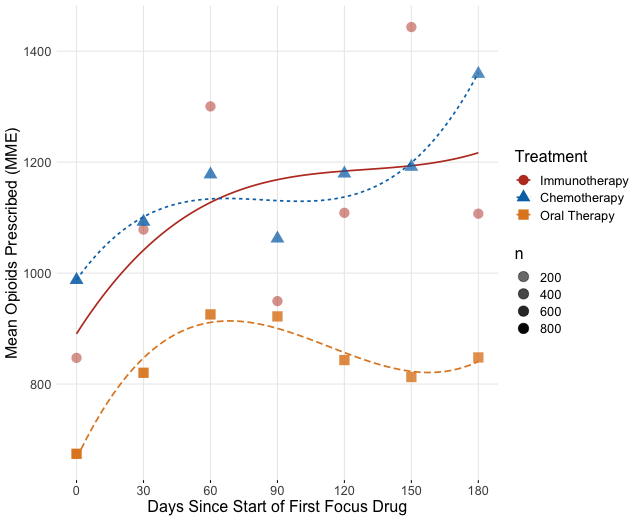

```{r setup, include=FALSE}
knitr::opts_chunk$set(
	echo = TRUE,
	message = FALSE,
	warning = FALSE
)
library(tidyverse)
library(tableone)
library(MatchIt)
library(ggplot2)
library(pander)
library(stats)
library(optmatch)
library(splines)
library(mgcv)
library(itsadug)
library(RColorBrewer)
library(CBPS)
library(ggpubr)

```


##Abstract

Medical insurance claims are becoming increasingly common data sources to answer a variety of questions in biomedical research. Although comprehensive in terms of longitudinal characterization of disease development and progression for a potentially large number of patients, population-based studies using these datasets require thoughtful modification to sample selection and analytic strategies, relative to other types of studies.  Along with complex selection bias and missing data issues, claims-based studies are purely observational, which limits effective understanding and characterization of the treatment differences between groups being compared. Several methods have been developed to better estimate causal treatment effects from observational studies, often using the propensity score in various ways. This paper offers some practical guidance to researchers in using propensity-based methods for estimating causal treatment effects on several types of outcomes common to medical studies, such as binary, count, time to event and longitudinally varying repeated measures outcomes. We provide an online version of the paper with readily implementable code to serve as a guided tutorial for practitioners. The methods are illustrated using a sub-cohort of patients with prostate cancer from the large Clinformatics TM Data Mart Database (OptumInsight, Eden Prairie, Minnesota), consisting of 73 million distinct insurees from 2001-2016. We demonstrate estimation for each type of outcome with examples from the data, such as emergency room (ER) visits and opioid prescription fills.


##Introduction

Health service billing data can be used to answer clinical and epidemiological questions using a large number of patients and has the potential to capture patterns in health care practice that take place in the real world. Such large datasets allow investigators to conduct scientific queries which may be difficult, if not practically impossible, to answer via a randomized clinical trial. For example, comparing multiple treatments that are produced by different drug companies and with varying guidelines for their use for a disease may only be feasible in a real healthcare database. Although these large data sources offer a wealth of information, there are many challenges and drawbacks, such as confounding, selection bias, heterogeneity, missing values and misclassification of disease and exposures. For example, ICD codes are entered by the care provider, and thus certain diagnoses may be missed or may not be accurate or may differ across providers.$^{[1]}$ Motheral et al$^{[2]}$ address many of the common issues and provide guidelines for researchers when using these data sources. Regulatory agencies and pharmaceutical companies are increasingly considering real world evidence present in such databases in concert with randomized clinical trials.$^{[3]}$

Often, researchers wish to characterize the effect that an exposure, intervention, or treatment has on a given outcome with this readily available type of data. When characterizing a treatment effect on an outcome, randomized control trials are the gold standard. Randomization aims to ensure that the treatment and control groups are similar and considered “exchangeable.” However, randomized clinical trials are often only able to reflect a narrow clinical application due to restrictive inclusion/exclusion criteria. Claims data have the benefit of reflecting how medications are actually being prescribed, and thus may provide a more accurate depiction of treatment benefit in practice or real life evidence. 
With claims data, the assignment of treatment is not random, and thus susceptible to confounding and selection bias. In practice, the clinician and patient decide among treatment options based on the patient’s circumstances and overall health. Further, these same factors may also be associated with the health outcome of interest. If not properly incorporated, these factors will misrepresent and bias the true treatment effect comparison. Many have proposed general guidelines for analysis using claims data for comparative effectiveness research to address such issues.$^{[3,4,5,6]}$ While there are several approaches to handling confounding and selection bias available, propensity score-based methods are versatile in that they can be used for a variety of research questions and can be used for many different kinds of study designs and databases. Thus, these methods have gained increasing popularity, especially for questions of comparative effectiveness in pharmacoepidemiologic and pharmacoeconomic research. 

A downside to this rise in popularity is that the assumptions and critical steps for the methods are often ignored or unreported. Ali et al$^{[7]}$ found 296 published medical papers in a 6-month period that reported use of a propensity score method. However, in their systematic review, they found that 194 (65.5%) did not report how variables were selected for the propensity model, and that only 177 (59.8%) reported test for balance of confounders between the two groups of comparison. Others have also noted common misuse of propensity methods.$^{[8,9,10,11]}$ Yao et al$^{[12]}$ concluded in a recent systematic review of cancer studies that there is considerable room for improvement in reporting propensity analysis and offered guidelines for such reporting. Yet, some researchers are still not clear with their use of propensity methods and its presentation in a scientific paper. For example, when comparing the effectiveness of allopurinol or febuxostat on reducing the risk of atrial fibrillation, Singh et al$^{[13]}$ matched subjects based on the propensity score. While they did report which variables were used for propensity construction and balance diagnostics after matching, many important details were not reported. Analysis questions arise, such as how the propensity score was calculated (logistic regression or otherwise), what distance measure was used to match subjects, and if subjects were matched with or without replacement. These details are essential for researchers wishing to replicate the results reported.  The lack of detailed reporting and frequent misuse of propensity methodology propels the need for more effective practical guidance. 

Austin$^{[14]}$ provides a conceptual overview of propensity score methods from a foundational and introductory standpoint. Stuart et al$^{[15]}$ provide a general framework for using propensity methods with observational health care data, providing an example of effect estimation of drug monitoring programs for individuals with serious mental illness. Additionally, Brookhart et al$^{[16]}$ provide practical example when comparing the risk of angioedema between two treatments for hypertension. While these papers offer an elegant and lucid exposition of the underlying principles, and are extremely important contribution to the literature, these overviews do not offer the reader complete practical guidance, as there remains a gap from methodological understanding to actual implementation. Further, these tutorials do not directly address the use of propensity methods for a range of outcomes common to medical research, such as non-continuous or correlated outcomes. For example, a researcher may be interested in if a rare adverse event occurs or not (categorical) or monitoring a patient’s disease progression over the course of several visits (correlated repeated measures).There are unique assumption and considerations when using propensity methods for these different types of outcomes beyond those use for a simple scalar outcome,
Therefore, there is need for a usable, simple and comprehensive tutorial for characterizing a binary treatment effect on various outcome types and accompanying software codes. This paper outlines the use of two primary propensity score-based methods: Propensity Matching (PM) and Inverse Probability of Treatment Weighting (IPTW). The paper also details how to use each method to estimate average treatment effect for four common outcome types: 1) Binary, 2) Count, 3) Time to event, and 4) Longitudinally varying repeated measures. 

To illustrate these different propensity score methods using an insurance claims dataset, we chose to study treatment patterns and treatment outcomes among patients with advanced prostate cancer from the Clinformatics TM Data Mart Database (OptumInsight, Eden Prairie, Minnesota). This database has a wealth of de-identified medical claims, pharmacy claims, inpatient confinement information, provider information, and socio-demographic information. Each outcome type is defined from emergency room visits, time on treatment and enrolled, and prescription fills for opioids.


##Background

Causal inference relies on the potential-outcomes framework, where each individual has a potential outcome under each possible treatment not assigned to him/her.$^{[17]}$ Typically, this framework applies to two possible available treatments, such as treatment of interest compared to another treatment for the same disease, or more simply an active treatment to no treatment. As described by Rubin,$^{[17,18]}$ many causal inference problems involve comparison of potential outcomes on the same (say  $i^{th}$) individual. Define $Y_{i}(0)$ as the observed outcome under the control treatment, and $Y_{i}(1)$ as the potential outcome under the active treatment of interest. We wish to know the treatment effect for each individual defined as $Y_{i}(1) - Y_{i}(0)$, which cannot be estimated directly from the observed data because for each individual we observe either  $Y_{i}(0)$ or $Y_{i}(1)$, but never both. If subject $i$ actually received the active treatment, denoted by $T_i=1$ then $Y_{i}(1)$ is observed and $Y_i =Y_{i}(1)$; otherwise, $T_i=0$, and we observe $Y_i=Y_{i}(0)$, under the stable unit treatment value assumption. Often, researchers are interested in how patients receiving a specific treatment compares to a comparison group within a larger population. We can define the average treatment effect (ATE) as $E[Y_{i}(1) - Y_{i}(0)]$,which is the average treatment effect across the entire population.19 In a randomized trial, we can estimate ATE as $E[Y_{i}(1) - Y_{i}(0)] = E[Y_i|T_i=1] - E[Y_i|T_i=0]$ as randomization ensures that the treatment groups are balanced and hence $E[Y_i(a)] = E[Y_i(a)|T_i=a] = E[Y_i|T_i=a]$ for all $a = 0,1$ 14,20 We can also define the average treatment effect on the treated (ATT) as $E[Y_i(1)− Y_i(0)|T = 1]$ and the average treatment effect on the control (ATC) as $E[Y_i(1)− Y_i(0)|T = 0]$ when a particular sub-population is of interest.

A simple approach to look at a difference in an outcome is a general linear model with the treatment variable as the sole predictor is

$$
g(\mu_{i}) = \beta_{0} +\beta_{1}T_{i}
$$
where $\mu_{i} = E[Y_{i}|T_i]$ and $\beta_1$ is the parameter of interest for treatment comparison. In the simple linear regression case where $g()$ is the identity function, $\beta_1 = E[Y_i|T_i=1] - E[Y_i|T_i=0]$. This is the standard method for data from a randomized trial. With observational studies, however, the mechanism behind treatment assignment is not random, and thus the treatment populations may differ greatly. Therefore $E[Y(1)|T = 1] \neq E [Y(1)]$ and $E[Y(0)|T = 0] \neq E [Y(0)]$ in general.14 As a result, the estimate for ATE will be biased due to confounding. Traditionally, confounders were adjusted for directly in the outcome model to obtain an estimate of ATE. However useful, estimates from this approach may be unreliable where there are many covariates with potential non-linearity and interactions, the groups of comparison are greatly imbalanced on one or several confounders, or the confounders are highly correlated. With the large number of variables seen in health care databases, this approach is often not feasible due to the large dimension of the adjusted model and the possibility of model misspecification. The notion of the propensity score, a unidimensional construct, offers alternative analytical approaches that are more suitable for this type of data. Using the propensity score in analysis involves several steps that have to be exercised with caution, as outlined in Figure 1. Below, we outline each step and demonstrate the process.

<center>


</center>


### Variable Indentification and the Propensity Score 
Proposed by Rosenbaum and Rubin,$^{[21]}$ the propensity score is  $e_{i}= Pr(T_{i} = 1| X_{i} =x)$ . The score can be interpreted as the probability a subject receives treatment  conditional on the covariates $X_{i}$. Rosenbaum and Rubin$^{[21]}$ showed that conditional on the propensity score, an unbiased estimate of ATE can be obtained if the treatment is strongly ignorable. A treatment is strongly ignorable if two conditions are met: 
1) $0 <P(T_{i}=1|X_{i})<1$ and $(Y_i(0),Y_i(1)) \perp \perp T_i|X_i$ $^{[21]}$

The second of these assumptions is the “no unmeasured confounders” assumption. Thus, a critical assumption for use of the propensity score is that all variables that affect the outcome and treatment assignment are measured. If all confounding variables are identified and included, and the model is correctly specified, this score achieves covariate balance between treatment and control groups. With the treatment groups more comparable, we can better characterize the treatment’s effect on the outcome of interest. We can estimate this probability using logistic regression, predicting treatment received from our observed covariates, expressed as
$$log\frac{e_{i}}{(1-e_{i})} = X_{i}^T\gamma$$ 
and thus 
$$e_{i} = \dfrac{1}{1+exp(-X_{i}^T\gamma)}$$

While logistic regression is commonly used to estimate this propensity score, researchers have expanded their attention beyond parametric models. Many have used machine learning methods such as boosted logistic regression, random forests, and neural networks.$^{[22,23,24]}$ Imai and Ratkovic$^{[25]}$ propose the Covariate Balancing Propensity Score (CBPS) as a generalized method of moments estimate that operationalizes on the propensity score’s two characteristics as a covariate balancing score and the conditional probability of treatment assignment, shown to perform well in certain applications.$^{[26]}$ We do note that the ultimate goal of the propensity model is not to predict treatment assignment, but to reduce bias by balancing covariates.$^{[27]}$

Still, the treatment effect estimation methods are sensitive to misspecification of the propensity score model, and thus the variables and their functional forms used in this model can affect the estimation of average treatment effect. Many suggest including all variables at all associated with the outcome, while excluding those only associated with the treatment of interest, based on subject-matter knowledge$^{[16,28,29,30]}$ Vanderweele$^{[31]}$ provides a general guide to confounder selection in observational studies. Such variables may be difficult to identify in large databases, and thus several authors have proposed automated data-adaptive variable selection tools for high-dimensional propensity score models.$^{[32,33]}$ This paper focuses on estimation of the propensity score through logistic regression and CBPS with a modest number of covariates


###Propensity Methods
Once the propensity score is constructed, there are four basic ways to use the score in treatment effect estimation: 1) Stratification based on the propensity score, 2) Direct covariate adjustment using propensity score as a covariate in the outcome model, 3) Matching treatments and controls based on the propensity score (PM), and 4) Inverse probability treatment weighting on the propensity score (IPTW). Stratification ranks subjects by the estimated propensity score and splits them into mutually exclusive stratum. The treatment effect in each stratum can then be estimated and pooled to obtain an overall treatment effect.34 Direct covariate adjustment uses the propensity score in the outcome model as a covariate, often a non-parametric smoothing term using a spline function with the propensity score as an argument is used. We will not discuss the first two methods at length, as they are used less commonly, and research suggests they may be biased for non-continuous outcomes.35,36 The rest of this paper will focus on the more common methods, PM and IPTW.

####Propensity Matching

The first method discussed is matching observations based on the propensity score to estimate ATT. Often, exactly identical scores do not exist across individuals, and thus matching requires a clear definition of “closeness” of propensity based on a measure of distance.$^{[37,38]}$ Stuart$^{[38]}$ provides a comprehensive overview of the various matching methods available. In practice, it is common to do $1:1$ matching, where each individual in the treatment group is matched to a single individual in the comparison group, based on the predefined measure of closeness. This matching ratio can result in major loss of data, especially if the treatment groups are of very different sizes. An alternative is using $1:k$ matching, where $k$ is a max number of controls. With a defined distance, called a caliper, all potential matches within the distance up to $k$ will be matched. This allows for maximal efficiency of data while still reducing bias since all close matches are kept. There is little guidance on what caliper a researcher should specify; however, Austin$^{[39]}$ suggests a caliper of $0.2$ standard deviations of the logit of the propensity score as a default choice that works well across scenarios. 


####Inverse Probability of Treatment Weighting (IPTW)
The next method we consider is the inverse probability of treatment (IPTW) proposed by Rosenbaum.40 We can calculate the IPTW  $v_i$ as
$$
v_{i} = \dfrac{T_{i}}{\hat{e}_{i}} + \dfrac{(1-T_{i})}{(1-\hat{e}_{i})}
$$
where $\hat{e_i}$ is the estimated propensity score. The outcome model can be fit directly using these weights, similar to survey sample weighting.$^{[41,42]}$ These weights can be very unstable for extreme values of $\hat{e_i}$, so trimming these values away from the extreme is often practiced.$^{[43,44]}$ The construction of weights used here estimates ATE, and different constructions can be used for ATT and other effect estimates of interest.$^{[45]}$


###Balance Assessment

Before analyzing the outcome, it is good practice to check to see if the chosen propensity method achieved its goal of balancing the covariates. While there are several balance diagnostics a common balance diagnostic originally proposed by Rosenbaum and Rubin$^{[47]}$ is the standardized difference (or standardized bias) for $1:1$ matching, defined as
$$
  \frac{\bar{x}_{t} - \bar{x}_{c}}{s_{p}}
$$
This is the difference in mean value of the covariate in the treatment group vs. the control group, adjusting for variability, where $s_{p}$ is the pooled standard deviation defined as $s_{p}=\sqrt{\frac{s_{t}^2 +s_{c}^2}{2}}$.$^{[47,48]}$ This value is calculated for each covariate, with values closer to zero indicating less bias. The measure can be calculated for both continuous and categorical indicator variables.$^{[4,48]}$ A lack of balance indicates that the propensity model may be incorrect, or that a different method should be used. There is no generally accepted threshold, although some suggest that the standardized difference should not be greater than  $|0.1|$ $^{[47,48]}$ We can generalize this difference for $1:k$ matching and assessing balance when using IPTW by using weights when calculating the means and standard deviations.$^{[49]}$ The weighted mean is defined as   $\bar{x}_{w} = \frac{\sum w_{i}x_{i}}{\sum w_i}$ and the weighted standard deviaion is $$
s_{w} = \sqrt{\dfrac{\sum w_{i}(x_i - \bar{x}_{w})^2}{\frac{\sum w_{i}}{(\sum w_i)^2 - \sum {w_i}^2}}}
$$ where $w_i$ is the weight for subject $i$. For $1:1$ matching, all observations have equal weight. If 1:k matching is used, observations in the control treatment group have $1/k$ weights and treated observations have weights $1$. For IPTW, the calculated weights can be used, so $v_i = w_i$ for each observation. If sufficient balance is not met, the process of propensity score construction and balance assessment is repeated, changing to the propensity model or matching methods used. 


###Treatment Effect Estimation and Sensitivity Analysis

Once sufficient balance has been achieved, one can estimate the average treatment effect using a general outcome model
$$
g(\mu_{i}) = \beta_{0} +\beta_{1}T_{i}
$$

This model can be used directly on the matched dataset if $1:1$ matching is used. If $1:k$ matching or IPTW is used, the constructing weights need to be used as well. Weights can be incorporated in the same fashion as weights from a survey design, using robust standard error estimation to account for error in weight estimation.$^{[41,42]}$ One can also test how sensitive the results are to unobserved confounders. We will not demonstrate such sensitivity analyses tools, however, Liu et al$^{[50]}$ provide an overview of these approaches.


#Example:Comparing Oral Hormone Therapy vs. Immunotherapy for Advanced Prostate Cancer

Many patients with advanced prostate cancer will receive a number of different therapies sequentially to try to control the disease and symptoms. Patients may have varying degrees of responsiveness and tolerance to different therapies during the period of treatment. For example, some patients who experience pain from their cancer will have pain relief after starting a treatment and thus require less opiates to manage their cancer. On the other hand, some patients will have poor tolerance of specific therapies and may experience exacerbation or development of comorbid conditions. It is also important to note that a treatment is typically only continued for as long as it is effectively controlling the disease or symptom. Thus, the longer a patient is on a treatment, presumably the longer the duration of effective disease control on that treatment. 

We defined a cohort of men who received treatment for advanced prostate cancer, based on receiving one of six focus medications known to have a survival benefit in men with advanced prostate cancer (abiraterone, enzalutamide, sipuleucel-T, docetaxel, cabazitaxel, radium-223) from January 2010 through June 2016 from the Clinformatics TM Data Mart Insurance Claims Database. The initial cohort included any patient over the age of 18 with a diagnosis of malignant neoplasm of the prostate, coded as “185” in ICD-9 and “C61” in ICD-10. We restricted our final cohort to include patients that were continuously enrolled in the plan for the 180 days before the first medication claim. Finally, we wished to compare first-line therapies between patients where first-line treatment was defined as the first medication given of the six focus medications. We only kept only those whose first focus claim was abiraterone, enzalutamide, docetaxel, and sipuleucel-T, as the other two medications were rarely first-line and then categorized patients given abiraterone or enzalutamide as a common oral therapy group.


###Covariates

Age of the patient at the time of receipt of first-line treatment and patient sociodemographic variables were identified through enrollment records included in the OptumInsight database. A demographic-based analytical model is used by OptumInsight to derive many of the sociodemographic variables. The major data syndicator used is Knowledge-Based Marketing Solutions (KBM, Richardson, TX). Race was classified as white, black, Hispanic, or Asian. Geographic region of the patient was originally determined by their ZIP; however, this view of the data was encrypted so only a broader geographic region could be identified.
Diabetes, hypertension, cardiac arrhythmias, congestive heart failure (CHF), and osteoporosis, were the pre-existing comorbid diseases we included in our analysis. To identify a pre-existing comorbid disease rather than a comorbid condition that may have resulted from treatment, the presence of a pre-existing comorbid disease was defined as at least two diagnosis codes within the two years before receipt of the first-line drug.  The ICD-9 (2008-2012) and ICD-10 (2013-2016) codes are from Elixhauser Comorbidity Index and Clinical Classification Software.$^{[51,52]}$ Table 1 shows the descriptive characteristics of each of these variables across the three primary treatment groups.


###Outcomes

We chose three different types of outcomes that are typically extracted from a claims database. We defined a binary outcome to be whether the patient had any emergency room (ER) visit within 60 days of the first pharmacy claim of the focus medications and used the number of ER visits each patient had within 180 days from the first pharmacy claim as a count outcome. ER visits were identified using Current Procedural Terminology (CPT) codes. 

We were also interested in the overall survival of patients; however, exact death dates were unavailable with this version of the data. We thus considered two other time to event outcomes as possible surrogates: time on treatment and time enrolled.  Time on treatment was defined as the time from start of first medication to the last claim of any of the six focus medications, thus the event is stopping all focus treatment permanently.  Time enrolled was defined as the time from start of the first medication to the last claim for that subject within the Clinformatics TM Data Mart Database for any medical-related issue. This definition of time enrolled could be considered a censored surrogate for death because we expect most patients to have medical needs until shortly before death.  These two endpoints differ in that some individuals may have stopped treatment from a focus medication, yet still used medical services and managed pain beyond ending treatment, while others may have been treated continuously until death. Patients would be expected to have less total time on treatment if they had a highly resistant cancer that would not respond to any treatments (and thus treatments would not be continued if they were ineffective), or if they had severe toxicities to treatment that did not allow for continuation. Also, these endpoints differed across treatment groups, with those on oral therapy continuing treatment near the end of enrollment, whereas chemotherapy patients may stop a year or more before ending enrollment.  

For the final longitudinal varying repeated measures outcome, we used opioid usage over time, calculated using prescription drug pharmacy claims. Common opioid drug types were identified and were converted into morphine milligram equivalents (MME) according to the Center for Disease Control conversion factors.53 The total (MME) supply prescribed was calculated in 30-day periods, starting with the 30 days before the first-line of treatment, which was used as a baseline, and continuing at 30-day intervals for the duration of claims data available. Many patients with metastatic prostate cancer have pain from their disease that require opiates for pain control. Therefore, the level of MMEs may be a surrogate measure for disease burden, and disease response to treatment. Table 2 shows the descriptive summary of each of these outcome variables across the three primary treatment groups.


##Propensity Analysis

Empirically identifying the optimal sequence of therapies through disease course is a complex problem due to sparse sample size, once defining groups by specific orders of treatments and censoring. To determine which first-line treatment may lead to better outcomes regardless of which treatments a patient receives subsequently, we classified patients into one of the three categories of treatment that were prescribed first-line: oral therapy (abiraterone or enzalutamide), chemotherapy (docetaxel), or immunotherapy (sipuleucel-T). Since cabazitaxel and radium-223 were used infrequently as first-line treatments (n=110), we did not include patients who received cabazitaxel or radium-223 first-line in our analysis. We compared immunotherapy to oral therapy and compared immunotherapy to chemotherapy in two separate analyses. We chose immunotherapy as the reference group for both analyses, as it is the only treatment among the four included in the final analysis for which there is a clear treatment recommendation to be used in patients with minimally to asymptomatic metastatic castration-resistant prostate cancer. Our step-by-step example will primarily focus on the analysis process comparing immunotherapy to oral therapy. From Table 1, we can see that some covariates aren’t distributed the same across groups, such as income and provider specialty. 


We can load all data into an active r session:
```{r data, echo=TRUE}
#patient firsline information and demographic information
load('./firstline.Rdata')
#patient opioid filling information
load('./firstline_opioid.Rdata')
#change factor labels for better interpretability 
firstline_opioid$Treatment <-factor(firstline_opioid$Brand,labels = c("Immunotherapy","Chemotherapy","Oral Therapy"))

firstline_single$Treatment <-factor(firstline_single$Brand,labels = c("Immunotherapy","Chemotherapy","Oral Therapy"))
#alternative dataset for opioids, where 0's are filled in for all patient time points where no opioids were recorded
load("./firstline_zero.Rdata")

#we can explore and check the datasets
#check the size
dim(firstline_single)

#column names and the order
colnames(firstline_single)

#load package that makes convenient discriptive summary
library(tableone)
#descriptive summaries 
print(CreateTableOne(vars=c("agecat"),strata=c("Treatment"),data=firstline_single,factorVars = c("agecat"),test=FALSE))

```

###Propensity Score Estimation

We can construct a model for treatment assignment, $T_{i}=0$ if immunotherapy was given and $T_{i}=1$ if oral therapy was given using logistic regression, and the CBPS method. The logistic regression model included all variables shown in Table 1 as covariates and was constructed using the package *logistf*$^{[54]}$ that uses Firth-corrected logistic regression to address any separation issues. From the regression results, we can calculate the estimated propensity score for each subject. It is often helpful to plot the distribution of propensity scores between the two groups of comparison, as shown in Figure 2, especially if matching subjects based on the propensity score. If there is little or no overlap in the distributions, many subjects will not be included in analysis as matches will not be found. The propensity score constructed from the CBPS approach was implemented through the R package *CBPS*.$^{[25]}$ The weights from this propensity score were used in the outcome models similar to the inverse probability weights.


```{r propensity_construction, echo=TRUE, warning=FALSE}

library(tidyverse)

#create subsets for treating oral therapy and immunotherapy separately
oral<-firstline_single[firstline_single$pae<99,]
oral$treatment<-oral$pae

#restrict to subjects that were enrolled for at least 60 days for our 60 day outcome
oral60<-oral %>%
  filter(enrolltime >=60)


#calculate propensity score using logistic regression model
prop_model <-glm(treatment~agecat+racecat+educat+housecat+Division+Product+met+Aso+diabetes+
  hypertension+CHF+osteoporosis+arrythmia+uro,data=oral60,family=binomial(link="logit"))

#save predicted scores to dataset
oral60$pr_score <-predict(prop_model,type="response")


```


```{r ps plot}
library(ggplot2)
library(ggpubr)
#this plots the distribution of our estimated propensity scores
g<- ggplot(oral60,aes(x = pr_score, color=Treatment,fill=Treatment)) +
  geom_density(alpha=.47) + 
  xlab("Estimated Probability of Recieving Oral Therapy") +
  ylab ("Density") +theme_minimal()+ theme(
                           axis.ticks.y=element_blank(),
                         panel.grid.minor=element_blank(),
                         legend.title=element_blank(),
                         text = element_text(size=16),
                         axis.title.x =element_text(hjust = 0.2,size=16))
```
```{r plot_1, eval=FALSE}
ggpar(g,palette="nejm")

```

<center>

</center>

```{r cbps, echo=TRUE}
library(CBPS)
#calculate weights using CBPS package and function
cbpsoral <-CBPS(treatment~agecat+racecat+educat+housecat+Division+Product+met+Aso+diabetes+
  hypertension+CHF+osteoporosis+arrythmia+uro,data=oral60,standardize=FALSE,method="exact",ATT=1)

oral60$cbps <-cbpsoral$weights
```

###Propensity Score Matching
To create a matched dataset, we used the R package *Matchit*.$^{[55]}$ We defined our distance with logistic regression using the “nearest neighbor” method select matches within a defined caliper distance of $0.2$ standard deviations of the logit propensity score, with a variable matching ratio of $1:4 within the defined caliper. These matching specifications were chosen to ensure maximal efficiency of this data. If multiple close matches existed for a subject in the control group, those subjects were retained in the matched dataset. The caliper was decided using an iterative process, where several calipers were assessed and the one providing the highest quality matched sample was kept, based on the standardized differences across the covariates.

```{r matching, echo=TRUE, message=FALSE, warning=FALSE}
#create matched dataset based on same propensity model
#here we switched the outcome, as matchit requires the larger group to be the reference if variable ratio is being used
#We are capturing up to 4 oral therapy matches for every sipuleucel-T subject
matched <- matchit((1-treatment)~agecat+racecat+educat+housecat+Division+Product+met+Aso+diabetes+
  hypertension+CHF+osteoporosis+arrythmia+uro,data =oral60, method = "nearest",caliper=.2,ratio=4)

#looked at characteristics of matched object
matched_sum<-summary(matched)
matched_sum$nn

#save matched dataset
matched_oral <- match.data(matched)
```


###Inverse Probability Treatment Weighting
Weights were created from both the logistic regression and CBPS estimated propensity scores using the formula described above. Some weights were unstable, so propensity scores greater that $0.99$ were trimmed to $0.99$, and scores below $0.01$ were trimmed to $0.01$. Trimmed weights were used for analysis.

```{r ps_trim, echo=TRUE, message=FALSE, warning=FALSE}

#trim extreme values for stability
oral60$pr_score_trim <-if_else(oral60$pr_score<.01,.01,oral60$pr_score)
oral60$pr_score_trim <-if_else(oral60$pr_score>.99,.99,oral60$pr_score_trim)

#save the inverse weights from the propensity score
oral60$IPTW <-oral60$treatment/oral60$pr_score_trim + (1-oral60$treatment)/(1-oral60$pr_score_trim)
```

###Assessment of Covariate Balance
Each method can be assessed for successful reduction in standardized difference for the analysis sample. Figure 3 shows a plot of the standardized difference of the covariates between the immunotherapy group, and oral therapy group for CBPS, IPTW and propensity matching methods. We can see that the inverse weighted data and the matched sample reduced the standardized difference for many covariates, even if perfect balance was not achieved. Unsurprisingly, the CBPS weights have very low/no bias, as the weights are constructed to achieve this goal of exact matching. With balance among the covariates achieved, we can now begin treatment effect estimation.
```{r balance plot, echo=TRUE, message=FALSE, warning=FALSE}
###################figure
#for forest plot to check the standardized differences
#create dummy variables for the many categorical variables
model_mat <-model.matrix(~treatment +agecat+racecat+educat+housecat+Division+Product+met+Aso+diabetes+
  hypertension+CHF+osteoporosis+arrythmia+uro -1,oral)

model_mat <-data.frame(model_mat)


#calculate means and standard deviations of each variable by group
fullsamp_means <-model_mat %>%
  group_by(treatment) %>%
  summarise_all(funs(mean))

fullsamp_var <-model_mat %>%
    group_by(treatment) %>%
  summarise_all(funs(sd))

fullsamp_std <-data.frame(t(fullsamp_var))
fullsamp_std$pooled <- sqrt(((fullsamp_std[,1])^2 + (fullsamp_std[,2])^2)/2)

fullsamp<-data.frame(t(fullsamp_means),fullsamp_std$pooled)

#calculate the standardized difference of the observed sample
colnames(fullsamp)<-c("sip_mean","oral_mean","sd")
fullsamp$bias <-(as.numeric(as.character(fullsamp$sip_mean))-as.numeric(as.character(fullsamp$oral_mean)))/as.numeric(as.character(fullsamp$sd))
fullsamp$group <-rep("Observed",nrow(fullsamp))
fullsamp$label <-rownames(fullsamp)


######matched group
#same calculations, now for the saved matched dataset
model_mat <-model.matrix(~treatment +agecat+racecat+educat+housecat+Division+Product+met+Aso+diabetes+
  hypertension+CHF+osteoporosis+arrythmia+uro+weights -1,matched_oral)

model_mat <-data.frame(model_mat)

matched_means <-model_mat %>%
  group_by(treatment) %>%
  summarise_all(funs(weighted.mean(., weights)))

matched_var <-model_mat %>%
  group_by(treatment) %>%
  summarise_all(funs(sqrt(sum(weights*(.-weighted.mean(., weights))^2/((n()-1)/n()*sum(weights))))))

matched_std <-data.frame(t(matched_var))
matched_std$pooled <- sqrt(((matched_std[,1])^2 + (matched_std[,2])^2)/2)

matched<-data.frame(t(matched_means),matched_std$pooled)

#remove the last row of our dataframe which contains the weights
matched<-matched[-nrow(matched),]

colnames(matched)<-c("sip_mean","oral_mean","sd")
matched$bias <-(as.numeric(as.character(matched$sip_mean))-as.numeric(as.character(matched$oral_mean)))/as.numeric(as.character(matched$sd))
matched$group <-rep("Matched",nrow(matched))
matched$label <-rownames(matched)


#####IPTW Group
#same calcuation using the inverse probability weights
model_mat <-model.matrix(~treatment +agecat+racecat+educat+housecat+Division+Product+met+Aso+diabetes+
  hypertension+CHF+osteoporosis+arrythmia+uro+IPTW -1,oral60)

model_mat <-data.frame(model_mat)
#model_mat$treatment <-as.factor(model_mat$treatment)


weighted_means <-model_mat %>%
  group_by(treatment) %>%
  summarise_all(funs(weighted.mean(., IPTW)))

weighted_var <-model_mat %>%
  group_by(treatment) %>%
  summarise_all(funs(sqrt(sum(IPTW*(.-weighted.mean(., IPTW))^2/((n()-1)/n()*sum(IPTW))))))

weighted_std <-data.frame(t(weighted_var))
weighted_std$pooled <- sqrt(((weighted_std[,1])^2 + (weighted_std[,2])^2)/2)

weighted<-data.frame(t(weighted_means),weighted_std$pooled)

#remove the last row of the dataframe 
weighted<-weighted[-nrow(weighted),]

colnames(weighted)<-c("sip_mean","oral_mean","sd")
weighted$bias <-(as.numeric(as.character(weighted$sip_mean))-as.numeric(as.character(weighted$oral_mean)))/as.numeric(as.character(weighted$sd))
weighted$group <-rep("Logistic IPTW",nrow(weighted))
weighted$label <-rownames(weighted)


#####CBPS Group
#same calculations using the covariate balance propensity score weights

model_mat <-model.matrix(~treatment +agecat+racecat+educat+housecat+Division+Product+met+Aso+diabetes+
  hypertension+CHF+osteoporosis+arrythmia+uro+cbps -1,oral60)

model_mat <-data.frame(model_mat)
#model_mat$treatment <-as.factor(model_mat$treatment)


cbps_means <-model_mat %>%
  group_by(treatment) %>%
  summarise_all(funs(weighted.mean(., cbps)))

cbps_var <-model_mat %>%
  group_by(treatment) %>%
  summarise_all(funs(sqrt(sum(cbps*(.-weighted.mean(., cbps))^2/((n()-1)/n()*sum(cbps))))))

cbps_std <-data.frame(t(cbps_var))
cbps_std$pooled <- sqrt(((cbps_std[,1])^2 + (cbps_std[,2])^2)/2)

balanced<-data.frame(t(cbps_means),cbps_std$pooled)

#remove last row containing weights
balanced<-balanced[-nrow(balanced),]

colnames(balanced)<-c("sip_mean","oral_mean","sd")
balanced$bias <-(as.numeric(as.character(balanced$sip_mean))-
                   as.numeric(as.character(balanced$oral_mean)))/as.numeric(as.character(balanced$sd))
balanced$group <-rep("CBPS IPTW",nrow(balanced))
balanced$label <-rownames(balanced)


#construct plot data frame from all calculations
plot_data <-rbind(fullsamp,matched,weighted,balanced)


#change label names for presentation purposes
plot_data$label <-c("Sip","Age: <55","Age: 55-64","Age: 65-74","Age: >74","Race: Asian","Race: Black","Race: Hispanic", "Race: Unknown","Educaton: Some College","Education: Unknown","Income: 50-99K", "Income: >99k", "Income: Unknown","Region: East South Central","Region: Middle Atlantic", "Region: Mountain","Region: New England","Region: Pacific","Region: South Atlantic","Region: Unknown","Region: West North Central","Region: West South Central","Product: Other","Product: PPO","Metastatic: Yes","ASO: Yes","Diabetes: Yes","Hypertension: Yes","CHF: Yes","Osteoporosis: Yes","Arrhythmia: Yes","Provider: Urologist")


#remove row where bias is infinite because there are no subjects in control group
'%!in%' <- function(x,y)!('%in%'(x,y))
plot_data <-plot_data %>%
  filter(label %!in% c("Sip","Region: Unknown","treatment"))


library(ggplot2)
library(ggpubr)
library(ggsci)
#visual inspect covariate balance using ggplot
fp <- ggplot(data =plot_data,aes(x=label, y=bias,color=group,shape=group)) +
  scale_shape_manual(values=c(20,18,17,15))+ 
    geom_hline(yintercept=-0.1, lty=3,size=0.7) + 
  geom_hline(yintercept=0.1,lty=3,size=0.7) + #these lines indicate the thresholds for high differences

  geom_point(size=5) + 
  geom_hline(yintercept=0, lty=2) +  # add a dotted line at x=1 after flip
  coord_flip() +  # flip coordinates (puts labels on y axis)
  xlab("Variable") + ylab("Standardized Difference") + 
  theme_minimal()+ theme(
                           axis.ticks.y=element_blank(),
                         panel.grid.minor=element_blank(),
                         legend.title=element_blank(),
                         text = element_text(size=16),
                         axis.title.x =element_text(hjust = 0.2,size=16)) #additional aesthetic options
```
```{r plot3, eval=FALSE}
ggpar(fp,palette="nejm")

```

<center>

</center>

##Treatment Effect Estimation

###Binary Outcome: Visit to the Emergency Room (ER) in 60 days


The first outcome of interest is whether a patient had an emergency room (ER) visit within the first 60 days of starting their treatment. Let $Y_{i}=1$ if the $i-th$ patient had an ER visit within the first 60 days of starting their first treatment, and $Y_{i}=0$ if not. Thus,  $\pi_{i}(1)$ is the probability an individual had an ER visit if they received oral therapy as first-line treatment, and $\pi_{i}(0)$ if they received the immunotherapy (sipuleucel-T). We are interested in the ratio of the odds a patient had an ER visit when treated with oral therapy to the odds a patient had an ER visit when treated with immunotherapy. We can model this odds ratio using a logistic regression model:


$$
log(\dfrac{\pi_{i}}{1-\pi_{i}}) =  \beta_{1}T_{i} 
$$
Where $e^{\beta_{1}}$ is the odds ratio and thus $\pi_i$ is the probability of having an ER visit for subject $i$. This model provides the odds ratio directly from the observed data prior to our using any of the bias reduction techniques or or adjustments.


```{r ae_er60_unad, echo=TRUE}
#model the unadjusted treatment effect
mod_unad <-glm(er60~treatment,data=oral60,family=binomial(link=logit))
#summarize model results
summary(mod_unad)

#hard to interpret results because they are still on natural log scale
#here is a quick function to exponentiate  and report estimate and confidence interval
exp_out <-function(model_object){
  out<-matrix(nrow=1,ncol=3)
    out[1,1] <-round(exp(summary(model_object)$coefficients[2,1]),2)   
    out[1,2] <-round(exp(summary(model_object)$coefficients[2,1] - 1.96*summary(model_object)$coefficients[2,2]),2)
    out[1,3] <-round(exp(summary(model_object)$coefficients[2,1] + 1.96*summary(model_object)$coefficients[2,2]),2)
  colnames(out) <-c('OR','Lower','Upper')
  rownames(out)<-names(model_object$coefficients[2])
  print(out)
}

#now see odds ratio and confidence interval after expoentiation
exp_out(mod_unad)
```
 After running this model, we get an estimate of 0.75 (0.46,1.23), also reported in Table 3. This odds ratio indicates that patients treated with oral therapy first line had 0.75 times the odds of an ER visit in 60 days than immunotherapy patients, before making adjustments.  Next, we use the traditional covariate adjustment approach:

$$
log(\dfrac{\pi_{i}}{1-\pi_{i}}) =  \beta_{1}T_{i} +\beta_{2}X_{2i} + \beta_{3}X_{3i} + ...+ \beta_{k}X_{ki} 
$$
where the additional $X$'s are the variables thought to confound assignment of treatment, such as age, race, comorbidities, and the other variables as listed previously in Table 1. The interpretation of the odds ratio $e^{\beta_1}$ changes slightly 0.80 (0.47,1.36) as we are now modeling a conditional odds ratio versus the marginal odds ratio above. This odds ratio indicates that the odds of an ER visit in 60 days for the oral therapy group are 0.8 times the odds of an ER visit for the immunotherapy group, conditional on the adjustment covariates.
```{r ae_er60_adj, echo=TRUE}


#now modeling provenge adjusting for all covariates
#not a good choice when there are many covariates
mod_adj <-glm(er60~treatment+agecat+racecat+educat+housecat+Division+Product+met+Aso+diabetes+
  hypertension+CHF+osteoporosis+arrythmia+uro,data=oral60,family=binomial(link=logit))

exp_out(mod_adj)
```

Now we compare these results to our propensity methods. We can run the marginal logistic regression model on our propensity matched dataset, obtaining an estimate of 0.91 (0.54,1.53).  Notice the larger confidence interval, as the matching process reduced the sample size. 

```{r ae_er60_match, echo=TRUE}

#regular glm, but incorporating the weights from MATCHIT
mod_match <-glm(er60~treatment,data=matched_oral,family=binomial(link='logit'),weights = weights)

exp_out(mod_match)
```

```{r ae_er60_prop, eval=FALSE, include=FALSE}
library(mgcv)
mod_prop <-gam(er60~treatment+s(pr_score,k=4,m=3),data=oral60,family=binomial(link='logit'))

#same output function but for GAM model objects
exp_out_gam <-function(gam_model){
    out<-matrix(nrow=1,ncol=3)
    out[1,1] <-round(exp(gam_model$coefficients[2]),2)   
    out[1,2] <-round(exp(gam_model$coefficients[2] - 1.96*sqrt(gam_model$Ve[2,2])),2)
    out[1,3] <-round(exp(gam_model$coefficients[2] + 1.96*sqrt(gam_model$Ve[2,2])),2)
  colnames(out) <-c('Estimate','Lower','Upper')
  rownames(out)<-names(gam_model$coefficients[2])
  print(out)
}

exp_out_gam(mod_prop)
```
Finally, we can fit the outcome model on the full dataset, now weighting each observation by the IPTW from the propensity scores estimated through logistic regression and the CBPS. Here, we use the same marginal model, using the weights for robust standard error estimation as described previously. We did so by using the R package *survey*.$^{[56]}$ The estimates from these weighted models are 0.56 (0.26,1.23) and 0.55 (0.25 1.21). None of these ORs were statistically significant, indicating that there may not be a significant difference in the odds of an ER visits between these two treatment groups. When comparing immunotherapy and chemotherapy, the weighted logistic regression and CBPS estimates are 1.51 (0.87, 2.61) and 1.85 (1.12,3.05), suggesting that chemotherapy patients may have a greater odds of an ER visit.

```{r ae_er60_iptw, echo=TRUE}

library(survey)

#create survey object using IPTW weights
design.ps <- svydesign(ids=~1, weights=~IPTW, data=oral60)

mod_iptw<-svyglm(er60~treatment,design=design.ps,family=binomial(link='logit'))

exp_out(mod_iptw)

design.cbps <- svydesign(ids=~1, weights=~cbps, data=oral60)

mod_iptw<-svyglm(er60~treatment,design=design.cbps,family=binomial(link='logit'))

exp_out(mod_iptw)
```


```{r doc_er60, eval=FALSE, include=FALSE}
doc<-firstline_single[firstline_single$pdoc<99,]
doc$treatment<-doc$pdoc

doc60<-doc %>%
  filter(enrolltime >=60)

#will produce warning, but warning is not of concern 
matched <- matchit((1-treatment)~agecat+racecat+educat+housecat+Division+Product+met+Aso+diabetes+
  hypertension+CHF+osteoporosis+arrythmia+uro,data =doc60, method = "nearest",caliper=.2,ratio=4)

matched_sum<-summary(matched)
matched_sum$nn


matched_doc <- match.data(matched)

modfullgroup <-glm(er60~treatment,data=doc60,family=binomial(link=logit))
summary(modfullgroup)
exp_out(modfullgroup)

modfullgroup2 <-glm(er60~treatment+agecat+racecat+educat+housecat+Division+Product+met+Aso+diabetes+
  hypertension+CHF+osteoporosis+arrythmia+uro,data=doc60,family=binomial(link=logit))

exp_out(modfullgroup2)

matchedmodreg <-glm(er60~treatment,data=matched_doc,family=binomial(link='logit'),weights =weights)
exp_out(matchedmodreg)

propdoc <-glm(treatment~agecat+racecat+educat+housecat+Division+Product+met+Aso+diabetes+
  hypertension+CHF+osteoporosis+arrythmia+uro,data=doc60,family=binomial(link='logit'))

doc60$pr_score <-predict(propdoc, type = "response")

summary(doc60$pr_score)

doc60$pr_score_trim <-ifelse(doc60$pr_score<.01,.01,doc60$pr_score)
doc60$pr_score_trim <-ifelse(doc60$pr_score>.99,.99,doc60$pr_score_trim)

doc60$IPTW <-doc60$treatment/doc60$pr_score_trim + (1-doc60$treatment)/(1-doc60$pr_score_trim)

#prep <-gam(er60~treatment+s(pr_score,k=4,m=3),data=doc60,family=binomial(link='logit'))
#summary(prep)
#exp(prep$coefficients[2] +qnorm(c(0.5,0.025,0.975)) *(sqrt(prep$Vc[2,2]) ))


cbps <-CBPS(treatment~agecat+racecat+educat+housecat+Division+Product+met+Aso+diabetes+
  hypertension+CHF+osteoporosis+arrythmia,data=doc60,standardize=FALSE,method="exact",ATT=1)
doc60$CBPS <-cbps$weights

design.ps <- svydesign(ids=~1, weights=~IPTW, data=doc60)

mod_iptw<-svyglm(er60~treatment,design=design.ps,family=binomial(link='logit'))

exp_out(mod_iptw)

design.cbps <- svydesign(ids=~1, weights=~CBPS, data=doc60)

mod_iptw<-svyglm(er60~treatment,design=design.cbps,family=binomial(link='logit'))

exp_out(mod_iptw)

```

### Count Outcome: Number of Emergency Room (ER) visits in 180 days
Next, we model our count outcome, the number of ER visits, where $Y_i$ can take any positive integer values. We are interested in the difference in the expected number of ER visits between patients in the immunotherapy and oral therapy groups. We can model that difference as:
$$
log(\mu_{i}) = \beta _{0} + \beta_{1}T_{i} 
$$
where $\mu_{i}$ is the expected number of ER visits in 180 days from start of treatment. Thus,  $e^{\beta_{1}}$ can tell us the factor the expected counts differ as a risk ratio. All models we fit in the binary outcome can be fit in a similar fashion to this count outcome. One key change here is the Poisson model assumes the same parameter for the expected (mean) count and the variance; we can see from Table 1 that this assumption may not hold. Thus, we accounted for this relationship by changing the dispersion parameter in our models, allowing the variance to be a factor larger than the mean. Table 3 shows the results of each method for the count outcome. 

```{r ae_er180, echo=TRUE}
#filter data to those with at least 180 days of enrollment
oral180<-oral %>%
  filter(enrolltime >=180)

#use quasipoisson function to account for overdispersion
mod_unad <-glm(ercount180~treatment,data=oral180,family=poisson(link="log"))

exp_out(mod_unad)
```

```{r ae_er180_no, echo=TRUE}
modfullgroup2 <-glm(ercount180~treatment+agecat+racecat+educat+housecat+Division+Product+met+Aso+diabetes+hypertension+CHF+osteoporosis+arrythmia+uro,data=oral180,family=poisson(link="log"))

exp_out(modfullgroup2)

#similar matching process for this group, but slighlty different matching numbers

matched <- matchit((1-treatment)~agecat+racecat+educat+housecat+Division+Product+met+Aso+diabetes+
  hypertension+CHF+osteoporosis+arrythmia+uro,data =oral180, method = "nearest",caliper=.2,ratio=4)

matched_sum<-summary(matched)
matched_sum$nn


matched_ae <- match.data(matched)

matchedmodreg <-glm(ercount180~treatment,data=matched_ae,family=quasipoisson(link="log"),weights = weights)

exp_out(matchedmodreg)

propae <-glm(treatment~agecat+racecat+educat+housecat+Division+Product+met+Aso+diabetes+
  hypertension+CHF+osteoporosis+arrythmia+uro,data=oral180,family=binomial(link='logit'))

oral180$pr_score <-predict(propae, type = "response")

summary(oral180$pr_score)

oral180$pr_score_trim <-ifelse(oral180$pr_score<.01,.01,oral180$pr_score)
oral180$pr_score_trim <-ifelse(oral180$pr_score>.99,.99,oral180$pr_score_trim)

oral180$IPTW <-oral180$treatment/oral180$pr_score_trim + (1-oral180$treatment)/(1-oral180$pr_score_trim)


cbps <-CBPS(treatment~agecat+racecat+educat+housecat+Division+Product+met+Aso+diabetes+
  hypertension+CHF+osteoporosis+arrythmia+uro,data=oral180,standardize=FALSE,method="exact")
oral180$CBPS <-cbps$weights

design.ps <- svydesign(ids=~1, weights=~IPTW, data=oral180)

mod_iptw<-svyglm(ercount180~treatment,design=design.ps,family=poisson)

exp_out(mod_iptw)

design.cbps <- svydesign(ids=~1, weights=~CBPS, data=oral180)

mod_iptw<-svyglm(ercount180~treatment,design=design.cbps,family=poisson)

exp_out(mod_iptw)


```

The models show that we can expect the same number of ER visits for patients who receive an oral therapy first-line vs. those who receive immunotherapy. For example, the matched ratio estimate is 1.00 (0.59,1.71), indicating the expected number of ER visits is the same for both treatment groups. However, we see a different pattern when comparing immunotherapy to chemotherapy, the matched ratio is 1.70 (1.00, 2.90), indicating that patients on chemotherapy have more ER visits.

```{r doc_er180, eval=FALSE, include=FALSE}

doc180<-doc %>%
  filter(enrolltime >=180)

modfullgroup <-glm(ercount180~treatment,data=doc180,family=quasipoisson(link="log"))
summary(modfullgroup)
for(i in 2:length(modfullgroup$coefficients)){
  out <-data.frame(t(exp(summary(modfullgroup)$coefficients[i,1] +     qnorm(c(0.5,0.025,0.975)) * summary(modfullgroup)$coefficients[i,2])))
  colnames(out) <-c('OR','Lower','Upper')
  rownames(out)<-names(modfullgroup$coefficients[i])
  print(out)
}

modfullgroup2 <-glm(ercount180~treatment+agecat+racecat+educat+housecat+Division+Product+met+Aso+diabetes+hypertension+CHF+osteoporosis+arrythmia+uro,data=doc180,family=quasipoisson(link="log"))

for(i in 2:length(modfullgroup$coefficients)){
  out <-data.frame(t(exp(summary(modfullgroup2)$coefficients[i,1] +     qnorm(c(0.5,0.025,0.975)) * summary(modfullgroup2)$coefficients[i,2])))
  colnames(out) <-c('OR','Lower','Upper')
  rownames(out)<-names(modfullgroup2$coefficients[i])
  print(out)
}

matched <- matchit((1-treatment)~agecat+racecat+educat+housecat+Division+Product+met+Aso+diabetes+
  hypertension+CHF+osteoporosis+arrythmia+uro,data =doc180, method = "nearest",caliper=.2,ratio=4)

matched_sum<-summary(matched)
matched_sum$nn


matched_doc <- match.data(matched)

matchedmodreg <-glm(ercount180~treatment,data=matched_doc,family=quasipoisson(link="log"))
summary(matchedmodreg)
for(i in 2:length(matchedmodreg$coefficients)){
  out <-data.frame(t(exp(summary(matchedmodreg)$coefficients[i,1] +     qnorm(c(0.5,0.025,0.975)) * summary(matchedmodreg)$coefficients[i,2])))
  colnames(out) <-c('OR','Lower','Upper')
  rownames(out)<-names(matchedmodreg$coefficients[i])
  print(out)
}

propdoc <-glm(treatment~agecat+racecat+educat+housecat+Division+Product+met+Aso+diabetes+
  hypertension+CHF+osteoporosis+arrythmia+uro,data=doc180,family=binomial(link='logit'))

doc180$pr_score <-predict(propdoc, type = "response")

summary(doc180$pr_score)

doc180$pr_score_trim <-ifelse(doc180$pr_score<.01,.01,doc180$pr_score)
doc180$pr_score_trim <-ifelse(doc180$pr_score>.99,.99,doc180$pr_score_trim)

doc180$IPTW <-doc180$treatment/doc180$pr_score_trim + (1-doc180$treatment)/(1-doc180$pr_score_trim)

prep <-gam(ercount180~treatment+s(pr_score,k=4,m=3),data=doc180,family=quasipoisson(link="log"))
summary(prep)
exp(prep$coefficients[2] +qnorm(c(0.5,0.025,0.975)) *(sqrt(prep$Vp[2,2]) ))


dociptw<-glm(ercount180~treatment,data=doc180,family=quasipoisson(link="log"),weights=as.vector(IPTW))
summary(dociptw)
for(i in 2:length(dociptw$coefficients)){
  out <-data.frame(t(exp(summary(dociptw)$coefficients[i,1] +     qnorm(c(0.5,0.025,0.975)) * summary(dociptw)$coefficients[i,2])))
  colnames(out) <-c('OR','Lower','Upper')
  rownames(out)<-names(dociptw$coefficients[i])
  print(out)
}

cbps <-CBPS(treatment~agecat+racecat+educat+housecat+Division+Product+met+Aso+diabetes+
  hypertension+CHF+osteoporosis+arrythmia,data=doc180,standardize=FALSE,method="exact")
doc180$CBPS <-cbps$weights

doccbps <-glm(er60~treatment,data=doc180,family=quasipoisson(link="log"),weights=as.vector(CBPS))
summary(doccbps)
for(i in 2:length(doccbps$coefficients)){
  out <-data.frame(t(exp(summary(doccbps)$coefficients[i,1] +     qnorm(c(0.5,0.025,0.975)) * summary(doccbps)$coefficients[i,2])))
  colnames(out) <-c('OR','Lower','Upper')
  rownames(out)<-names(doccbps$coefficients[i])
  print(out)
}
```

###Length of Stay Outcomes: Time on Treatment and Time Enrolled
We will now discuss the time to events outcomes previously described. For each treatment group, we are interested in the risk of stopping treatment from the all of the six focus medications, and the risk of dropping out at any given time point. These risks, or hazards, can be estimated using a proportional hazards model 
$$
log(\dfrac{\lambda_{i}(t)}{\lambda_{0}(t)}) =  \beta_{1}T_{i} 
$$
where $\lambda_{0}(t)$ is the baseline hazard function for immunotherapy and $\lambda_{i}(i)$ is the hazard for treatment group $T_{i}$. Thus, $e^{\beta_{1}}$ is a hazard ratio of the two treatment groups being compared at the same time. We used the package *survival*$^{[57]}$ to fit the Cox proportional hazards models.

```{r time_ae, echo=TRUE}
library(survival)
library(survminer)
#create a factor variable of the treatment
oral$treat_f<-factor(oral$treatment,labels =c("Immuno","Oral"))

mod_unad <-survfit(Surv(enrolltime) ~ treat_f, data = oral)


#view Kaplan-Meier Estimates
mod_unad

#can also try fitting cox model to look at hazard ratios
#mod_unad_cox <-coxph(Surv(enrolltime) ~ treatment_fac, data = oral)

#estimates from cox model
#out <-exp(mod_unad$coefficients[1] +qnorm(c(0.5,0.025,0.975)) *(sqrt(mod_unad$var[1,1]) ))
#names(out) <-c("Estimate","Lower","Upper")
#round(out,2)
```
```{r survplot, echo=T, message=FALSE, warning=FALSE, results='hide'}
#We can also make a Kaplan-Meier Plot of all the enrollment data
#saved as a file, then reloaded into the markdwon
png(filename="./PS_survplot.png",height = 520,width = 640)
ggsurvplot(
    fit = mod_unad, 
    xlab = "Days Since Start of First Focus Drug", 
    ylab = "Overall survival probability",
    surv.median.line = "hv",
    risk.table = "absolute",
    conf.int = FALSE,
     palette = "nejm",
    xlim=c(0,1100),
    break.x.by=365,
    surv.plot.height=.6,
    legend.title="Treatment",
    legend.labs=c("Immunotherapy","Oral Therapy"))

dev.off()

```
<center>

</center>
Here, the matched estimate 1.15 (1.04,1.28) shows that patients who receive an oral therapy first-line were more likely to stop treatment at any given time than patients who received immunotherapy. In other words, patients who received an oral therapy first-line had a shorter total duration of time on all treatments than patients who received immunotherapy as their first-line therapy. Using the same method, patients who received chemotherapy as first-line had a hazard ratio of 1.36 (1.21,1.54) again, having a shorter duration of time on treatment than those patients who started with immunotherapy. In Table 3, we can see the estimates for the hazard ratios of ending enrollment as well, with 1.35 (1.28,1.42) comparing oral therapy to immunotherapy, and 1.31 (1.24,1.39) comparing chemotherapy to immunotherapy using the logistic IPTW method.


```{r time_ae_other, eval=FALSE, include=FALSE}

modfullgroup2 <- coxph(Surv(enrolltime)~provfac +agecat+racecat+educat+
                      housecat+Division+
                      Product+met+Aso+diabetes+
                      hypertension+
                      CHF+osteoporosis+arrythmia+
                      uro,data=ae)
summary(modfullgroup2)

exp(modfullgroup2$coefficients[1] +qnorm(c(0.5,0.025,0.975)) *(sqrt(modfullgroup2$var[1,1]) ))

matched <- matchit((1-treatment)~agecat+racecat+educat+housecat+Division+Product+met+Aso+diabetes+
  hypertension+CHF+osteoporosis+arrythmia+uro,data =ae, method = "nearest",caliper=.2,ratio=4)

matched_sum<-summary(matched)
matched_sum$nn


matched_ae <- match.data(matched)

matchedmodreg <-coxph(Surv(enrolltime) ~ provfac, data = matched_ae)
summary(matchedmodreg)

exp(matchedmodreg$coefficients[1] +qnorm(c(0.5,0.025,0.975)) *(sqrt(matchedmodreg$var[1,1]) ))

propae <-glm(treatment~agecat+racecat+educat+housecat+Division+Product+met+Aso+diabetes+
  hypertension+CHF+osteoporosis+arrythmia+uro,data=ae,family=binomial(link='logit'))

ae$pr_score <-predict(propae, type = "response")

summary(ae$pr_score)

ae$pr_score_trim <-ifelse(ae$pr_score<.01,.01,ae$pr_score)
ae$pr_score_trim <-ifelse(ae$pr_score>.99,.99,ae$pr_score_trim)

ae$IPTW <-ae$treatment/ae$pr_score_trim + (1-ae$treatment)/(1-ae$pr_score_trim)

prep <-coxph(Surv(enrolltime)~provfac+pspline(pr_score,df=2),data=ae)
summary(prep)

exp(prep$coefficients[1] +qnorm(c(0.5,0.025,0.975)) *(sqrt(prep$var[1,1]) ))

aeiptw<-coxph(Surv(enrolltime)~provfac,data=ae,weights = IPTW)

summary(aeiptw)

exp(aeiptw$coefficients[1] +qnorm(c(0.5,0.025,0.975)) *(sqrt(aeiptw$var[1,1]) ))

cbps <-CBPS(treatment~agecat+racecat+educat+housecat+Division+Product+met+Aso+diabetes+
  hypertension+CHF+osteoporosis+arrythmia+uro,data=ae,standardize=FALSE,method="exact")
ae$CBPS <-cbps$weights

aecbps <-coxph(Surv(enrolltime)~provfac,data=ae,weights = CBPS)
summary(aecbps)
exp(aecbps$coefficients[1] +qnorm(c(0.5,0.025,0.975)) *(sqrt(aecbps$var[1,1]) ))


#time on 6 drugs
modfullgroup <-coxph(Surv(enroll_drug) ~ provfac, data = ae)
summary(modfullgroup)
exp(modfullgroup$coefficients[1] +qnorm(c(0.5,0.025,0.975)) *(sqrt(modfullgroup$var[1,1]) ))


modfullgroup2 <- coxph(Surv(enroll_drug)~provfac +agecat+racecat+educat+
                      housecat+Division+
                      Product+met+Aso+diabetes+
                      hypertension+
                      CHF+osteoporosis+arrythmia+
                      uro,data=ae)
summary(modfullgroup2)

exp(modfullgroup2$coefficients[1] +qnorm(c(0.5,0.025,0.975)) *(sqrt(modfullgroup2$var[1,1]) ))

matched <- matchit((1-treatment)~agecat+racecat+educat+housecat+Division+Product+met+Aso+diabetes+
  hypertension+CHF+osteoporosis+arrythmia+uro,data =ae, method = "nearest",caliper=.2,ratio=4)

matched_sum<-summary(matched)
matched_sum$nn


matched_ae <- match.data(matched)

matchedmodreg <-coxph(Surv(enroll_drug) ~ provfac, data = matched_ae)
summary(matchedmodreg)

exp(matchedmodreg$coefficients[1] +qnorm(c(0.5,0.025,0.975)) *(sqrt(matchedmodreg$var[1,1]) ))

propae <-glm(treatment~agecat+racecat+educat+housecat+Division+Product+met+Aso+diabetes+
  hypertension+CHF+osteoporosis+arrythmia+uro,data=ae,family=binomial(link='logit'))

ae$pr_score <-predict(propae, type = "response")

summary(ae$pr_score)

ae$pr_score_trim <-ifelse(ae$pr_score<.01,.01,ae$pr_score)
ae$pr_score_trim <-ifelse(ae$pr_score>.99,.99,ae$pr_score_trim)

ae$IPTW <-ae$treatment/ae$pr_score_trim + (1-ae$treatment)/(1-ae$pr_score_trim)

prep <-coxph(Surv(enroll_drug)~provfac+pspline(pr_score,df=2),data=ae)
summary(prep)

exp(prep$coefficients[1] +qnorm(c(0.5,0.025,0.975)) *(sqrt(prep$var[1,1]) ))

aeiptw<-coxph(Surv(enroll_drug)~provfac,data=ae,weights = IPTW)

summary(aeiptw)

exp(aeiptw$coefficients[1] +qnorm(c(0.5,0.025,0.975)) *(sqrt(aeiptw$var[1,1]) ))

cbps <-CBPS(treatment~agecat+racecat+educat+housecat+Division+Product+met+Aso+diabetes+
  hypertension+CHF+osteoporosis+arrythmia+uro,data=ae,standardize=FALSE,method="exact")
ae$CBPS <-cbps$weights

aecbps <-coxph(Surv(enroll_drug)~provfac,data=ae,weights = CBPS)
summary(aecbps)
exp(aecbps$coefficients[1] +qnorm(c(0.5,0.025,0.975)) *(sqrt(aecbps$var[1,1]) ))
```


```{r time_doc, eval=FALSE, include=FALSE}
doc$provfac<-factor(doc$treatment,labels =c("Sip","Doc"))

modfullgroup <-coxph(Surv(enrolltime) ~ provfac, data = doc)
summary(modfullgroup)
exp(modfullgroup$coefficients[1] +qnorm(c(0.5,0.025,0.975)) *(sqrt(modfullgroup$var[1,1]) ))


modfullgroup2 <- coxph(Surv(enrolltime)~provfac +agecat+racecat+educat+
                      housecat+Division+
                      Product+met+Aso+diabetes+
                      hypertension+
                      CHF+osteoporosis+arrythmia+
                      uro,data=doc)
summary(modfullgroup2)

exp(modfullgroup2$coefficients[1] +qnorm(c(0.5,0.025,0.975)) *(sqrt(modfullgroup2$var[1,1]) ))

matched <- matchit((1-treatment)~agecat+racecat+educat+housecat+Division+Product+met+Aso+diabetes+
  hypertension+CHF+osteoporosis+arrythmia+uro,data =doc, method = "nearest",caliper=.2,ratio=4)

matched_sum<-summary(matched)
matched_sum$nn


matched_doc <- match.data(matched)

matchedmodreg <-coxph(Surv(enrolltime) ~ provfac, data = matched_doc)
summary(matchedmodreg)

exp(matchedmodreg$coefficients[1] +qnorm(c(0.5,0.025,0.975)) *(sqrt(matchedmodreg$var[1,1]) ))

propdoc <-glm(treatment~agecat+racecat+educat+housecat+Division+Product+met+Aso+diabetes+
  hypertension+CHF+osteoporosis+arrythmia+uro,data=doc,family=binomial(link='logit'))

doc$pr_score <-predict(propdoc, type = "response")

summary(doc$pr_score)

doc$pr_score_trim <-ifelse(doc$pr_score<.01,.01,doc$pr_score)
doc$pr_score_trim <-ifelse(doc$pr_score>.99,.99,doc$pr_score_trim)

doc$IPTW <-doc$treatment/doc$pr_score_trim + (1-doc$treatment)/(1-doc$pr_score_trim)

prep <-coxph(Surv(enrolltime)~provfac+pspline(pr_score,df=2),data=doc)
summary(prep)

exp(prep$coefficients[1] +qnorm(c(0.5,0.025,0.975)) *(sqrt(prep$var[1,1]) ))

dociptw<-coxph(Surv(enrolltime)~provfac,data=doc,weights = IPTW)

summary(dociptw)

exp(dociptw$coefficients[1] +qnorm(c(0.5,0.025,0.975)) *(sqrt(dociptw$var[1,1]) ))

cbps <-CBPS(treatment~agecat+racecat+educat+housecat+Division+Product+met+Aso+diabetes+
  hypertension+CHF+osteoporosis+arrythmia,data=doc,standardize=FALSE,method="exact")
doc$CBPS <-cbps$weights

doccbps<-coxph(Surv(enrolltime)~provfac,data=doc,weights = CBPS)

summary(doccbps)

exp(doccbps$coefficients[1] +qnorm(c(0.5,0.025,0.975)) *(sqrt(doccbps$var[1,1]) ))


#time on 6 drugs
modfullgroup <-coxph(Surv(enroll_drug) ~ provfac, data = doc)
summary(modfullgroup)
exp(modfullgroup$coefficients[1] +qnorm(c(0.5,0.025,0.975)) *(sqrt(modfullgroup$var[1,1]) ))


modfullgroup2 <- coxph(Surv(enroll_drug)~provfac +agecat+racecat+educat+
                      housecat+Division+
                      Product+met+Aso+diabetes+
                      hypertension+
                      CHF+osteoporosis+arrythmia+
                      uro,data=doc)
summary(modfullgroup2)

exp(modfullgroup2$coefficients[1] +qnorm(c(0.5,0.025,0.975)) *(sqrt(modfullgroup2$var[1,1]) ))

matched <- matchit((1-treatment)~agecat+racecat+educat+housecat+Division+Product+met+Aso+diabetes+
  hypertension+CHF+osteoporosis+arrythmia+uro,data =doc, method = "nearest",caliper=.2,ratio=4)

matched_sum<-summary(matched)
matched_sum$nn


matched_doc <- match.data(matched)

matchedmodreg <-coxph(Surv(enroll_drug) ~ provfac, data = matched_doc)
summary(matchedmodreg)

exp(matchedmodreg$coefficients[1] +qnorm(c(0.5,0.025,0.975)) *(sqrt(matchedmodreg$var[1,1]) ))

propdoc <-glm(treatment~agecat+racecat+educat+housecat+Division+Product+met+Aso+diabetes+
  hypertension+CHF+osteoporosis+arrythmia+uro,data=doc,family=binomial(link='logit'))

doc$pr_score <-predict(propdoc, type = "response")

summary(doc$pr_score)

doc$pr_score_trim <-ifelse(doc$pr_score<.01,.01,doc$pr_score)
doc$pr_score_trim <-ifelse(doc$pr_score>.99,.99,doc$pr_score_trim)

doc$IPTW <-doc$treatment/doc$pr_score_trim + (1-doc$treatment)/(1-doc$pr_score_trim)

prep <-coxph(Surv(enroll_drug)~provfac+pspline(pr_score,df=2),data=doc)
summary(prep)

exp(prep$coefficients[1] +qnorm(c(0.5,0.025,0.975)) *(sqrt(prep$var[1,1]) ))

dociptw<-coxph(Surv(enroll_drug)~provfac,data=doc,weights = IPTW)

summary(dociptw)

exp(dociptw$coefficients[1] +qnorm(c(0.5,0.025,0.975)) *(sqrt(dociptw$var[1,1]) ))

cbps <-CBPS(treatment~agecat+racecat+educat+housecat+Division+Product+met+Aso+diabetes+
  hypertension+CHF+osteoporosis+arrythmia,data=doc,standardize=FALSE,method="exact")
doc$CBPS <-cbps$weights

doccbps<-coxph(Surv(enroll_drug)~provfac,data=doc,weights = CBPS)

summary(doccbps)

exp(doccbps$coefficients[1] +qnorm(c(0.5,0.025,0.975)) *(sqrt(doccbps$var[1,1]) ))
```


```{r opioid_doc, eval=FALSE, include=FALSE}

doc<-firstline_opioid[firstline_opioid$pdoc<=1,]

doc$provfac<-factor(doc$pdoc,labels =c("Sip","Doc"))
doc$Patid <-as.factor(doc$Patid)
doc$t <-as.integer(doc$t)

doc <-doc[doc$t<=6,]

modfullgroup <-bam(monthtotal~provfac + s(t,by=provfac,k=3) +
             s(Patid, bs="re",m=1),
            data=doc)
summary(modfullgroup)

p <- plot_diff(modfullgroup, view="t", 
                 comp=list(provfac=c("Doc", "Sip")),
                 cond=list(Condition=1),
                 ylim=c(-1000,2000),
                 main="Doc-Sip",
                 col=rainbow(6)[6], 
                 rm.ranef=TRUE)

        print(paste(p$est[c(1,51,99)],p$est[c(1,51,99)] - p$CI[c(1,51,99)],p$est[c(1,51,99)] + p$CI[c(1,51,99)])) 


modfullgroup2 <-bam(monthtotal~provfac +agecat+racecat+educat+
              housecat+Division+
              Product+met+Aso+diabetes+
              hypertension+
              CHF+osteoporosis+arrythmia+
              uro + s(t,by=provfac,k=3) +
             s(Patid, bs="re",m=1),
            data=doc)
summary(modfullgroup2)


p <- plot_diff(modfullgroup2, view="t", 
                 comp=list(provfac=c("Doc", "Sip")),
                 cond=list(Condition=1),
                 ylim=c(-1000,2000),
                 main="Doc-Sip",
                 col=rainbow(6)[6], 
                 rm.ranef=TRUE)

        print(paste(p$est[c(1,51,99)],p$est[c(1,51,99)] - p$CI[c(1,51,99)],p$est[c(1,51,99)] + p$CI[c(1,51,99)])) 
  
  doc_matching <-doc %>%
    group_by(Patid) %>%
    filter(row_number()==1)
  
  doc_matching <-data.frame(doc_matching)
  
matched <- matchit(treatment~agecat+racecat+educat+housecat+Division+Product+met+Aso+diabetes+hypertension+CHF+osteoporosis+arrythmia+uro,data =doc_matching, method ="nearest",caliper=.2,ratio=4)

matched_sum<-summary(matched)
matched_sum$nn


matched_doc <- match.data(matched)

matched_ids <-unique(matched_doc$Patid)

m_doc <- doc %>%
  filter(Patid %in% matched_ids)
  
matchedmodreg <-bam(monthtotal~provfac + s(t,by=provfac,k=4) 
            +s(t,k=4) + s(Patid, bs="re",m=1),
            data=m_doc)
summary(matchedmodreg)

p <- plot_diff(matchedmodreg, view="t", 
                 comp=list(provfac=c("Doc", "Sip")),
                 cond=list(Condition=1),
                 ylim=c(-1000,2000),
                 main="Doc-Sip",
                 col=rainbow(6)[6], 
                 rm.ranef=TRUE)

        print(paste(p$est[c(1,51,99)],p$est[c(1,51,99)] - p$CI[c(1,51,99)],p$est[c(1,51,99)] + p$CI[c(1,51,99)])) 

propdoc <-glm(provfac~agecat+racecat+educat+housecat+Division+Product+met+Aso+diabetes+
  hypertension+CHF+osteoporosis+arrythmia+uro,data=doc_matching,family=binomial(link='logit'))

doc_matching$pr_score <-predict(propdoc, type = "response")

cbps <-CBPS(treatment~agecat+racecat+educat+housecat+Division+Product+met+Aso+diabetes+
  hypertension+CHF+osteoporosis+arrythmia+uro,data=doc_matching,standardize=TRUE,method="exact")
doc_matching$CBPS <-cbps$weights

doc_matching$pr_score_trim <-ifelse(doc_matching$pr_score<.01,.01,doc_matching$pr_score)
doc_matching$pr_score_trim <-ifelse(doc_matching$pr_score>.99,.99,doc_matching$pr_score_trim)

doc_matching$IPTW <-doc_matching$treatment/doc_matching$pr_score_trim + (1-doc_matching$treatment)/(1-doc_matching$pr_score_trim)

doc_matching$st_weight <-doc_matching$IPTW / mean(doc_matching$IPTW)

doc_matching <- doc_matching[,c(3,29:33)]

doc <-left_join(doc,doc_matching,by="Patid")

prep <-bam(monthtotal~provfac + s(t,by=provfac,k=3) + s(pr_score,k=4) +
             s(Patid, bs="re",m=1),
            data=doc)
summary(prep)

p <- plot_diff(prep, view="t", 
                 comp=list(provfac=c("Doc", "Sip")),
                 cond=list(Condition=1),
                 ylim=c(-1000,2000),
                 main="Doc-Sip",
                 col=rainbow(6)[6], 
                 rm.ranef=TRUE)

        print(paste(p$est[c(1,51,99)],p$est[c(1,51,99)] - p$CI[c(1,51,99)],p$est[c(1,51,99)] + p$CI[c(1,51,99)])) 

dociptw <-bam(monthtotal~provfac + s(t,by=provfac,k=3) + 
             s(Patid, bs="re",m=1),
            data=doc, weights = st_weight)

summary(dociptw)


p <- plot_diff(dociptw, view="t", 
                 comp=list(provfac=c("Doc", "Sip")),
                 cond=list(Condition=1),
                 ylim=c(-1000,2000),
                 main="Doc-Sip",
                 col=rainbow(6)[6], 
                 rm.ranef=TRUE)

        print(paste(p$est[c(1,51,99)],p$est[c(1,51,99)] - p$CI[c(1,51,99)],p$est[c(1,51,99)] + p$CI[c(1,51,99)])) 
        
doccbps <-bam(monthtotal~provfac + s(t,by=provfac,k=3) + 
             s(Patid, bs="re",m=1),
            data=doc, weights = CBPS)

summary(dociptw)


p <- plot_diff(doccbps, view="t", 
                 comp=list(provfac=c("Doc", "Sip")),
                 cond=list(Condition=1),
                 ylim=c(-1000,2000),
                 main="Doc-Sip",
                 col=rainbow(6)[6], 
                 rm.ranef=TRUE)

        print(paste(p$est[c(1,51,99)],p$est[c(1,51,99)] - p$CI[c(1,51,99)],p$est[c(1,51,99)] + p$CI[c(1,51,99)])) 

```


### Time Varying Outcome: Opioid Usage Post Treatment 

Lastly, in those patients who had an opioid prescribed at any time, we evaluated the longitudinally varying repeated measures outcome of opioids prescribed in MME per month for patients who had baseline opioid use before starting one of the focus treatments for their prostate cancer. Each patient included in this subset had baseline opioid prescriptions (30 days prior to start of treatment) as well as 180 days of opioids prescribed after initiation of treatment. The opioid prescriptions were defined in 30-day periods. Figure 3 shows the mean of each 30-day period across the three treatment groups, with a smooth showing the overall trend. 
```{r opioid_plot, echo=TRUE}
plot_data <-firstline_opioid %>%
  group_by(t,Brand) %>%
  summarise(mean = mean(monthtotal), std=sqrt(var(monthtotal)), n = n(),
            median = median(monthtotal), q1=quantile(monthtotal,.25),
            q3=quantile(monthtotal,.75)) %>%
  filter(t<=6)

plot_data$Treatment<-as.numeric(plot_data$Brand)
plot_data$Treatment<-factor(plot_data$Treatment,levels=c(1,2,3),labels = c("Immunotherapy","Chemotherapy","Oral Therapy"))
plot_data$provfac <-factor(as.numeric(plot_data$Brand),levels=c(1,2,3),labels=c("Sip","Doc","AE"))
plot_data$t <- plot_data$t*30

plot_all <-firstline_opioid %>%
  dplyr::select(t,Brand,monthtotal) %>%
  filter(t<=6)

plot_all$Treatment<-as.numeric(plot_all$Brand)
plot_all$Treatment<-factor(plot_all$Treatment,levels=c(1,2,3),labels = c("Immunotherapy","Chemotherapy","Oral Therapy"))
plot_all$provfac <-factor(as.numeric(plot_all$Brand),levels=c(1,2,3),labels=c("Sip","Doc","AE"))

plot_all$mean <-plot_all$monthtotal

#plot_data <-plot_data[plot_data$Brand!="DOC",]

p <-ggplot(plot_data,aes(x=t,y=mean,group=Treatment,color=Treatment,fill=Treatment,linetype=Treatment,weight=n,shape=Treatment,alpha=n))   + 
geom_smooth(method = lm, formula = y ~ splines::bs(x, 3), se = FALSE,size=0.8,alpha=0.4)+ geom_point(size=4.5) + labs(color='Treatment',x='Days Since Start of First Focus Drug',y='Mean Opioids Prescribed (MME)') + 
  scale_x_continuous(breaks = seq(0, 180, by = 30)) +theme_minimal()+
  scale_alpha_continuous(range = c(0.5, 1)) +
  theme(#plot.title = element_text(hjust = 0.9,size=16),
                           axis.ticks.y=element_blank(),
                         panel.grid.minor=element_blank(),
                         text = element_text(size=16))
```
```{r plot4, eval=FALSE}
ggpar(p,palette="nejm")
```

```{r plot4save, message=FALSE, warning=FALSE, include=FALSE}
png(filename="./PS_plot4.png",height = 520,width = 640)
ggpar(p,palette="nejm")
dev.off()
```

<center>

</center>

We wish to model the trend and to test if there is any difference in mean opioid prescribing at any time point between treatment groups. We can model the quantity of opioids prescribed in MME $Y_{ij}$ at the 30 day period $t_j$ for each individual $i$ as:

$$
Y_{ij} = \beta_{0} + b_{0i} + \beta_{1}T_{i} + S(t_{j}) +S(t_{j})T_{i} +\epsilon_{ij}
$$

where $j=1,..,n_{i}$, $n_{i} \in \{1,2,3,4,5,6,7\}$, $b_{0} \sim N(0,\tau^{2})$ and $\epsilon_{i} \sim MVN_{n_{i}}(0,\sigma^{2}I_{n_{i}})$. $S(t_{ij})$ is specified as a penalized regression spline with 3 degrees of freedom, allowing more flexible smooths for modeling the prescribing trend over time. We set the smooth in an interaction term to allow for different smooth trends for the immunotherapy and oral therapy treatment groups. Thus, the main parameter of interest tells us the difference in the mean opioid prescribing over time between the two groups. We can fit each of the methods in this outcome, adding covariates and smooths directly in the model, and fitting the model on a matched dataset. We use the R package *mgcv*.$^{[58]}$ Maindonald$^{[59]}$ also provides more detail on smooths when using GAM models. An important note when using IPTW and CBPS is that we are only weighting on the initial treatment, so at other time points the weights may bias the results. Also, we truncated the time to six months because many patients will only respond to or tolerate treatment for around six months before switching therapies to another focus treatment. Opiate use may parallel disease response to treatment in those who are started on opiates for their cancer. In other words, a patient’s opiate use may decrease when their cancer is improving on treatment and subsequently increase when the cancer has become resistant to treatment. Pain management beyond six months from the initial treatment is unlikely related to that treatment as many patients have changed regimens or stopped treatment altogether. Any inferences using the full time period will be heavily biased by changing therapy or require advanced methods to handle switching treatments, such as marginal structure models.60 Table 3 shows the estimated difference in mean opioid usage between groups at selected time points. 

```{r opioid_ae, echo=TRUE, eval=FALSE}

#these models take a long time to run, so output is saved 
#then reposted for illustrations

#opioid data is stored in firstline_opioid dataset
#create ae to only compare oral therapy and immunotherapy
ae<-firstline_opioid[firstline_opioid$pae<=1,]


ae$treatment <-ae$pae

#select variables needed from ae
ae <-ae %>%
  dplyr::select(Patid,monthtotal,t,treatment,pae,agecat,racecat,educat,
              housecat,Division,
              Product,met,Aso,diabetes,
              hypertension,
              CHF,osteoporosis,arrythmia,
              uro)

#replace missings 
ae$monthtotal <-ifelse(is.na(ae$monthtotal),0,ae$monthtotal)

ae$provfac<-factor(ae$pae,labels =c("Sip","AE"))
ae$Patid <-as.factor(ae$Patid)
ae$t <-as.integer(ae$t)

#keep only the first 6 periods
ae <-ae[ae$t<=6,]

modfullgroup <-bam(monthtotal~provfac  +s(t,by=provfac,k=3)+s(Patid, bs="re",m=1),data=ae)


summary(modfullgroup)


  p <- plot_diff(modfullgroup, view="t", 
                 comp=list(provfac=c("AE", "Sip")),
                 cond=list(Condition=1),
                 ylim=c(-1000,2000),
                 xlim=c(0,6),
                 main="AE-Sip",
                 col=rainbow(6)[6], 
                 rm.ranef=TRUE) #plot=FALSE
  
  #optional plot of smoothed model difference over time 
#plot_smooth(modfullgroup, view = "t",cond=list(provfac=c("Sip")),rm.ranef = TRUE, main="Model Dif",rug =FALSE)

  #check which rows of plot data contain estimates at times of interest 
p0 <-subset(p,t==0)
p0

#time we want may not be exeacly estimated, need something very close
#row 51 is what I took 
p3 <-subset(p,t>2.8 & t<3.2)
p3


p6 <-subset(p,t>5.8 & t<6.2)
p6

  #manual extraction of estimate and CI at desired time points
  print(paste(p$est[c(1,51,100)],p$est[c(1,51,100)] - p$CI[c(1,51,100)],p$est[c(1,51,100)] + p$CI[c(1,51,100)])) 
  

#now with covariate adjustments

modfullgroup2 <-bam(monthtotal~provfac +agecat+racecat+educat+
              housecat+Division+
              Product+met+Aso+diabetes+
              hypertension+
              CHF+osteoporosis+arrythmia+
              uro  + s(t,by=provfac,k=3) +
            + s(Patid, bs="re",m=1),
            data=ae)
summary(modfullgroup2)

  
    p <- plot_diff(modfullgroup2, view="t", 
                 comp=list(provfac=c("AE", "Sip")),
                 cond=list(Condition=1),
                 ylim=c(-1000,2000),
                 main="AE-Sip",
                 col=rainbow(6)[6], 
                 rm.ranef=TRUE)

  print(paste(p$est[c(1,51,99)],p$est[c(1,51,99)] - p$CI[c(1,51,99)],p$est[c(1,51,99)] + p$CI[c(1,51,99)]))  
  
  
  #match based on start of focus drug treatment 
  
  ae_matching <-ae %>%
    group_by(Patid) %>%
    filter(row_number()==1)
  
  ae_matching <-data.frame(ae_matching)
  
matched <- matchit(treatment~agecat+racecat+educat+housecat+Division+Product+met+Aso+diabetes+hypertension+CHF+osteoporosis+arrythmia+uro,data =ae_matching, method ="nearest",caliper=.2,ratio=4)

matched_sum<-summary(matched)
matched_sum$nn


matched_ae <- match.data(matched)

matched_ids <-unique(matched_ae$Patid)


#spline adjustment 
m_ae <- ae %>%
  filter(Patid %in% matched_ids)
  
matchedmodreg <-bam(monthtotal~provfac + s(t,by=provfac,k=3) +
             s(Patid, bs="re",m=1),
            data=m_ae)
summary(matchedmodreg)

    p <- plot_diff(matchedmodreg, view="t", 
                 comp=list(provfac=c("AE", "Sip")),
                 cond=list(Condition=1),
                 ylim=c(-1000,2000),
                 main="AE-Sip",
                 col=rainbow(6)[6], 
                 rm.ranef=TRUE)

        print(paste(p$est[c(1,51,99)],p$est[c(1,51,99)] - p$CI[c(1,51,99)],p$est[c(1,51,99)] + p$CI[c(1,51,99)])) 

#Now IPTW based on first drug
propae <-glm(provfac~agecat+racecat+educat+housecat+Division+Product+met+Aso+diabetes+
  hypertension+CHF+osteoporosis+arrythmia+uro,data=ae_matching,family=binomial(link='logit'))

ae_matching$pr_score <-predict(propae, type = "response")

summary(ae_matching$pr_score)

ae_matching$pr_score_trim <-ifelse(ae_matching$pr_score<.01,.01,ae_matching$pr_score)
ae_matching$pr_score_trim <-ifelse(ae_matching$pr_score>.99,.99,ae_matching$pr_score_trim)

ae_matching$IPTW <-ae_matching$treatment/ae_matching$pr_score_trim + (1-ae_matching$treatment)/(1-ae_matching$pr_score_trim)

cbps <-CBPS(treatment~agecat+racecat+educat+housecat+Division+Product+met+Aso+diabetes+
  hypertension+CHF+osteoporosis+arrythmia+uro,data=ae_matching,standardize=TRUE,method="exact")
ae_matching$CBPS <-cbps$weights

#normalize weights for bam
ae_matching$st_weight <-ae_matching$IPTW / mean(ae_matching$IPTW)

ae_matching<-data.frame(ae_matching)

ae_matching <- ae_matching %>%
            dplyr::select(Patid,pr_score,pr_score_trim,IPTW,CBPS,st_weight)

ae <-left_join(ae,ae_matching,by="Patid")

prep <-bam(monthtotal~provfac + s(t,by=provfac,k=3) + s(pr_score,k=4) +
            s(Patid, bs="re",m=1),
            data=ae)
summary(prep)

p <- plot_diff(prep, view="t", 
                 comp=list(provfac=c("AE", "Sip")),
                 cond=list(Condition=1),
                 ylim=c(-1000,2000),
                 main="AE-Sip",
                 col=rainbow(6)[6], 
                 rm.ranef=TRUE)

   print(paste(p$est[c(1,51,99)],p$est[c(1,51,99)] - p$CI[c(1,51,99)],p$est[c(1,51,99)] + p$CI[c(1,51,99)])) 

aeiptw <-bam(monthtotal~provfac + s(t,by=provfac,k=3) +  
             s(Patid, bs="re",m=1),
            data=ae, weights = st_weight)

summary(aeiptw)


p <- plot_diff(aeiptw, view="t", 
                 comp=list(provfac=c("AE", "Sip")),
                 cond=list(Condition=1),
                 ylim=c(-1000,2000),
                 main="AE-Sip",
                 col=rainbow(6)[6], 
                 rm.ranef=TRUE)

        print(paste(p$est[c(1,51,99)],p$est[c(1,51,99)] - p$CI[c(1,51,99)],p$est[c(1,51,99)] + p$CI[c(1,51,99)])) 
   
   
 aecbps <-bam(monthtotal~provfac + s(t,by=provfac,k=3) +  
             s(Patid, bs="re",m=1),
            data=ae, weights = CBPS)

summary(aecbps)


p <- plot_diff(aecbps, view="t", 
                 comp=list(provfac=c("AE", "Sip")),
                 cond=list(Condition=1),
                 ylim=c(-1000,2000),
                 main="AE-Sip",
                 col=rainbow(6)[6], 
                 rm.ranef=TRUE)

        print(paste(p$est[c(1,51,99)],p$est[c(1,51,99)] - p$CI[c(1,51,99)],p$est[c(1,51,99)] + p$CI[c(1,51,99)])) 
        


```

For example, the difference in MME prescribed to an average individual in the immunotherapy group vs. the oral therapy group at treatment start is -83 MME (CI -391, 224) in the unadjusted model. In other words, among patients prescribed opioids, the average individual in the immunotherapy group treatment is predicted to have 83 more MME’s of prescribed opioids than the average individual in the oral therapy group at treatment start; however, this difference is not significantly significant. This estimate changes 90 days post treatment start to -130 MME (CI -380, 121) demonstrating how the estimate varies across time. We did not detect any significant differences in opioid usage at any time point, for both the oral and immunotherapy comparison and the chemotherapy and immunotherapy comparison.


##Discussion
We have presented a very simple and standard use of propensity methods for estimating the causal effects of a treatment on the outcomes of interest that are routinely used. We showed methods that can make the comparison groups more balanced on a large number of characteristics, and thus provide more accurate estimates of possible causal relationships. To illustrate these methods, we analyzed treatment outcomes for different therapies used to treat patients with advanced prostate cancer. The results above showed that patients who received chemotherapy (docetaxel) first-line may have more frequent trips to the emergency room in the first six months compared to patients who receive immunotherapy (sipuleucel-T) as first-line therapy. The results also demonstrated that patients who received immunotherapy first-line may have longer total time on all treatments (first-line and subsequent treatments) than patients whose first-line therapy is an oral therapy or chemotherapy. Finally, among patients who already have a baseline opioid requirement for pain control when they initiated treatment for advanced prostate cancer, we saw higher average baseline requirements among those patients who were started on chemotherapy than those patients who were started on immunotherapy. However, patients in the chemotherapy group appeared to have better pain control after starting treatment than those patients started on immunotherapy.  
There are inherent limitations to the data, as the Clinformatics TM Data Mart Database is designed for billing purposes and not for research. Thus, the data is subject to misclassification of diagnosis codes and is missing socioeconomic values for many individuals. Although we could not identify if an individual was correctly classified as having prostate cancer, we only included those that also had a pharmacy claim of one of the six focus medications which are primarily used for advanced prostate cancer. Those individuals with missing sociodemographic information were still included in the analysis and treated as a separate category. 

A significant limitation to making any clinical conclusions about prostate cancer outcomes with the findings in this paper is that prostate cancer is a heterogeneous cancer, with a wide variation in prognosis and expected responses to therapy, even in the metastatic setting. Thus, a major unmeasured confounder when studying prostate cancer in claims data is the extent of disease at initiation of treatment. This unmeasured confounder may explain some of the observed effects on our outcomes. Claims can identify if a patient is metastatic but cannot identify the extent of their metastases. This limitation has significant implications if one were to clinically interpret the data. For example, when comparing opioid requirements and differences of opioid use among treatment groups, we cannot ascertain whether a patient is using opioids for their cancer or for another reason. It’s possible that patients in the immunotherapy group who have a baseline opioid requirement may use opioids for a condition unrelated to their advanced prostate cancer, as opposed to patients in the chemotherapy or oral therapy group. 
In addition, while we could identify when a patient visited the ER, we did not have the reason a patient visited the ER available. Patients may be presenting to the ER due to their disease, toxicities of the treatment, or another reason unrelated to their disease or treatment. These other un-related factors may be driving the large odds ratios observed between chemotherapy and immunotherapy patients. Identifying the fact that patients treated with chemotherapy first-line visit the ER more frequently may be signaling the fact that patients treated with chemotherapy first-line have more severe prostate cancer with more associated problems that require ER evaluation. 

Some of these limitations are inherent to analyzing claims data. If we were able to control for disease severity at initiation of treatment, than an increased odds of visiting the ER would more reliably indicate a higher toxicity of therapy, or less control of disease from the treatment. Furthermore, since we cannot control for disease severity, we are not able to confidently say that patients who received immunotherapy are on treatment longer because of immunotherapy – we are only able to conclude that they remain on treatment longer. It’s possible that patients started on immunotherapy have less aggressive disease at the start of therapy. However, interestingly, we did find that the increased time that patients in the immunotherapy group remained enrolled (potential surrogate for survival) compared to patients in the other two groups was longer than the differences we saw when comparing the amount of time on treatment. While impossible to conclude from these data, these data do suggest it’s possible that patients who receive immunotherapy first-line may derive a longer-term benefit that is demonstrated even after all treatment is discontinued. For this comparison we used the dates from the last claim per individual as a censored time endpoint, as death records were unavailable. While the true death date is ideal, this endpoint is an underestimate for all prostate cancer patients and is a right censored measure of survival.  These limitations are important for researchers to recognize, as the methods do provide conclusive interpretations when all confounders are controlled, however they do not overcome fundamental limitations of the data. Thus, researchers must be very cognizant of what variables are available, are used, and if they are adequate for causal interpretation.

There are also challenges and drawbacks to the methods used here. Propensity methods rely on correct specification of the propensity model. Here, we used a theoretical framework, pre-emptively specifying which variables are most associated with assignment of treatment, such as age, economic status, and pre-existing comorbid conditions. These variables were considered as potential confounders to both treatment and outcome assessment. We were unable to account for all known confounders, and thus the propensity model may not have addressed all imbalance between groups. Another potential limitation to this method is that we used a logistic regression model to calculate the propensity scores. While this model allows for natural interpretation of the variables included (which may still be of interest), it may be poor at predicting propensity in comparison to machine learning models.$^{[22]}$ Furthermore, the uncertainty around the propensity estimates is not accounted for in the outcome models, and thus lead to incorrect inference and confidence with the estimates.$^{[15]}$ Additionally, we effectively have three treatments of interest, yet we stratified the data to have two separate, independent analyses, of two treatment groups. This provided easier calculation and matching from propensity; however, segmenting may mis-specify the treatment allocation mechanisms, as in practice all options are available. Generalized propensity scores can be calculated for multiple categories, with the cost of considerably greater complexity.$^{[61,62]}$ Nonetheless, the methods are very useful for two clear treatment groups to be compared, and when there are many confounding variables. Finally, significant findings found using propensity methods may be still be sensitive to a confounder that was not included in the analysis. Sensitivity analysis can test how much the estimate may change due to an unobserved variable.$^{[50]}$


##Conclusion

In summary, the methods shown are very standard and routinely used tools for estimating causal effects from observed data in claims databases. It is important to note that these tools cannot perfectly answer causal questions, even with the most extensive data.  There are assumptions that need to be met for causal interpretation of these estimates and they are often not verifiable from observed data. Thus, careful consideration is required by the researchers as to what variables are confounding treatment and outcome, and what method and assumptions best fit the study. 


##References
1.	Tyree, P. T., Lind, B. K., & Lafferty, W. E. (2006). Challenges of using medical insurance claims data for utilization analysis. American Journal of Medical Quality : The Official Journal of the American College of Medical Quality, 21(4), 269–275. https://doi.org/10.1177/1062860606288774

2.	Motheral, B., Brooks, J., Clark, M. A., Crown, W. H., Davey, P., Hutchins, D., … Stang, P. (2003). A Checklist for Retrospective Database Studies—Report of the ISPOR Task Force on Retrospective Databases. Value in Health, 6(2), 90–97. https://doi.org/10.1046/J.1524-4733.2003.00242.X

3.	Sherman, R. E., Anderson, S. A., Dal Pan, G. J., Gray, G. W., Gross, T., Hunter, N. L., … Califf, R. M. (2016). Real-World Evidence — What Is It and What Can It Tell Us? New England Journal of Medicine, 375(23), 2293–2297. https://doi.org/10.1056/NEJMsb1609216

4.	Birnbaum, H. G., Cremieux, P. Y., Greenberg, P. E., LeLorier, J., Ostrander, J., & Venditti, L. (1999). Using Healthcare Claims Data for Outcomes Research and Pharmacoeconomic Analyses. PharmacoEconomics, 16(1), 1–8. https://doi.org/10.2165/00019053-199916010-00001

5.	Johnson, M. L., Crown, W., Martin, B. C., Dormuth, C. R., & Siebert, U. (2009). Good Research Practices for Comparative Effectiveness Research: Analytic Methods to Improve Causal Inference from Nonrandomized Studies of Treatment Effects Using Secondary Data Sources: The ISPOR Good Research Practices for Retrospective Database Analysis Task Force Report—Part III. Value in Health, 12(8), 1062–1073. https://doi.org/10.1111/J.1524-4733.2009.00602.X

6.	Berger, M. L., Sox, H., Willke, R. J., Brixner, D. L., Eichler, H.-G., Goettsch, W., … Daniel Mullins, C. (2017). Good practices for real-world data studies of treatment and/or comparative effectiveness: Recommendations from the joint ISPOR-ISPE Special Task Force on real-world evidence in health care decision making. Pharmacoepidemiology and Drug Safety, 26(9), 1033–1039. https://doi.org/10.1002/pds.4297

7.	Ali, M. S., Groenwold, R. H. H., Belitser, S. V., Pestman, W. R., Hoes, A. W., Roes, K. C. B., … Klungel, O. H. (2015). Reporting of covariate selection and balance assessment in propensity score analysis is suboptimal: a systematic review. Journal of Clinical Epidemiology, 68(2), 122–131. https://doi.org/10.1016/J.JCLINEPI.2014.08.011

8.	Weitzen, S., Lapane, K. L., Toledano, A. Y., Hume, A. L., & Mor, V. (2004). Principles for modeling propensity scores in medical research: a systematic literature review. Pharmacoepidemiology and Drug Safety, 13(12), 841–853. https://doi.org/10.1002/pds.969

9.	Austin, P. C. (2008). A critical appraisal of propensity-score matching in the medical literature between 1996 and 2003. Statistics in Medicine, 27(12), 2037–2049. https://doi.org/10.1002/sim.3150

10.	D’ASCENZO, F., CAVALLERO, E., BIONDI-ZOCCAI, G., MORETTI, C., OMEDÈ, P., BOLLATI, M., … SHEIBAN, I. (2012). Use and Misuse of Multivariable Approaches in Interventional Cardiology Studies on Drug-Eluting Stents: A Systematic Review. Journal of Interventional Cardiology, 25(6), 611–621. https://doi.org/10.1111/j.1540-8183.2012.00753.x

11.	Deb, S., Austin, P. C., Tu, J. V., Ko, D. T., Mazer, C. D., Kiss, A., & Fremes, S. E. (2016). A Review of Propensity-Score Methods and Their Use in Cardiovascular Research. Canadian Journal of Cardiology, 32(2), 259–265. https://doi.org/10.1016/J.CJCA.2015.05.015

12.	Yao, X. I., Wang, X., Speicher, P. J., Hwang, E. S., Cheng, P., Harpole, D. H., … Pang, H. H. (2017). Reporting and Guidelines in Propensity Score Analysis: A Systematic Review of Cancer and Cancer Surgical Studies. JNCI: Journal of the National

13.	Singh, J. A., & Cleveland, J. D. (2019). Comparative effectiveness of allopurinol and febuxostat for the risk of atrial fibrillation in the elderly: a propensity-matched analysis of Medicare claims data. European Heart Journal. https://doi.org/10.1093/eurheartj/ehz154

14.	Austin, P. C. (2011). An Introduction to Propensity Score Methods for Reducing the Effects of Confounding in Observational Studies. Multivariate Behavioral Research, 46(3), 399–424. https://doi.org/10.1080/00273171.2011.568786

15.	Stuart, E. A., DuGoff, E., Abrams, M., Salkever, D., & Steinwachs, D. (2013). Estimating causal effects in observational studies using Electronic Health Data: Challenges and (some) solutions. EGEMS (Washington, DC), 1(3), 1038. https://doi.org/10.13063/2327-9214.1038

16.	Brookhart, M. A., Wyss, R., Layton, J. B., & Stürmer, T. (2013). Propensity score methods for confounding control in nonexperimental research. Circulation. Cardiovascular Quality and Outcomes, 6(5), 604–611. https://doi.org/10.1161/CIRCOUTCOMES.113.000359

17.	Rubin, D. B. (1974). ESTIMATING CAUSAL EFFECTS OF TREATMENTS IN RANDOMIZED AND NONRANDOMIZED STUDIES 1. Journal of Educational Psychology (Vol. 66). Retrieved from http://www.fsb.muohio.edu/lij14/420_paper_Rubin74.pdf

18.	Rubin, D. B. (2005). Causal Inference Using Potential Outcomes: Design, Modeling, Decisions. https://doi.org/10.1198/016214504000001880

19.	Imbens, G. W. (2004). Nonparametric Estimation of Average Treatment Effects under Exogeneity: A Review Author(s): Guido W. Imbens Source: The Review of Economics and Statistics NONPARAMETRIC ESTIMATION OF AVERAGE TREATMENT EFFECTS UNDER EXOGENEITY: A REVIEW* (Vol. 86). Retrieved from https://faculty.smu.edu/millimet/classes/eco7377/papers/imbens 04.pdf

20.	Lunceford, J. K., & Davidian, M. (n.d.). Stratification and Weighting Via the Propensity Score in Estimation of Causal Treatment Effects: A Comparative Study. Retrieved from https://www4.stat.ncsu.edu/~davidian/statinmed.pdf

21.	Rosenbaum, P. R., & Rubin, D. B. (1983). The Central Role of the Propensity Score in Observational Studies for Causal Effects. Biometrika (Vol. 70). Retrieved from http://www.stat.cmu.edu/~ryantibs/journalclub/rosenbaum_1983.pdf

22.	Lee, B. K., Lessler, J., & Stuart, E. A. (2010). Improving propensity score weighting using machine learning. Statistics in Medicine, 29(3), 337–346. https://doi.org/10.1002/sim.3782

23.	Setoguchi, S., Schneeweiss, S., Brookhart, M. A., Glynn, R. J., & Cook, E. F. (2008). Evaluating uses of data mining techniques in propensity score estimation: a simulation study. Pharmacoepidemiology and Drug Safety, 17(6), 546–555. https://doi.org/10.1002/pds.1555

24.	Westreich, D., Lessler, J., & Funk, M. J. (2010). Propensity score estimation: neural networks, support vector machines, decision trees (CART), and meta-classifiers as alternatives to logistic regression. Journal of Clinical Epidemiology, 63(8), 826–833. https://doi.org/10.1016/J.JCLINEPI.2009.11.020

25.	Imai, K., & Ratkovic, M. (2013). Covariate balancing propensity score. J. R. Statist. Soc. B (Vol. 76). https://doi.org/10.1111/rssb.12027

26.	Wyss, R., Ellis, A. R., Brookhart, M. A., Girman, C. J., Jonsson Funk, M., LoCasale, R., & Stürmer, T. (2014). The Role of Prediction Modeling in Propensity Score Estimation: An Evaluation of Logistic Regression, bCART, and the Covariate-Balancing Propensity Score. American Journal of Epidemiology, 180(6), 645–655. https://doi.org/10.1093/aje/kwu181

27.	Rubin, D. B., & Thomas, N. (1996). Matching Using Estimated Propensity Scores: Relating Theory to Practice. Biometrics, 52(1), 249. https://doi.org/10.2307/2533160

28.	Rubin, D. B. (1997). Estimating Causal Effects from Large Data Sets Using Propensity Scores. Annals of Internal Medicine, 127(8_Part_2), 757. https://doi.org/10.7326/0003-4819-127-8_Part_2-199710151-00064

29.	Perkins, S. M., Tu, W., Underhill, M. G., Zhou, X.-H., & Murray, M. D. (2000). The use of propensity scores in pharmacoepidemiologic research. Pharmacoepidemiology and Drug Safety, 9(2), 93–101. https://doi.org/10.1002/(SICI)1099-1557(200003/04)9:2<93::AID-PDS474>3.0.CO;2-I

30.	Brookhart, M. A., Schneeweiss, S., Rothman, K. J., Glynn, R. J., Avorn, J., & Stürmer, T. (2006). Variable Selection for Propensity Score Models. American Journal of Epidemiology, 163(12), 1149–1156. https://doi.org/10.1093/aje/kwj149

31.	VanderWeele, T. J. (2019). Principles of confounder selection. European Journal of Epidemiology, 34(3). https://doi.org/10.1007/s10654-019-00494-6

32.	Schneeweiss, S., Rassen, J. A., Glynn, R. J., Avorn, J., Mogun, H., & Brookhart, M. A. (2009). High-dimensional propensity score adjustment in studies of treatment effects using health care claims data. Epidemiology (Cambridge, Mass.), 20(4), 512–522. https://doi.org/10.1097/EDE.0b013e3181a663cc

33.	Schneeweiss, S., Eddings, W., Glynn, R. J., Patorno, E., Rassen, J., & Franklin, J. M. (2017). Variable Selection for Confounding Adjustment in High-dimensional Covariate Spaces When Analyzing Healthcare Databases. Epidemiology, 28(2), 237–248. https://doi.org/10.1097/EDE.0000000000000581

34.	Rosenbaum, P. R., & Rubin, D. B. (1984). Reducing Bias in Observational Studies Using Subclassification on the Propensity Score. Journal of the American Statistical Association, 79(387), 516. https://doi.org/10.2307/2288398

35.	Austin, P. C., Grootendorst, P., & Anderson, G. M. (2007). A comparison of the ability of different propensity score models to balance measured variables between treated and untreated subjects: a Monte Carlo study. Statistics in Medicine, 26(4), 734–753. https://doi.org/10.1002/sim.2580

36.	Austin, P. C. (2009). The Relative Ability of Different Propensity Score Methods to Balance Measured Covariates Between Treated and Untreated Subjects in Observational Studies. Medical Decision Making, 29(6), 661–677. https://doi.org/10.1177/0272989X09341755

37.	Rosenbaum, P. R., & Rubin, D. B. (1985). The bias due to incomplete matching. Biometrics, 41(1), 103–116. https://doi.org/10.2307/2530647

38.	Stuart, E. A. (2010). Matching methods for causal inference: A review and a look forward. Statistical Science : A Review Journal of the Institute of Mathematical Statistics, 25(1), 1–21. https://doi.org/10.1214/09-STS313

39.	Austin, P. C. (2011). Optimal caliper widths for propensity‐score matching when estimating differences in means and differences in proportions in observational studies. Pharmaceutical Statistics, 10(2), 150–161. https://doi.org/10.1002/PST.433

40.	Rosenbaum, P. R. (1987a). Model-Based Direct Adjustment. Journal of the American Statistical Association, 82(398), 387–394. https://doi.org/10.1080/01621459.1987.10478441

41.	Joffe, M. M., Ten Have, T. R., Feldman, H. I., & Kimmel, S. E. (2004). Model Selection, Confounder Control, and Marginal Structural Models. The American Statistician, 58(4), 272–279. https://doi.org/10.1198/000313004X5824

42.	Morgan, S. L., & Todd, J. J. (2008). 6. A Diagnostic Routine for the Detection of Consequential Heterogeneity of Causal Effects. Sociological Methodology, 38(1), 231–282. https://doi.org/10.1111/j.1467-9531.2008.00204.x

43.	Scharfstein, D. O., Rotnitzky, A., & Robins, J. M. (1999). Adjusting for Nonignorable Drop-Out Using Semiparametric Nonresponse Models. Retrieved from https://cdn1.sph.harvard.edu/wp-content/uploads/sites/343/2013/03/3R13de29.pdf

44.	Lee, B. K., Lessler, J., & Stuart, E. A. (2011). Weight Trimming and Propensity Score Weighting. PLoS ONE, 6(3), e18174. https://doi.org/10.1371/journal.pone.0018174

45.	Li, F., Morgan, K. L., & Zaslavsky, A. M. (2018). Balancing Covariates via Propensity Score Weighting. Journal of the American Statistical Association, 113(521), 390–400. https://doi.org/10.1080/01621459.2016.1260466

46.	Rosenbaum, P. R., & Rubin, D. B. (1985). Constructing a Control Group Using Multivariate Matched Sampling Methods That Incorporate the Propensity Score. The American Statistician, 39(1), 33. https://doi.org/10.2307/2683903

47.	Rosenbaum, P. R., & Rubin, D. B. (1985). Constructing a Control Group Using Multivariate Matched Sampling Methods That Incorporate the Propensity Score. The American Statistician, 39(1), 33. https://doi.org/10.2307/2683903

48.	Austin, P. C. (2009). Balance diagnostics for comparing the distribution of baseline covariates between treatment groups in propensity-score matched samples. Statistics in Medicine, 28(25), 3083–3107. https://doi.org/10.1002/sim.3697

49.	Austin, P. C. (2008). Assessing balance in measured baseline covariates when using many-to-one matching on the propensity-score. https://doi.org/10.1002/pds.1674

50.	Liu, W., Kuramoto, S. J., & Stuart, E. A. (2013). An introduction to sensitivity analysis for unobserved confounding in nonexperimental prevention research. Prevention Science : The Official Journal of the Society for Prevention Research, 14(6), 570–580. https://doi.org/10.1007/s11121-012-0339-5

51.	Elixhauser A,, C. S. D. R. H. R. M. C. (1998). Comorbidity Measures for Use with Administrative Data. Medical Care, 36(1), 8–27

52.	Elixhauser A.. (2014) Clinical Classifications Software (CCS) U.S. Agency for Healthcare Research and Quality

53.	National Center for Injury Prevention and Control. CDC compilation of benzodiazepines, muscle relaxants, stimulants, zolpidem, and opioid analgesics with oral morphine milligram equivalent conversion factors, 2018 version. Atlanta, GA: Centers for Disease Control and Prevention; 2018. Available at https://www.cdc.gov/drugoverdose/resources/data.html

54.	Heinze, G., Ploner, M., Dunkler, D., Southworth, H., & Maintainer, ]. (2018). Package “logistf” Title Firth’s Bias-Reduced Logistic Regression. Retrieved from https://cran.r-project.org/web/packages/logistf/logistf.pdf

55.	Ho, D. E., Imai, K., King, G., & Stuart, E. A. (2007). Matching as Nonparametric Preprocessing for Reducing Model Dependence in Parametric Causal Inference. Political Analysis, 15(03), 199–236. https://doi.org/10.1093/pan/mpl013

56.	Lumley, T., Maintainer``, M., & Lumley’’, T. (2019). Package “survey” Title Analysis of Complex Survey Samples. Retrieved from http://r-survey.r-forge.r-project.org/survey/

57.	Therneau, T. M., & Grambsch, P. M. (2000). Modeling survival data : extending the Cox model. Springer. Retrieved from https://cran.r-project.org/web/packages/survival/citation.html

58.	Wood, S.N. (2017) Generalized Additive Models: An Introduction with R (2nd edition). Chapman and Hall/CRC

59.	Maindonald, J. (2010). Smoothing Terms in GAM Models. Retrieved from http://wwwmaths.anu.edu.au/~johnm/r-book/xtras/lm-compute.pdf.

60.	Cole, S. R., & Hernán, M. A. (2008). Constructing Inverse Probability Weights for Marginal Structural Models. American Journal of Epidemiology, 168(6), 656–664. https://doi.org/10.1093/aje/kwn164

61.	Hirano, K., & Imbens, G. W. (n.d.). The propensity score with continuous treatments. Retrieved from http://www.math.mcgill.ca/dstephens/SISCR2017/Articles/HIrano-Imbens-2004.pdf

62.	Austin, P. C. (2018). Assessing the performance of the generalized propensity score for estimating the effect of quantitative or continuous exposures on binary outcomes. Statistics in Medicine, 37(11), 1874–1894. https://doi.org/10.1002/sim.7615


